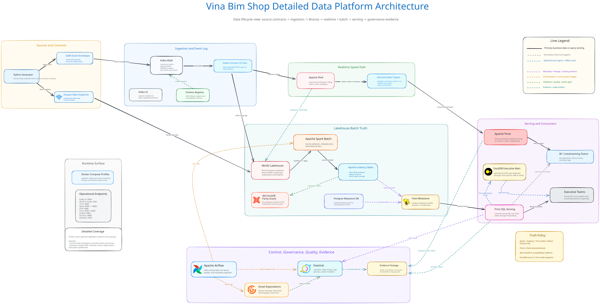
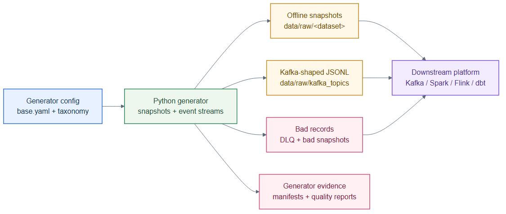
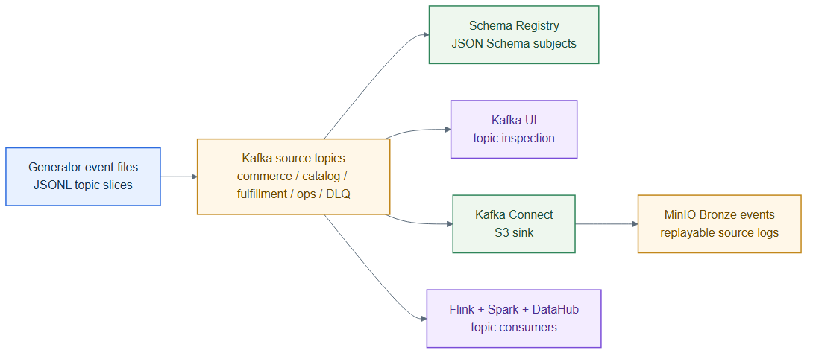
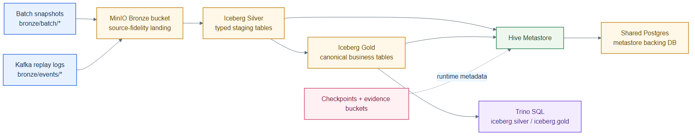
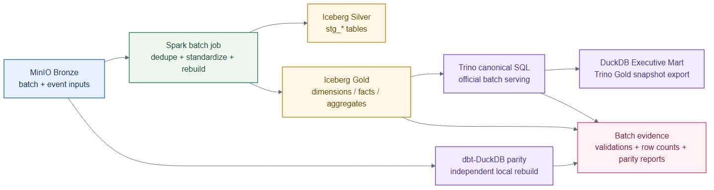
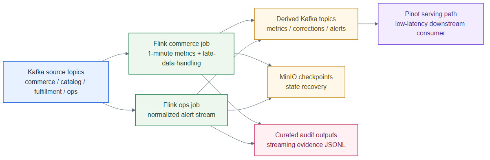
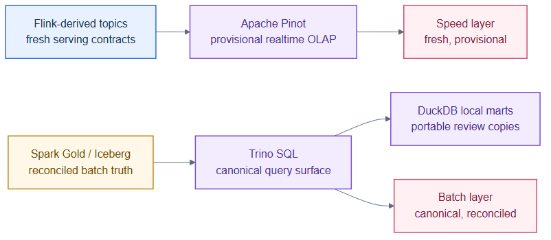
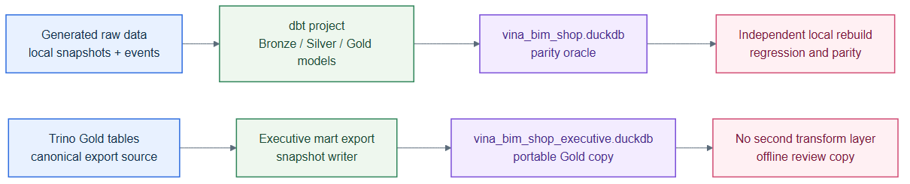
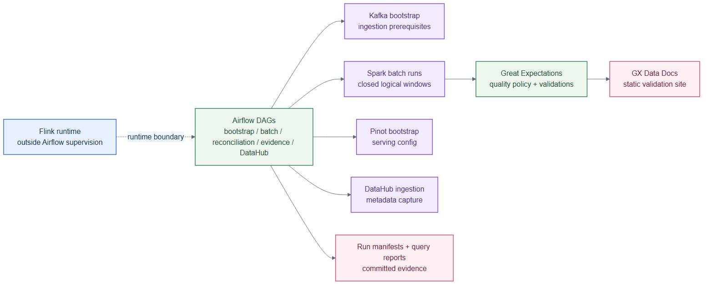
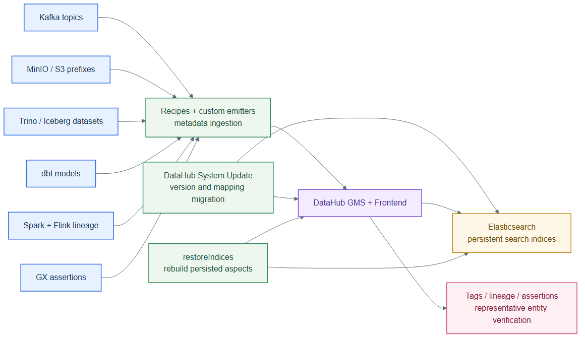

# Vina Bim Shop Data Platform

`vina-bim-shop` is a staged, runnable local data platform for a Shopee-inspired Vietnamese marketplace. It demonstrates how a modern e-commerce system can support both realtime operational analytics and batch-reconciled historical analytics through a Lambda-style architecture.

The project brings together data generation, event ingestion, lakehouse storage, batch and streaming processing, serving, orchestration, quality, and governance in one locally runnable platform.

---

## Table of Contents

- [System Architecture](#system-architecture)
- [Tech Stack](#tech-stack)
- [Introduction](#introduction)
- [Problem Definition](#problem-definition)
- [Project Status](#project-status)
- [Platform Implementation Overview](#platform-implementation-overview)
- [Repository Structure](#repository-structure)
- [Prerequisites](#prerequisites)
- [Installation & Setup](#installation--setup)
- [Configuration](#configuration)
- [Known Limits](#known-limits)
- [Data](#data)
- [Rubric Evidence and Navigation](#rubric-evidence-and-navigation)

---

## System Architecture



The detailed architecture view shows the project as a staged local platform: synthetic source contracts feed Kafka and local batch snapshots, Spark and Flink process the two analytical paths, Trino and Pinot expose different serving surfaces, and Airflow, Great Expectations, DataHub, and evidence artifacts make the run auditable.

Related diagrams:

- [Detailed PlantUML architecture](architecture/diagrams/detailed-lambda_architecture.puml)
- [Runnable Lambda architecture](architecture/diagrams/lambda_architecture.puml)
- [Schema design overview](architecture/diagrams/schema_design.puml)
- [Physical Bronze/Silver/Gold model](architecture/diagrams/erd/physical_gold_model.puml)
- [Gold layer ERD DBML](architecture/diagrams/erd/gold_layer_ERD.dbml)

---

## Tech Stack

| Layer | Technology | Purpose |
| --- | --- | --- |
| Source generation | Python, Faker, pandas, PyArrow | Generate Vietnamese marketplace snapshots, event streams, and evidence. |
| Ingestion | Kafka KRaft, Schema Registry, Kafka Connect, Kafka UI | Run event-log ingestion, JSON Schema registration, Bronze landing, and topic inspection. |
| Lakehouse storage | MinIO, Hive Metastore, Postgres, Apache Iceberg | Store Bronze replay logs, Silver/Gold tables, checkpoints, and catalog metadata. |
| Batch processing | Apache Spark, dbt-DuckDB | Build reconciled Silver/Gold tables and maintain a local parity oracle. |
| Streaming processing | Apache Flink | Produce event-time realtime metrics, alerts, and derived Kafka topics. |
| Serving | Trino, Apache Pinot, DuckDB | Serve canonical Gold SQL, provisional realtime OLAP, and portable local analysis marts. |
| Orchestration and quality | Apache Airflow, Great Expectations | Trigger control-plane workflows and publish validation evidence. |
| Governance | DataHub, Elasticsearch | Emit metadata, tags, glossary terms, quality assertions, indexed search, and lineage evidence. |
| Runtime | Docker Compose profiles, `uv`, pytest | Run the local stack, Python tooling, and verification suite. |

---

## Introduction

`vina-bim-shop` models the data platform needs of a Vietnamese e-commerce marketplace with customers, sellers, products, promotions, orders, payments, shipments, inventory, and user behavior events. It is intentionally built around realistic data engineering concerns: source contracts, replayable event logs, medallion lakehouse storage, quality gates, serving-layer truth policies, and auditable project outputs.

The main design choice is a Lambda architecture because the platform needs two complementary analysis streams:

- **Realtime analysis** for low-latency operational views such as traffic bursts, payment issues, live conversion, and alert candidates.
- **Batch analysis** for reconciled executive KPIs, dimensional modeling, financial formulas, and repeatable historical reporting.

Kafka, Flink, and Pinot provide the fresh but provisional speed path. MinIO, Spark, Iceberg, Hive Metastore, Trino, and DuckDB provide the reconciled batch path. Airflow, Great Expectations, and DataHub make the platform inspectable and auditable.

---

## Problem Definition

The platform answers a practical e-commerce data problem: how can a marketplace support live operational monitoring while still preserving a reliable historical source of truth for business reporting?

The source design deliberately includes both event envelopes and table-state exports:

| Source stream | Answers | Used by |
| --- | --- | --- |
| Kafka-shaped JSON event envelopes | What happened now? | Flink realtime metrics, Pinot dashboards, replay logs, behavior analysis. |
| Periodic table-state snapshots | What state is reliable at checkpoint? | Spark batch reconciliation, Gold dimensions/facts, Trino SQL, DuckDB evidence. |

The overlap is intentional. Orders, payments, shipments, and customer behavior can appear in both streams because events provide immediacy while snapshots provide checkpointed source-of-record state.

The generator also injects intentional data errors and contract drift so the platform can demonstrate realistic handling instead of only happy-path data:

- duplicate order-item payloads and duplicate commerce-event envelopes
- late-arriving commerce events
- missing values in fields such as `shipping_method`, `brand`, and `device_type`
- schema evolution where older slices miss newer optional fields
- malformed event and snapshot examples routed through `dead_letter_events`, `raw_bad_events`, and `raw_bad_snapshots`
- traffic burst and schema-version signals in operational events

---

## Project Status

Sections 01 and 02 are fulfilled for the mini-coursework phase. They are preserved as a historical project milestone, not as the overall identity of the platform.

For the original Sections 01/02 submission boundary, Spark, Flink, Apache Pinot, and Trino are architectural target contracts, while dbt-DuckDB is the runnable local implementation. The broader project now also includes the staged runnable platform implementation for ingestion, lakehouse, batch, streaming, serving, orchestration, and governance.

| View | Meaning |
| --- | --- |
| `Runnable locally` | `dbt-DuckDB`, the final dataset package, and the documented evidence artifacts can be reproduced on one machine. |
| `Architectural contract` | The staged Kafka, Spark, Flink, Pinot, Trino, Airflow, and DataHub stack documents the full target platform through service-level deliverables and evidence. |

Historical Section 01/02 artifacts and evidence:

- `uv run python scripts/qa/finalize_sections_01_02.py`
- [Final raw dataset zip](evidence/final_dataset/vina_bim_shop_medium_raw.zip)
- [Final dataset manifest](evidence/final_dataset/final_dataset_manifest.json)
- `data/gold/vina_bim_shop.duckdb`
- `data/gold/vina_bim_shop_executive.duckdb`
- [Data generator deliverable](deliverables/01_data_generator.md)
- [Schema design deliverable and Data Dictionary](deliverables/02_schema_design.md)
- [Physical Gold model PlantUML](architecture/diagrams/erd/physical_gold_model.puml)
- [Physical Gold model PNG](architecture/diagrams/erd/physical_gold_model.png)
- [Generator quality report](evidence/01_data_generator/quality_report.md)
- [dbt build report](evidence/02_schema_design/dbt_build_report.md)

---

## Platform Implementation Overview

The root README is the entrypoint. The deeper service-by-service explanations live in [deliverables](deliverables/) and evidence folders, so the descriptions below are intentionally concise.

| Stage | Profile or local path | Services and assets | Deep dive |
| --- | --- | --- | --- |
| Data generation | local Python | Synthetic snapshots, Kafka-shaped JSONL, bad records, quality evidence. | [01 data generator](deliverables/01_data_generator.md) |
| Ingestion | `ingestion` | Kafka KRaft, Schema Registry, Kafka Connect, Kafka UI. | [03 Kafka ingestion](deliverables/03_kafka_ingestion.md) |
| Lakehouse | `lakehouse` | MinIO, Hive Metastore, Trino, shared Postgres. | [04 lakehouse](deliverables/04_lakehouse.md) |
| Batch | `batch` plus dbt-DuckDB | Spark master, worker, history server, Iceberg Gold, dbt parity. | [05 Spark batch](deliverables/05_spark_batch.md) |
| Streaming | `streaming` | Flink JobManager, TaskManager, job submitter, derived Kafka topics. | [06 Flink streaming](deliverables/06_flink_streaming.md) |
| Serving | `serving` plus Trino/DuckDB | Apache Pinot realtime OLAP, Trino canonical SQL, DuckDB local marts. | [07 Pinot serving](deliverables/07_pinot_serving.md) |
| Local analytics | local DuckDB files plus dbt | dbt-DuckDB parity oracle and DuckDB Executive Mart export. | [10 DuckDB/dbt local analytics](deliverables/10_duckdb_dbt_local_analytics.md) |
| Orchestration | `orchestration` | Airflow webserver, scheduler, init, GX Data Docs. | [08 Airflow + GX](deliverables/08_airflow_gx_orchestration.md) |
| Governance | `governance` | DataHub GMS, frontend, actions, Elasticsearch, metadata recipes. | [09 DataHub governance](deliverables/09_datahub_governance.md), [DataHub evidence](evidence/final_integration/datahub_lineage.md) |

### Data Generation

Data generation is the source-system simulator for the platform. It produces offline Parquet snapshots, Kafka-shaped JSONL topics, bad-record fixtures, and committed evidence that feed the batch, streaming, and local analytics paths.



Key docs:

- [Generator deliverable](deliverables/01_data_generator.md)
- [Source event catalog](architecture/domain/source-event-catalog.md)
- [Source-to-target mapping](architecture/domain/source-to-target-mapping.md)

### Ingestion

The ingestion profile turns the generated event contracts into a real Kafka surface. Kafka topics, Schema Registry subjects, Kafka UI inspection, and Kafka Connect Bronze landing together make the source-event path replayable.



Key docs:

- [Kafka ingestion deliverable](deliverables/03_kafka_ingestion.md)
- [Kafka ingestion evidence](evidence/03_kafka_ingestion/)

### Lakehouse

The lakehouse profile is the shared storage and SQL foundation for the platform. MinIO, Hive Metastore, shared Postgres, Iceberg, and Trino give Spark and Kafka Connect a common Bronze-to-Gold boundary.



Key docs:

- [Lakehouse deliverable](deliverables/04_lakehouse.md)
- [Lakehouse evidence](evidence/04_lakehouse/)

### Batch

Spark owns the reconciled Bronze-to-Silver-to-Gold batch path over MinIO and Iceberg. Trino serves Spark Gold as the canonical SQL surface, while dbt-DuckDB parity and Executive Mart exports provide local verification and packaging.



Key docs:

- [Spark batch deliverable](deliverables/05_spark_batch.md)
- [Spark batch evidence](evidence/05_spark_batch/)
- [dbt parity report](evidence/05_spark_batch/dbt_parity_report.md)
- [DuckDB/dbt local analytics deliverable](deliverables/10_duckdb_dbt_local_analytics.md)

### Streaming

Flink consumes Kafka source topics with event-time logic and emits narrow serving contracts for metrics, corrections, and operational alerts. The streaming layer is intentionally fresh and provisional, not the final financial truth.



Key docs:

- [Flink streaming deliverable](deliverables/06_flink_streaming.md)
- [Flink evidence](evidence/06_flink_streaming/)

### Serving

Serving is split by freshness and truth role. Pinot answers low-latency questions over Flink-derived topics, while Trino answers canonical SQL over Spark-written Gold tables and can export portable DuckDB copies.



Schema design is part of the serving implementation, not just documentation. The committed model artifacts are:

- [Physical Bronze/Silver/Gold model](architecture/diagrams/erd/physical_gold_model.puml)
- [Rendered physical Gold model](architecture/diagrams/erd/physical_gold_model.png)
- [Gold layer ERD DBML](architecture/diagrams/erd/gold_layer_ERD.dbml)
- [Schema design deliverable and Data Dictionary](deliverables/02_schema_design.md)

Key docs:

- [Pinot serving deliverable](deliverables/07_pinot_serving.md)
- [Pinot evidence](evidence/07_pinot_serving/)

### Local Analytics

DuckDB provides the portable local analytics layer in two forms: the dbt-DuckDB parity oracle rebuilt from generated raw data, and the Executive Mart exported from Trino Gold. These files support regression checks and offline inspection without requiring the full distributed stack to stay online.



Key docs:

- [DuckDB/dbt local analytics deliverable](deliverables/10_duckdb_dbt_local_analytics.md)
- [dbt parity report](evidence/05_spark_batch/dbt_parity_report.md)
- [Schema design deliverable and Data Dictionary](deliverables/02_schema_design.md)

### Orchestration

Airflow owns the control-plane workflows for staged local runs: bootstrap, batch windows, reconciliation, evidence packaging, and DataHub ingestion. Great Expectations applies the project quality policy and publishes GX Data Docs, while Flink runtime remains outside Airflow supervision in v1.



Key docs:

- [Airflow + GX deliverable](deliverables/08_airflow_gx_orchestration.md)
- [Airflow + GX evidence](evidence/08_airflow_gx/)

### Governance

DataHub catalogs the same assets the platform actually produces: Kafka topics, MinIO prefixes, Trino/Iceberg tables, dbt models, Spark and Flink lineage, and GX assertions. Governance proof requires Elasticsearch-backed search, GMS verification, and a rendered frontend entity page.



Key docs:

- [DataHub governance deliverable](deliverables/09_datahub_governance.md)
- [DataHub evidence summary](evidence/final_integration/datahub_lineage.md)
- [Governance evidence folder](evidence/09_datahub_governance/)

---

## Repository Structure

```text
vina-bim-shop/
|-- architecture/             # Domain contracts, PlantUML, DBML, and Excalidraw architecture assets
|-- compose/                  # Domain Compose files included by the root compatibility entry point
|-- configs/                  # Generator, scenario, and pipeline configuration
|-- data/                     # Gitignored local raw and Gold outputs, with folder-intent .gitignore files
|-- deliverables/             # Project writeups and service-level documentation
|-- evidence/                 # Committed evidence packages, screenshots, manifests, reports, and query outputs
|-- infra/                    # Docker images, service config, Airflow DAGs, and dbt project assets
|-- scripts/                  # CLI entrypoints for generation, bootstrap, smoke tests, evidence, reset, and exports
|-- src/vina_bim_shop/        # Python packages for generation, Kafka, lakehouse, Flink, Pinot, quality, and governance
|-- tests/                    # Unit and integration checks for contracts, runtime helpers, evidence, and docs
|-- docker-compose.yml        # Root Docker Compose compatibility entry point
|-- pyproject.toml            # Python project metadata and dependencies
`-- uv.lock                   # Locked Python dependency graph
```

See the [Script inventory](scripts/README.md) for the official command surface and the debug/manual/destructive helpers queued for later cleanup.
Official evidence capture commands on `main` generate machine-verifiable artifacts only;
committed screenshot files remain historical review evidence and are not regenerated by
the official capture scripts.

---

## Prerequisites

| Tool | Recommended version | Purpose |
| --- | --- | --- |
| Docker Desktop / Docker Compose | Docker 24+ | Run staged service profiles. |
| Python | 3.12+ | Run generator, scripts, tests, dbt-DuckDB path. |
| `uv` | Current stable | Install and run the Python environment. |
| Git | Current stable | Clone and inspect the project repository. |
| DBeaver or DuckDB CLI | Optional | Inspect local DuckDB evidence files. |
| PlantUML / DBML tooling | Optional | Preview architecture and ERD files locally. |

The repo includes `.env.example` with local defaults. Copy it to `.env` if you want explicit environment settings.

---

## Installation & Setup

This project is designed to demonstrate the platform end to end through staged local execution, with each subsystem being independently verifiable. Use the fast local path for core checks, or start the distributed profiles in the documented order.

### Common Commands

The repository ships a root [Makefile](Makefile) that wraps the most common commands under a `make + verb` convention. Run `make help` at any time to see the full catalog. Recipes are shell-agnostic: they delegate to `uv run python` and `scripts/ctl.py`, whose compose lifecycle expands documented profile bundles and prebuilds shared images where needed.

| Target | What it does |
| --- | --- |
| `make install` | `uv sync` to install Python dependencies. |
| `make generate` | Run the data generator with default options (`SCALE=medium`, `MODE=full`, `SEED=42`). Override with `make generate SCALE=smoke MODE=streaming SEED=7`. |
| `make build-dbt` | Run `dbt build` against the local DuckDB profile. |
| `make test` | Run `pytest`. |
| `make finalize` | Produce the final Section 01/02 evidence package. |
| `make reset` | Run `scripts/qa/reset_all.py` (destructive; forwards `RESET_FLAGS=...`, e.g. `--dry-run`, `--force`, `--force --clean-local-data`). |
| `make up-<profile>` / `make down-<profile>` | Start or stop one of the supported compose profiles; dependent profiles expand to the documented staged bundles. |

The PowerShell snippets below remain the authoritative command surface; the Makefile is a thin, discoverable shortcut on top of them.

### 1. Install Python dependencies

```powershell
uv sync
```

### 2. Run the fast local compatibility path

Use this path when you want reproducible Section 01/02 evidence without starting the distributed services.

```powershell
uv run python scripts/generate/run_generator.py --scale medium --mode full --clean --seed 42
uv run dbt build --project-dir infra/analytics/dbt --profiles-dir infra/analytics/dbt
uv run pytest
```

### 3. Start the distributed platform in stages

Start each stage in order. All services share the same Docker network.

> **Runtime note:** The platform runs locally, but constrained machines should start Docker Compose profiles in stages. A broad full-stack startup can destabilize Docker and cause API inspection failures. The `all` profile is high-resource and best-effort; staged startup is the supported local workflow.

```powershell
docker compose --profile ingestion up -d
docker compose --profile lakehouse up -d
docker compose --profile batch up -d
docker compose --profile ingestion --profile lakehouse --profile streaming up -d
docker compose --profile ingestion --profile lakehouse --profile streaming --profile serving up -d
docker compose --profile orchestration up -d
docker compose --profile ingestion --profile lakehouse --profile governance up -d
```

### 4. Generate final Section 01/02 package evidence

```powershell
uv run python scripts/qa/finalize_sections_01_02.py
```

### 5. Export the local executive mart

Run this after Spark Gold tables are available through Trino.

```powershell
uv run python scripts/spark/export_executive_mart.py --duckdb-path data/gold/vina_bim_shop_executive.duckdb --evidence-root evidence/05_spark_batch
```

### 6. Reset local runtime state

```powershell
# Preview what would be destroyed
uv run python scripts/qa/reset_all.py --dry-run

# Full reset with confirmation prompt
uv run python scripts/qa/reset_all.py

# Full reset without prompt
uv run python scripts/qa/reset_all.py --force

# Reset including gitignored local generated data
uv run python scripts/qa/reset_all.py --clean-local-data
```

The reset script is a documented `needs-review` destructive helper. It stops services, removes Docker volumes, and optionally cleans gitignored local data such as `data/raw/`, `infra/analytics/dbt/target/`, and `evidence/runtime/`. It does not remove committed source files or committed evidence.

---

## Configuration

Local defaults are documented in [.env.example](.env.example). Most scripts work with defaults, but the variables below define the main configuration groups.

| Group | Variables | Default intent |
| --- | --- | --- |
| Runtime | `VBS_ENV`, `VBS_RANDOM_SEED`, `VBS_TAXONOMY_PATH` | Local execution with deterministic seed `42` and committed taxonomy snapshot. |
| Kafka | `VBS_KAFKA_BOOTSTRAP_SERVERS`, `VBS_SCHEMA_REGISTRY_URL`, `VBS_KAFKA_CONNECT_URL`, `VBS_KAFKA_UI_URL` | Local Kafka services on ports `9092`, `8081`, `8083`, and `8084`. |
| MinIO | `VBS_MINIO_ENDPOINT`, `VBS_MINIO_INTERNAL_ENDPOINT`, `VBS_MINIO_ROOT_USER`, `VBS_MINIO_ROOT_PASSWORD`, `VBS_MINIO_REGION` | Local object storage with internal Docker and external localhost endpoints. |
| Lakehouse catalog | `VBS_LAKEHOUSE_POSTGRES_*`, `VBS_HIVE_METASTORE_*`, `VBS_TRINO_*` | Shared Postgres, Hive Metastore, and Trino local serving defaults. |
| Spark | `VBS_SPARK_MASTER_URL`, `VBS_SPARK_MASTER_UI_URL`, `VBS_SPARK_HISTORY_URL` | Spark master, UI, and history server endpoints. |
| Flink | `VBS_FLINK_UI_URL`, `VBS_FLINK_JOBMANAGER_URL`, `VBS_FLINK_MAX_RUNTIME_MINUTES`, `VBS_FLINK_DISABLE_AUTO_STOP` | Flink UI/runtime settings and local safety timeout. |
| Pinot | `VBS_PINOT_CONTROLLER_URL`, `VBS_PINOT_BROKER_URL` | Pinot controller and broker endpoints for bootstrap and query scripts. |
| Orchestration | `VBS_AIRFLOW_UI_URL`, `VBS_AIRFLOW_ADMIN_USERNAME`, `VBS_AIRFLOW_ADMIN_PASSWORD`, `VBS_GX_DOCS_URL` | Airflow and GX Data Docs local URLs. |
| Data roots | `VBS_RAW_ROOT`, `VBS_BRONZE_*`, `VBS_*_BUCKET`, `VBS_DUCKDB_PATH` | Local raw output paths, MinIO bucket names, and DuckDB defaults. |

---

## Known Limits

These are current runtime, data-truth, and scope boundaries to keep in mind when running or evaluating the platform.

### Runtime and startup

- Start Docker Compose profiles in stages and expect some UI or runtime constraints on local machines.
- The `all` profile is high-resource and best-effort; it is not the primary local workflow.

### Data and serving truth

- dbt-DuckDB is a local compatibility path. In the full platform, Spark/Iceberg/Trino is the canonical source for reconciled truth.
- The DuckDB Executive Mart is a Trino Gold snapshot export, not an independent source of truth. Regenerate it after each Spark Gold refresh.
- Pinot serves fresh, provisional realtime data. Use Trino-served Gold tables as the official KPI source.

### Operations and recovery

- Airflow orchestrates batch and control-plane work; it does not supervise long-running Flink jobs in v1.
- DataHub requires separate ingestion recipe runs after the platform services are healthy.
- DataHub recovery verification currently covers indexed search and a rendered `vina_bim_shop.fact_order` lineage page after a frontend restart.

### Scope boundaries

- Observability hardening, production security, CI/CD, and Section 03 drift scenarios are outside the current project scope.

---

## Data

Generated local data lives in `data/` and is intentionally gitignored except for nested `.gitignore` files that preserve folder intent.

| Path | Role | Git behavior |
| --- | --- | --- |
| `data/raw/` | Generator-managed raw Parquet snapshots, Kafka-topic JSONL files, and bad-record examples. | Gitignored local output. |
| `data/gold/vina_bim_shop.duckdb` | dbt-DuckDB parity oracle rebuilt from local raw inputs. | Gitignored local output. |
| `data/gold/vina_bim_shop_executive.duckdb` | DuckDB Executive Mart exported from Trino Gold. | Gitignored local output. |
| `evidence/final_dataset/vina_bim_shop_medium_raw.zip` | Submitted medium raw dataset package. | Committed evidence. |
| `evidence/final_dataset/final_dataset_manifest.json` | Manifest for the final dataset package. | Committed evidence. |
| `evidence/final_integration/` | Health JSON, historical screenshots, row counts, query outputs, reconciliation, and lineage evidence. | Committed evidence. |

Runtime service profiles:

| Profile | Services |
| --- | --- |
| `ingestion` | Kafka KRaft, Schema Registry, Kafka Connect, Kafka UI |
| `lakehouse` | MinIO, Hive Metastore, Trino, shared Postgres |
| `batch` | Spark master, worker, history server |
| `streaming` | Flink JobManager, TaskManager, job submitter |
| `serving` | Pinot Zookeeper, controller, broker, server |
| `orchestration` | Airflow webserver, scheduler, init, GX Data Docs |
| `governance` | DataHub GMS, frontend, actions, Elasticsearch |
| `all` | Best-effort startup of all profiles; staged startup remains the supported workflow |

---

## Rubric Evidence and Navigation

This section is optional and intended for reviewers or maintainers who need to trace the project to its generated evidence. It is not part of the normal runtime setup.

The central proof index is [the implementation and evidence index](deliverables/13_mini_coursework_rubric_evidence.md). Its machine-verifiable source of truth is the [Mini-Coursework manifest](evidence/final_integration/mini_coursework_rubric_manifest.json), verified with the documented `--verify` command. Current verification summary: **45 Satisfied · 0 Partial · 0 Missing**.

Quick links:

- [Business domain and platform purpose](#introduction)
- [Reviewer-facing deployment diagram](architecture/diagrams/detailed-architecture.svg) and [diagram conventions](architecture/diagrams/README.md)
- [Repository map](#repository-structure) and [staged deployment order](#3-start-the-distributed-platform-in-stages)
- [Declared public API coverage](evidence/final_integration/public_documentation_coverage.json)
- [Implementation and evidence index](deliverables/13_mini_coursework_rubric_evidence.md)

### Public API documentation

The project exposes a deliberately small public API surface. The coverage report lists the supported modules and symbols below; internal helpers remain internal. Every listed module and symbol must have a nonempty docstring.

| Module | Declared symbols |
| --- | --- |
| [`generators/runner.py`](src/vina_bim_shop/generators/runner.py) | `GenerationResult`, `run_generation` |
| [`lakehouse/spark/runner.py`](src/vina_bim_shop/lakehouse/spark/runner.py) | `run_batch_pipeline` |
| [`flink/runtime.py`](src/vina_bim_shop/flink/runtime.py) | `RuntimeSettings`, `load_runtime_settings` |
| [`orchestration/specs.py`](src/vina_bim_shop/orchestration/specs.py) | `DagSpec`, `dag_specs_by_id` |
| [`datahub_lineage/emitter.py`](src/vina_bim_shop/datahub_lineage/emitter.py) | `DataHubLineageEmitter` |
| [`pinot/bootstrap.py`](src/vina_bim_shop/pinot/bootstrap.py) | `apply_assets` |
| [`quality/policies.py`](src/vina_bim_shop/quality/policies.py) | `gate_outcome_for_layer` |
