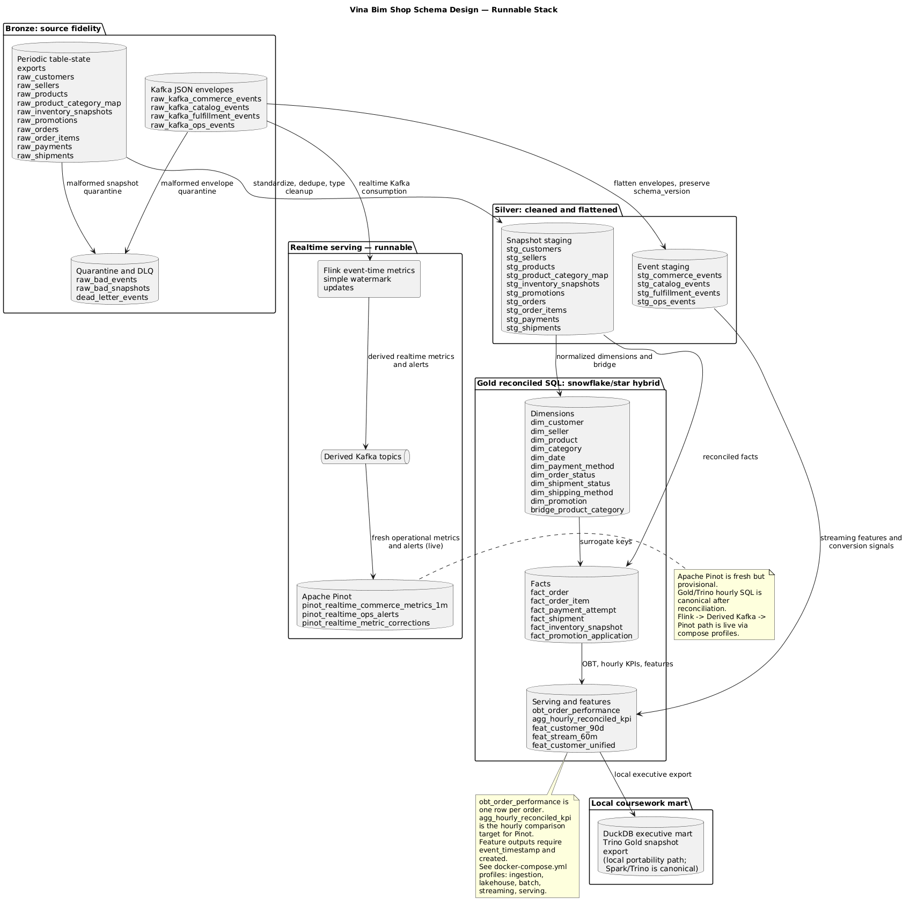
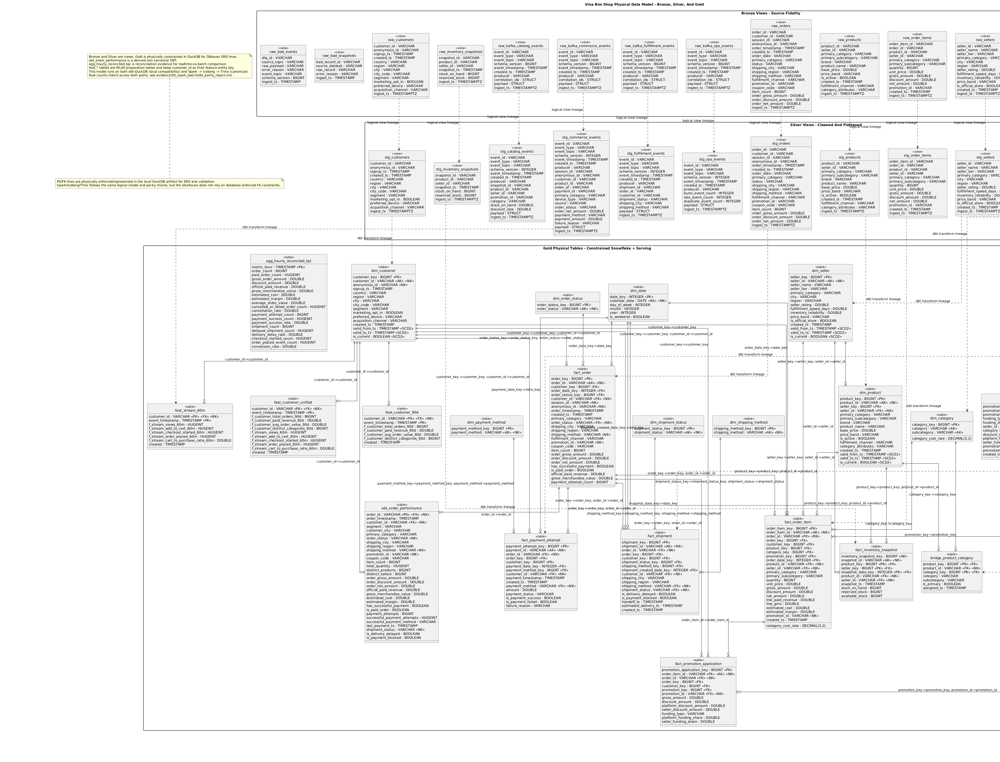

# 02 Schema Design And Data Dictionary

## Purpose

This document defines the canonical data model for `vina-bim-shop`. It explains how raw marketplace snapshots and Kafka event envelopes become Bronze, Silver, and Gold analytical datasets, and it serves as the main Data Dictionary referenced by the root README.

The schema design supports two truth surfaces:

- `Apache Pinot is fresh but provisional` for live operational metrics.
- `Trino-served Gold tables are the canonical reconciled truth` for official historical reporting.

`dbt-DuckDB is the local execution and test harness` for fast local rebuilds and physical ERD evidence. Spark/Iceberg/Trino provides the distributed implementation path for the same Gold logic, with row-count and KPI parity evidence in [evidence/05_spark_batch/dbt_parity_report.md](../evidence/05_spark_batch/dbt_parity_report.md).

## Architecture Fit

`JSON event envelopes answer what happened now`. They preserve producer intent, event time, creation time, correlation IDs, payload details, and schema version. They are best for immediate operational visibility, replay, and timing analysis.

`Periodic table-state exports answer what state is reliable at checkpoint`. They are source-of-record extracts for customers, products, orders, payments, shipments, and related entities. They are better for reconciliation because order status, payment status, shipment state, and financial totals can change after the first event is emitted.

| Pair | Why both exist | Truth policy |
| --- | --- | --- |
| Event envelopes vs table-state exports | Events capture the timeline; snapshots capture reliable checkpointed state. | Batch snapshots override overlapping order, payment, and shipment events for official historical reporting. |
| Streaming path vs batch path | Streaming keeps simple metrics fresh; batch supports heavier joins, deduplication, and dimensional modeling. | Streaming is fresh and provisional; batch is reconciled truth. |
| Pinot vs Trino Gold | Pinot serves low-latency operational metrics; Trino serves governed history over Gold. | Pinot is not used as the official financial source. |
| dbt-DuckDB vs DuckDB Executive Mart | dbt-DuckDB rebuilds from raw local inputs; Executive Mart is exported from Trino Gold. | Parity oracle and executive snapshot have different provenance. |

The older flat stream helper output is not part of the public contract. Kafka-topic-shaped JSONL files under `data/raw/kafka_topics/<topic>/events.jsonl` are the streaming raw source.

## Layer Overview

| Layer | Storage/modeling shape | Responsibility |
| --- | --- | --- |
| Bronze | Source-fidelity views or raw objects | Preserve snapshots, event envelopes, schema versions, payloads, and quarantine records. |
| Silver | Standardized typed views/tables | Deduplicate by business keys, flatten event envelopes, cast timestamps/numerics, and normalize nullable drift fields. |
| Gold | Constrained analytical tables | Provide dimensions, facts, OBTs, aggregates, and feature tables for reporting and downstream AI work. |
| Serving | Trino, DuckDB, Pinot | Split canonical historical SQL from portable local analysis and fresh realtime dashboards. |

Gold DuckDB tables enforce primary-key and foreign-key constraints through dbt contracts so DBeaver can render physical ERD relationship lines from database metadata. Bronze and Silver remain views in dbt-DuckDB, but they are included in the physical model for lineage context. The physical model is committed at [architecture/diagrams/erd/physical_gold_model.puml](../architecture/diagrams/erd/physical_gold_model.puml) with a rendered PNG at [architecture/diagrams/erd/physical_gold_model.png](../architecture/diagrams/erd/physical_gold_model.png).

## Data Format Rationale

The platform uses different data formats at different points because the work changes from source simulation, to replayable ingestion, to governed analytical storage, to low-latency serving.

| Stage | Format | Why this format is used |
| --- | --- | --- |
| Offline source snapshots | Parquet | Batch extracts are tabular, columnar, compact, and efficient for Spark and dbt-DuckDB reads. Parquet is a good fit for checkpointed source-of-record state such as orders, payments, shipments, and product snapshots. |
| Source event envelopes | JSON messages | Kafka source events need flexible envelopes with `event_id`, `event_type`, `schema_version`, timestamps, correlation IDs, and event-specific payloads. JSON preserves producer intent and makes schema drift visible. |
| Local event-log files | JSONL | The generator writes one JSON envelope per line so event streams remain human-readable, replayable, and easy to package as local evidence before or after Kafka is running. |
| Kafka ingestion | JSON governed by Schema Registry | Kafka keeps the realtime event log, while Schema Registry gives the JSON payloads explicit contracts for source topics and dead-letter handling. |
| Bronze lakehouse | Source-fidelity Parquet and JSONL/object data | Bronze preserves what arrived, plus ingestion metadata and quarantine records. This keeps bad rows inspectable instead of silently coercing them too early. |
| Silver lakehouse | Standardized Iceberg tables/views | Silver changes the data from source-shaped records into typed, deduplicated, normalized analytical records while retaining enough source metadata for audit. |
| Gold lakehouse | Apache Iceberg tables | Gold is the canonical analytical model. Iceberg provides durable lakehouse tables that Spark can write, Hive Metastore can catalog, and Trino can query consistently. |
| Trino serving | SQL over Iceberg Gold | Trino does not create a new truth layer; it exposes current Spark-written Gold tables as the canonical shared SQL surface. |
| Pinot realtime serving | Pinot realtime segments from Flink-derived Kafka topics | Pinot is optimized for low-latency OLAP over fresh derived streams such as metrics, alerts, and correction snapshots. It complements the lakehouse instead of replacing it. |
| DuckDB local analytics | Local `.duckdb` files | `data/gold/vina_bim_shop.duckdb` supports dbt parity, while `data/gold/vina_bim_shop_executive.duckdb` packages a Trino Gold snapshot for DBeaver/offline evidence review. |

The format evolution is therefore intentional: generated Parquet snapshots and JSON/JSONL events preserve source reality; Kafka and Bronze keep replayability; Silver standardizes and deduplicates; Gold Iceberg tables become the canonical batch truth; Trino, Pinot, and DuckDB expose fit-for-purpose serving surfaces.

Physical data types are still standardized in Silver and Gold. For example, timestamps are cast for event-time logic, surrogate keys use integer-like types, financial measures use numeric types, and JSON payload fragments are preserved where schema drift must remain inspectable.

## Bronze Data Dictionary

Bronze preserves raw data with minimal interpretation.

| Bronze object/table | Grain | Important fields | Source | Notes |
| --- | --- | --- | --- | --- |
| `raw_customers` | one customer snapshot | `customer_id`, `anonymous_id`, `signup_ts`, `segment`, `city`, `created_ts` | `customers` Parquet | Customer profile and segmentation. |
| `raw_sellers` | one seller snapshot | `seller_id`, `seller_tier`, `primary_category`, `seller_rating`, `created_ts` | `sellers` Parquet | Seller operational attributes. |
| `raw_products` | one product snapshot | `product_id`, `seller_id`, `primary_category`, `brand`, `fulfillment_channel`, `category_attributes` | `products` Parquet | Includes nullable schema-evolution fields. |
| `raw_product_category_map` | one product-category assignment | `product_id`, `category`, `subcategory`, `is_primary`, `assigned_ts` | `product_category_map` Parquet | Many-to-many taxonomy source. |
| `raw_inventory_snapshots` | one product inventory snapshot | `snapshot_id`, `product_id`, `snapshot_ts`, `stock_on_hand`, `reserved_stock` | `inventory_snapshots` Parquet | Batch inventory state. |
| `raw_promotions` | one promotion | `promotion_id`, `funding_type`, `funding_detail`, `discount_rate` | `promotions` Parquet | Funding detail can be JSON text. |
| `raw_orders` | one order header | `order_id`, `customer_id`, `order_timestamp`, `status`, `shipping_method`, `order_net_amount` | `orders` Parquet | Official order state source. |
| `raw_order_items` | one order line before deduplication | `order_item_id`, `order_id`, `product_id`, `quantity`, `net_amount` | `order_items` Parquet | Contains intentional duplicates. |
| `raw_payments` | one payment attempt | `payment_id`, `order_id`, `payment_timestamp`, `payment_status`, `amount` | `payments` Parquet | Payment success/failure source. |
| `raw_shipments` | one shipment | `shipment_id`, `order_id`, `shipment_status`, `handoff_ts`, `estimated_delivery_ts` | `shipments` Parquet | Fulfillment state source. |
| `raw_kafka_commerce_events` | one commerce event envelope | `event_id`, `event_type`, `schema_version`, `event_timestamp`, `created_ts`, `correlation_ids`, `payload` | `commerce_events` | Behavior and payment events. |
| `raw_kafka_catalog_events` | one catalog event envelope | `event_id`, `event_type`, `schema_version`, `event_timestamp`, `payload` | `catalog_events` | Product, price, inventory, promotion changes. |
| `raw_kafka_fulfillment_events` | one fulfillment event envelope | `event_id`, `event_type`, `shipment_id`, `order_id`, `payload` | `fulfillment_events` | Shipment lifecycle events. |
| `raw_kafka_ops_events` | one ops event envelope | `event_id`, `event_type`, `late_event_count`, `duplicate_event_count`, `burst_event_count` | `ops_events` | Source observability events. |
| `raw_bad_events` | one malformed event wrapper | `source_topic`, `raw_payload`, `error_reason`, `schema_version` | `dead_letter_events` | Quarantine/DLQ contract. |
| `raw_bad_snapshots` | one malformed snapshot wrapper | `source_dataset`, `raw_record`, `error_reason`, `ingest_ts` | `bad_snapshots` | Batch quarantine contract. |

## Silver Data Dictionary

Silver standardizes data for analytics and downstream transformations.

| Silver table | Grain | Key columns | Important type changes and rules |
| --- | --- | --- | --- |
| `stg_customers` | one customer | `customer_id` | Keeps geography, segment, opt-in, device, and acquisition fields; dedupes by latest `created_ts`. |
| `stg_sellers` | one seller | `seller_id` | Preserves seller tier, rating, fulfillment speed, inventory reliability, and price band. |
| `stg_products` | one product | `product_id` | Keeps nullable `brand`, `fulfillment_channel`, and `category_attributes` for schema drift. |
| `stg_product_category_map` | one product-category assignment | `product_id`, `category`, `subcategory` | Dedupes assignment records and keeps `is_primary`. |
| `stg_inventory_snapshots` | one inventory snapshot | `snapshot_id` | Casts `snapshot_ts`; preserves stock counts as integer-like measures. |
| `stg_promotions` | one promotion | `promotion_id` | Derives `platform_funding_share` and `seller_funding_share` from funding type/detail. |
| `stg_orders` | one order | `order_id` | Dedupes by latest `created_ts`; accepted statuses are `paid` and `payment_failed`. |
| `stg_order_items` | one order line | `order_item_id` | Removes intentional duplicate payloads by stable item key. |
| `stg_payments` | one payment attempt | `payment_id` | Accepted payment statuses are `success` and `failed`. |
| `stg_shipments` | one shipment | `shipment_id` | Normalizes shipment status and shipping method values. |
| `stg_commerce_events` | one commerce event | `event_id` | Flattens common `correlation_ids` and payload fields; filters by batch window in Spark. |
| `stg_catalog_events` | one catalog event | `event_id` | Extracts product, seller, promotion, category, stock, and discount fields from payloads. |
| `stg_fulfillment_events` | one fulfillment event | `event_id` | Extracts shipment/order/customer IDs and fulfillment fields. |
| `stg_ops_events` | one ops event | `event_id` | Extracts burst, late-event, and duplicate counts for operational evidence. |

Silver deduplication uses stable business keys plus latest source creation time. Event Silver tables deduplicate by `event_id`, keep `schema_version`, and preserve enough payload data for late-arrival and schema-evolution reasoning.

## Gold Data Dictionary

Gold is the business-ready model. Dimensions and facts are physically constrained in DuckDB and represented in the committed ERD.

### Dimensions And Bridge

| Table | Grain | Primary key | Important columns and types | Truth role |
| --- | --- | --- | --- | --- |
| `dim_customer` | one customer | `customer_key bigint` | `customer_id varchar`, `signup_ts timestamp`, `segment varchar`, `city varchar`, `marketing_opt_in boolean`, `valid_from_ts timestamp`, `is_current boolean` | Customer profile dimension. |
| `dim_seller` | one seller | `seller_key bigint` | `seller_id varchar`, `seller_tier varchar`, `seller_rating double`, `fulfillment_speed_days double`, `is_official_store boolean` | Seller and marketplace operations dimension. |
| `dim_product` | one product | `product_key bigint` | `product_id varchar`, `seller_key bigint`, `brand varchar`, `base_price double`, `fulfillment_channel varchar`, `category_attributes varchar` | Product dimension with seller relationship. |
| `dim_category` | one category/subcategory | `category_key bigint` | `category varchar`, `subcategory varchar`, `category_cost_rate decimal(3,2)` | Normalized taxonomy and cost-rate lookup. |
| `dim_date` | one calendar date | `date_key integer` | `calendar_date date`, `day_of_week integer`, `month integer`, `year integer`, `is_weekend boolean` | Shared calendar dimension. |
| `dim_payment_method` | one method | `payment_method_key bigint` | `payment_method varchar` | Payment normalization. |
| `dim_order_status` | one status | `order_status_key bigint` | `order_status varchar` | Order lifecycle normalization. |
| `dim_shipment_status` | one status | `shipment_status_key bigint` | `shipment_status varchar` | Shipment status normalization. |
| `dim_shipping_method` | one method | `shipping_method_key bigint` | `shipping_method varchar` | Shipping method normalization including unknown values. |
| `dim_promotion` | one promotion | `promotion_key bigint` | `promotion_id varchar`, `funding_type varchar`, `discount_rate double`, `platform_funding_share double`, `seller_funding_share double` | Promotion and discount funding dimension. |
| `bridge_product_category` | one product-category assignment | `product_key`, `category_key` | `product_id varchar`, `category varchar`, `subcategory varchar`, `is_primary boolean` | Supports many-to-many category assignments. |

Physical key policy:

- Surrogate keys such as `customer_key`, `product_key`, and `order_key` are the primary dimensional join path.
- Natural/source IDs such as `customer_id`, `product_id`, `order_id`, `payment_id`, `shipment_id`, and `snapshot_id` remain available for auditability.
- `dim_promotion` includes a `NO_PROMOTION` sentinel row so `fact_order_item.promotion_key` is never null.
- Current dimensions include SCD Type 2 support columns (`valid_from_ts`, `valid_to_ts`, `is_current`) while containing one current row per natural entity.

### Facts

| Table | Grain | Primary key | Important measures and types | Truth role |
| --- | --- | --- | --- | --- |
| `fact_order` | one order | `order_key bigint` | `order_gross_amount double`, `order_discount_amount double`, `order_net_amount double`, `official_paid_revenue double`, `gross_merchandise_value double`, `payment_attempt_count bigint` | Official order-level revenue and GMV truth. |
| `fact_order_item` | one order line | `order_item_key bigint` | `quantity bigint`, `gross_amount double`, `discount_amount double`, `net_amount double`, `category_cost_rate decimal(3,2)`, `estimated_cost double`, `estimated_margin double` | Item-level revenue, cost, and margin. |
| `fact_payment_attempt` | one payment attempt | `payment_attempt_key bigint` | `amount double`, `is_payment_success boolean`, `is_payment_failed boolean`, `failure_reason varchar` | Payment success/failure analysis. |
| `fact_shipment` | one shipment | `shipment_key bigint` | `is_delivery_delayed boolean`, `is_payment_blocked boolean`, `handoff_ts timestamp`, `estimated_delivery_ts timestamp` | Fulfillment and delay analysis. |
| `fact_inventory_snapshot` | one product/seller/date snapshot | composite product/seller/date key | `snapshot_id varchar`, `stock_on_hand bigint`, `reserved_stock bigint`, `available_stock bigint` | Inventory availability analysis. |
| `fact_promotion_application` | one promoted order item | `promotion_application_key bigint` | `discount_amount double`, `platform_discount_amount double`, `seller_discount_amount double` | Promotion funding attribution. |

### OBT, Aggregates, And Features

| Table | Grain | Key columns | Purpose |
| --- | --- | --- | --- |
| `obt_order_performance` | one row per order | `order_id` | Joins order, customer, payment, shipment, item rollups, discount, revenue, estimated cost, and margin for executive BI. It intentionally avoids item-level grain so dashboards do not multiply orders. |
| `agg_hourly_reconciled_kpi` | one row per hour | `metric_hour timestamp` | Canonical hourly KPI aggregate and comparison target for Pinot realtime metrics. |
| `feat_customer_90d` | one customer at feature timestamp | `customer_id`, `event_timestamp` | Offline customer order and paid revenue history. |
| `feat_stream_60m` | one customer-hour | `customer_id`, `event_timestamp` | Streaming activity counters from commerce events. |
| `feat_customer_unified` | one customer at latest feature timestamp | `customer_id`, `event_timestamp` | Combines offline and streaming features for model-ready analysis. |

Feature outputs retain `event_timestamp` for point-in-time joins and expose `created` for auditability. Their source events, Bronze and Silver models, dimensions, facts, OBTs, and aggregates retain their existing `created_ts` fields where those fields already exist.

## Rubric Evidence (Rows 40-44)

### Row 40 — All-zone ERD

[`architecture/diagrams/schema_design.puml`](../architecture/diagrams/schema_design.puml) is the generated all-zone ERD source. The Section 02 evidence generator verifies that it names every Bronze, Silver, and Gold dbt model before rendering the reviewer-facing image and records the source path, SHA-256, and zone model counts in the run manifest.



### Row 41 — SCD2-compatible dimensions

`dim_customer`, `dim_seller`, and `dim_product` expose `valid_from_ts`, `valid_to_ts`, and `is_current`. These are SCD2-compatible columns, while the current dbt builds remain current-row oriented rather than a full historical SCD2 version chain.

### Row 42 — Feature timestamp contract

Feature outputs retain `event_timestamp` and expose `created` in both dbt and Spark. `created` is an output alias derived from the upstream `created_ts` audit timestamp; source and non-feature schemas are unchanged. The generated catalog and schema inventory provide the exact column proof.

### Row 43 — Dimension/fact relationships

The physical ERD records the constrained DuckDB Gold primary and foreign-key relationships, including the dimension-to-fact and dimension-to-feature links.



### Row 44 — Naming conventions

| Zone | Required prefixes | Evidence |
| --- | --- | --- |
| Bronze | `raw_` | Source-fidelity and quarantine models. |
| Silver | `stg_` | Standardized snapshot and event models. |
| Gold | `dim_`, `fact_`, `obt_`, `agg_`, `feat_`, `bridge_` | Constrained serving, dimensional, and relationship models. |

## Business Logic Formulas

All official financial formulas are batch-reconciled formulas from Gold, not Pinot-only formulas.

| Metric | Formula | Notes |
| --- | --- | --- |
| Gross order amount | `sum(order_gross_amount)` | Pre-discount order amount. |
| Net order amount | `sum(order_net_amount)` | After discounts, before truth filtering. |
| official paid revenue | `sum(order_net_amount where order_status = 'paid' and payment_status = 'success')` | Official revenue definition. |
| GMV | `sum(order_gross_amount where order_status = 'paid' and payment_status = 'success')` | Failed-payment orders are excluded. |
| Discount amount | `sum(gross_amount - net_amount)` or source `discount_amount` | Uses source totals after Silver deduplication. |
| Platform discount | `discount_amount * platform_funding_share` | Platform-funded uses `1.0`, seller-funded uses `0.0`, mixed uses `funding_detail` or `0.5` fallback. |
| Seller discount | `discount_amount * seller_funding_share` | Complement to platform funding share. |
| AOV | `official_paid_revenue / paid_order_count` | Uses paid successful orders only. |
| Payment success rate | `successful_payment_attempts / payment_attempts` | Attempt-level payment metric. |
| Cancellation or failed-order rate | `payment_failed_order_count / order_count` | Current source uses `payment_failed` as failed order status. |
| Delivery delay rate | `delayed_shipments / shipments` | Uses shipment status `delayed`. |
| Conversion rate | `order_placed_events / checkout_started_events` | Streaming-derived behavior metric; reconciled batch can compare it hourly. |
| Estimated cost | `line_net_amount * category_cost_rate` | Category rates: FMCG `0.72`, ELHA `0.82`, Fashion `0.55`, Home & Living `0.62`. |
| Estimated margin | `official paid revenue - estimated cost` | Item-level margin is summed to order/hourly aggregates. |

The project does not generate true cost of goods, returns, refunds, tax, or seller finance data, so margin is an estimated coursework metric.

## Serving Contracts

| Surface | Audience | Source | Freshness and truth role |
| --- | --- | --- | --- |
| Trino SQL Serving | Analysts and shared SQL consumers | Current Iceberg Gold through Hive Metastore | Canonical online query interface after Spark Gold refresh. |
| DuckDB Executive Mart | Executives and local reviewers | Trino Gold snapshot export | Fast local/offline copy; stale until regenerated. |
| dbt-DuckDB Parity Oracle | Data engineers | dbt rebuild from raw local inputs | Regression oracle; not the official serving surface. |
| Pinot realtime tables | BI/livestreaming and operations | Flink-derived Kafka topics | Fresh provisional view for live metrics and alerts. |

Pinot realtime contracts:

| Pinot table | Grain | Source | Purpose |
| --- | --- | --- | --- |
| `pinot_realtime_commerce_metrics_1m` | one event-time minute by category/source/status | Flink from Kafka commerce events | Fresh revenue proxy, GMV proxy, payment failures, checkout/order conversion. |
| `pinot_realtime_ops_alerts` | one alert event | Flink from ops/catalog/fulfillment signals | Traffic bursts, late arrivals, duplicate spikes, inventory/fulfillment alerts. |
| `pinot_realtime_metric_corrections` | one correction snapshot | Flink late-event correction path | Late-data adjustments for realtime metric keys. |

Flink uses watermarking and allowed lateness for late events. Product and customer SCD joins stay out of the streaming path unless the needed fields are already present in the event payload.

## Service Interactions

| Service or layer | How it uses the schema design |
| --- | --- |
| Data generator | Produces the source snapshots and event envelopes that populate Bronze and provide intentional drift examples. |
| Kafka ingestion | Registers event contracts and lands raw event streams for Bronze replay and DLQ handling. |
| Lakehouse | Stores Bronze, Silver, and Gold objects with the medallion naming and typing conventions documented here. |
| Spark batch | Implements the distributed Bronze-to-Silver-to-Gold transformation path and writes canonical Iceberg tables. |
| dbt-DuckDB | Rebuilds the same model locally as a parity oracle and evidence-friendly DuckDB file. |
| Trino | Serves Spark-written Gold tables for canonical SQL inspection and executive mart export. |
| Flink and Pinot | Use the event and realtime serving contracts for fresh provisional metrics and alerts. |
| Airflow and GX | Apply quality policy to Bronze, Silver, Gold, Pinot query, and reconciliation checks. |
| DataHub | Publishes dataset, tag, assertion, and lineage metadata for the model layers. |

## Data Quality And Evidence

Quality policy:

- Bronze keeps raw records and reads malformed examples into `raw_bad_events`, `raw_bad_snapshots`, or Kafka `dead_letter_events`.
- Bronze failures warn and require quarantine rather than blocking the whole pipeline.
- Silver normalizes nullable schema-evolution fields and keeps `schema_version`.
- Silver and Gold failures block orchestration because these layers feed official reporting.
- Pinot metrics are compared against `agg_hourly_reconciled_kpi` using hourly windows and a tolerance-aware contract check.
- When Pinot and Gold differ, Gold wins for official historical reporting.

Local evidence command:

```powershell
uv run python scripts/qa/generate_section02_evidence.py
```

Evidence artifacts:

- [evidence/02_schema_design/dbt_build_report.md](../evidence/02_schema_design/dbt_build_report.md)
- [evidence/02_schema_design/dbt_test_results.csv](../evidence/02_schema_design/dbt_test_results.csv)
- [evidence/02_schema_design/dbt_model_results.csv](../evidence/02_schema_design/dbt_model_results.csv)
- [evidence/02_schema_design/dbt_catalog_summary.csv](../evidence/02_schema_design/dbt_catalog_summary.csv)
- [evidence/02_schema_design/schema_inventory.csv](../evidence/02_schema_design/schema_inventory.csv)
- [evidence/02_schema_design/table_row_counts.csv](../evidence/02_schema_design/table_row_counts.csv)
- [evidence/02_schema_design/run_manifest.json](../evidence/02_schema_design/run_manifest.json)
- [evidence/02_schema_design/screenshots/schema_design.png](../evidence/02_schema_design/screenshots/schema_design.png)
- [evidence/02_schema_design/screenshots/gold_schema_inventory.png](../evidence/02_schema_design/screenshots/gold_schema_inventory.png)
- [evidence/02_schema_design/screenshots/dbt_test_summary.png](../evidence/02_schema_design/screenshots/dbt_test_summary.png)

## Implementation Files

| File | Responsibility |
| --- | --- |
| [infra/analytics/dbt/models/bronze](../infra/analytics/dbt/models/bronze) | Source-fidelity views and quarantine models. |
| [infra/analytics/dbt/models/silver](../infra/analytics/dbt/models/silver) | Standardized and deduplicated staging models. |
| [infra/analytics/dbt/models/gold](../infra/analytics/dbt/models/gold) | Constrained dimensions, facts, OBT, aggregate, and feature tables. |
| [infra/analytics/dbt/models/gold/_dimensions.yml](../infra/analytics/dbt/models/gold/_dimensions.yml) | Gold dimension and bridge contracts, keys, types, and tests. |
| [infra/analytics/dbt/models/gold/_facts.yml](../infra/analytics/dbt/models/gold/_facts.yml) | Gold fact contracts, relationships, expression tests, and types. |
| [infra/analytics/dbt/models/gold/_marts.yml](../infra/analytics/dbt/models/gold/_marts.yml) | Gold OBT and aggregate contracts, keys, and types. |
| [infra/analytics/dbt/models/gold/_features.yml](../infra/analytics/dbt/models/gold/_features.yml) | Gold feature contracts, composite keys, and types. |
| [infra/analytics/dbt/macros/business_logic.sql](../infra/analytics/dbt/macros/business_logic.sql) | Shared business formulas. |
| [architecture/diagrams/erd/gold_layer_ERD.dbml](../architecture/diagrams/erd/gold_layer_ERD.dbml) | Gold-only ERD for DBML/dbdiagram preview. |
| [architecture/diagrams/erd/physical_gold_model.puml](../architecture/diagrams/erd/physical_gold_model.puml) | Full physical model across Bronze, Silver, and Gold. |

## Convenience Make Targets

The root [Makefile](../Makefile) wraps the most common commands for this deliverable under a `make + verb` convention. It delegates to the official scripts in [scripts/](../scripts/) and to `scripts/ctl.py` for Docker Compose lifecycle; compose targets expand documented profile bundles and prebuild shared images where needed.

| Target | What it does |
| --- | --- |
| `make install` | `uv sync` to install Python dependencies. |
| `make generate` | Run the data generator (this deliverable consumes its raw outputs). |
| `make build-dbt` | Run `dbt build` against the local DuckDB profile that materializes the schema described above. |
| `make test` | Run `pytest` to verify the schema contracts and model files. |
| `make finalize` | Produce the final Section 01/02 evidence package, including the dbt build report. |
