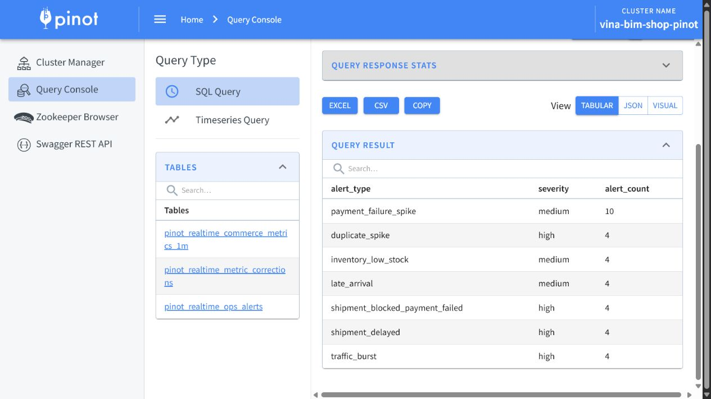

# Novel Ideas Evidence

This deliverable packages two implemented platform capabilities as the two required novel ideas. The order is deliberate: the first idea proves portable local analytics and the second proves fresh realtime serving. Together they show two complementary ways to make the same e-commerce platform reviewable without treating either one as a replacement for canonical Spark Gold truth.

## Novel Idea 1: DuckDB/dbt local analytics

### Problem

The full distributed stack is valuable for end-to-end processing, but it is expensive to start merely to inspect models, validate a change, or review coursework evidence. Reviewers need a portable, reproducible analytical surface that can still be checked against the canonical batch path.

### Implementation and proof

dbt rebuilds Bronze, Silver, and Gold models into the local `data/gold/vina_bim_shop.duckdb` parity database. The representative aggregate below runs read-only against `gold.fact_order`; the evidence also records the successful dbt model/test counts, Spark/Trino parity report, and Topic 05 isolated ART-index evidence.

```powershell
uv run dbt build --project-dir infra/analytics/dbt --profiles-dir infra/analytics/dbt
uv run python scripts/qa/capture_novel_ideas.py
```

```sql
SELECT
  count(*) AS order_count,
  sum(CASE WHEN is_paid_order THEN 1 ELSE 0 END) AS paid_order_count,
  sum(official_paid_revenue) AS official_paid_revenue,
  sum(gross_merchandise_value) AS gross_merchandise_value
FROM gold.fact_order;
```

The 2026-07-12 capture returned one typed row: `order_count=1,800`, `paid_order_count=1,734`, `official_paid_revenue=5,488,980,096.0`, and `gross_merchandise_value=5,737,896,000.0`. Its dbt gate recorded 52 successful models, 66 successful tests, and 22 Gold models; 27 Spark/Trino parity comparisons and the isolated `idx_benchmark_fact_order_order_id` evidence also passed.

The fresh machine-readable result, typed columns, source hashes, and dbt/parity/index gates are in [Idea 1 evidence](../evidence/10_novel_ideas/idea_1_duckdb_dbt.json). The [run manifest](../evidence/10_novel_ideas/run_manifest.json) binds it to the current screenshots and upstream artifacts.


### Why it is novel, value, and limits

The novelty is not DuckDB or dbt in isolation; it is their use as an independent, file-portable parity oracle beside the Spark/Iceberg/Trino path. This gives reviewers a single local database for repeatable model checks while retaining measured parity to distributed Gold output. The isolated index benchmark is supporting evidence only: it never mutates the canonical database, and its local timing result is not a production performance claim.

DuckDB/dbt remains a local reproducibility path. Spark Gold through Trino is the canonical full-platform truth, and the separately exported Executive Mart is a snapshot that must be regenerated after a Gold refresh.

## Novel Idea 2: Pinot realtime serving

### Problem

Operators need fast answers about active operational signals and recent stream behavior without waiting for the next batch refresh. Raw Kafka topics are too low-level for that purpose, while a second canonical financial store would create conflicting truth.

### Implementation and proof

Flink normalizes `ops_events`, `catalog_events`, and `fulfillment_events` into the derived Kafka topic `realtime_ops_alerts`. Apache Pinot ingests that topic into `pinot_realtime_ops_alerts`, where the controller, broker, table/segment state, source provenance, and a successful aggregate query are captured together.

```powershell
uv run python scripts/pinot/refresh_evidence.py
uv run python scripts/qa/capture_novel_ideas.py
```

```sql
SELECT alert_type, severity, count(*) AS alert_count
FROM pinot_realtime_ops_alerts
GROUP BY alert_type, severity
ORDER BY alert_count DESC, alert_type
LIMIT 20;
```

The 2026-07-12 capture found a healthy realtime table with one segment and a consuming segment. The query returned seven rows without a partial response: `payment_failure_spike` / `medium` was the leading group with 10 alerts; the remaining six groups each had 4 alerts.

The [Idea 2 evidence](../evidence/10_novel_ideas/idea_2_pinot_realtime.json) records healthy controller/broker checks, the online realtime table, consuming or completed segment proof, query rows, and the Flink-to-Kafka-to-Pinot provenance. The [run manifest](../evidence/10_novel_ideas/run_manifest.json) records the fresh runtime gate and screenshot hashes.



### Why it is novel, value, and limits

The novelty is the explicit speed-layer boundary: Pinot receives only Flink-derived serving contracts, not raw source topics, and the evidence proves that boundary with table configuration and runtime results. It gives operators low-latency OLAP for alerts while preserving the batch lakehouse as the official financial and executive reporting surface.

Pinot is fresh and provisional. Late-data corrections require correction-aware queries, and the historical correction-aware dashboard contract needs Pinot multi-stage execution; that limitation is recorded rather than hidden. Spark Gold through Trino remains canonical for reconciled KPIs.
