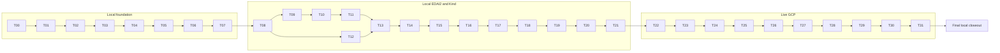

# EDAI2 Master Session Prompts

## Purpose and operating model

This is the copy/paste control plane for 33 topic-specific Codex chats. Each topic uses one chat in two phases: paste its planning prompt, review the decision-complete handoff, then paste its execution prompt into the same chat. Execute topics serially in numeric order and complete the topic's Completion Record before beginning the next execution phase.

This package creates planning artifacts only. The later topic chats implement EDAI2 on the checkout already open at package creation (`feature/implement-edai2`). They must never create a worktree or branch, switch branches, stage, commit, push, or open a PR unless the user separately asks.

## Locked sources

| Source | Required SHA-256 |
|---|---|
| `tmp/edai2-plan/03_data_generator_improvement.md` | `ece171c3d400c3b16fc668cd28e3587faebe1f596dd6c0c4498ff055e3fc027f` |
| `tmp/edai2-plan/04.2_llm_design.md` | `b8be3ef5c84fe4d6fe52e8894c3c5dc1c3babc898e2a87684b2b8ff720d6d079` |
| `tmp/rubic-check/Coursework Tracking (Public).xlsx` | `71b2403e068081b00245bea5e15c5754f3762ad354e0a3a6576d69e4963c8657` |

Every session must fail closed before edits if any digest differs. The rubric source is `tmp/rubic-check/Coursework Tracking (Public).xlsx`, with scored cells `Sheet3!E3:E62`; Row 2 is mandatory but unscored.

## Pinned workstation baseline

| Tool | Winget ID | Required version/reference |
|---|---|---|
| Kind | `Kubernetes.kind` | [0.32.0](https://github.com/kubernetes-sigs/kind/releases/tag/v0.32.0) |
| Kind node | — | `kindest/node:v1.35.5@sha256:ce977ae6d65918d0b58a5f8b5e940429c2ce42fa3a5619ec2bbc60b949c0ac95` |
| Helm | `Helm.Helm` | [3.20.0](https://github.com/helm/helm/releases/tag/v3.20.0) |
| Terraform | `Hashicorp.Terraform` | [1.15.8](https://developer.hashicorp.com/terraform/install) |
| Google Cloud CLI | `Google.CloudSDK` | [577.0.0](https://docs.cloud.google.com/sdk/docs/install-sdk) |
| kubectl | existing client | 1.34.1; within one minor of the Kind 1.35.5 node under the [version-skew policy](https://kubernetes.io/releases/version-skew-policy/) |

## Shared execution rules

1. Read the complete topic file and predecessor Completion Records before acting.
2. Start and finish with `rtk git status --short --branch`; preserve unrelated work.
3. Use the current checkout/branch only. No branch, worktree, staging, commit, push, or PR.
4. Planning phase is read-only. Execution begins only after the same chat has produced its decision-complete handoff.
5. Use `apply_patch` for repository text edits. `uv add` is permitted only as the dependency-manager exception; inspect both `pyproject.toml` and `uv.lock` diffs. Make recipes use `uv run`; operators use `rtk make`.
6. Run one execution/runtime topic at a time. Never auto-prune Docker data or stop unrelated containers.
7. Every Kubernetes command names an explicit kubeconfig and context. Never use the current default corporate context.
8. Kind output is labelled `local preflight` and earns no GKE rubric credit.
9. GCP work stops before mutation if project, billing, IAM, trial-expiry, current-spend, recovery-sink, DNS, lease, or other required inputs are missing.
10. `tmp/edai2-gcp/coursework.auto.tfvars` stays untracked and is selected through `EDAI2_TFVARS_PATH`.
11. Machine-readable evidence governs. After one bounded tuning retry, failed empirical gates remain Partial/Missing; compatible maximum is 99 because E49 is permanently Out of Scope.

## Locked reconciliation rules

- Upload and verify Section 03 before drift deployment; the drift Helm/Jenkins path owns activation, with no duplicate post-deploy import.
- Derive Section 03 runtime timestamps from generator configuration, never from copied literals.
- Reuse an identical immutable bundle only after full hash/schema verification; reject a same-ID content mismatch.
- Keep the CI bootstrap RAG index distinct from the later canonical evidence index.
- Five `SandboxAgent` resources represent exactly three logical identities: retrieval, drift, and coordinator.
- Scale the inactive model to zero during the other model's two-replica factorial cells.
- Topics 28-31 each receive a separate at-most-six-hour evidence lease and budget gate.
- Capture six distinct Jenkins job pages in one browser session without rebuilding.

## Local Kind guardrail

Topic 21 uses one control-plane node named `edai2-lean`, kubeconfig `tmp/edai2-kind/kubeconfig`, context `kind-edai2-lean`, and the pinned node image digest above. Do not run the broad Compose platform and Kind simultaneously. Namespace aggregate requests are at most 6 CPU/16 GiB, limits at most 10 CPU/22 GiB, with at most 30 pods, 8 PVCs/20 GiB, and zero `LoadBalancer` services. KEDA maximum is one locally; scale-to-two is render/static validation only. Skip full llm-d, Jenkins, observability, Vault recovery, and every GKE-specific proof.

## Screenshot acceptance gate

Section 03 remains 1600×900. Browser evidence uses a fixed 1600×1000 viewport and primary captures are full contextual viewport images, not element crops. A capture is accepted only when target selectors are fully inside the viewport, the application is stable, and title/context are visible. Write to a temporary path, verify the PNG signature, decode and fully load it, then atomically replace the final path. Record dimensions, UTC, URL/source, commit/revision, visible selectors, SHA-256, linked machine evidence, and what the image proves/does not prove. Reject blank/near-uniform, clipped, loading, login-only, generic-home, error, stale, secret-bearing, or PII-bearing images. Inspect every accepted image at original resolution.

## Schedule and dependency catalog

| # | Topic file | Phase | Class | Direct prerequisites | Purpose | Rubric role |
|---:|---|---|---|---|---|---|
| 00 | [`local/00-workstation-toolchain-context-safety.md`](local/00-workstation-toolchain-context-safety.md) | Local foundation | Local-only | — | Workstation prerequisites and kube-context isolation | Supporting prerequisite |
| 01 | [`local/01-section03-config-drift-sampler.md`](local/01-section03-config-drift-sampler.md) | Local foundation | Local-only | 00 | Section 03 Tasks 1-2: typed configuration and deterministic drift sampling | Contributes to E32-E33 |
| 02 | [`local/02-section03-labels-psi-candidate-evidence.md`](local/02-section03-labels-psi-candidate-evidence.md) | Local foundation | Local-only | 01 | Section 03 Tasks 3-4: labels, PSI, training join, and candidate evidence | Contributes to E32-E34 |
| 03 | [`local/03-section03-dbt-gold-contracts.md`](local/03-section03-dbt-gold-contracts.md) | Local foundation | Local-only | 02 | Section 03 Task 5: leakage-safe dbt Gold contracts | Supports E34 |
| 04 | [`local/04-section03-spark-gold-parity.md`](local/04-section03-spark-gold-parity.md) | Local foundation | Local-only | 03 | Section 03 Task 6: Spark/Iceberg outputs and three-way parity | Supports E34 |
| 05 | [`local/05-section03-airflow-datahub-governance.md`](local/05-section03-airflow-datahub-governance.md) | Local foundation | Local-only | 04 | Section 03 Tasks 7-8: DP3 validation and DataHub governance | Supports E32-E34 |
| 06 | [`local/06-section03-docs-schema-finalizer.md`](local/06-section03-docs-schema-finalizer.md) | Local foundation | Local-only | 05 | Section 03 Tasks 9 and Task 10 finalizer implementation | Supports E32-E34 |
| 07 | [`local/07-section03-canonical-runtime-promotion.md`](local/07-section03-canonical-runtime-promotion.md) | Local foundation | Local runtime | 06 | Section 03 Task 10 canonical seed-42 capture and immutable promotion | E32-E34 |
| 08 | [`local/08-edai2-prerequisite-contracts.md`](local/08-edai2-prerequisite-contracts.md) | Local EDAI2 | Local-only | 07 | EDAI2 Tasks 0-1: fail-closed prerequisite and repository contracts | Supports E32-E34, E59-E60 |
| 09 | [`local/09-rag-source-chunking-embeddings.md`](local/09-rag-source-chunking-embeddings.md) | Local EDAI2 | Local-only | 08 | EDAI2 Task 2: trusted sources, versions, 400/80 chunks, embeddings | Supports E8-E9, E61 |
| 10 | [`local/10-rag-index-feast-airflow-datahub.md`](local/10-rag-index-feast-airflow-datahub.md) | Local EDAI2 | Local integration | 09 | EDAI2 Task 2: candidate/active index, Feast, Airflow, DataHub | Supports E8-E9 |
| 11 | [`local/11-retrieval-api-mcp-safety.md`](local/11-retrieval-api-mcp-safety.md) | Local EDAI2 | Local-only | 10 | EDAI2 Task 3: async retrieval API, MCP, grounding, citation safety | Supports E10-E12, E62 |
| 12 | [`local/12-section03-loader-drift-api-mcp.md`](local/12-section03-loader-drift-api-mcp.md) | Local EDAI2 | Local-only | 08 | EDAI2 Task 4: strict Section 03 loader and async drift API/MCP | Supports E16-E18 |
| 13 | [`local/13-coordinator-inference-routing-telemetry.md`](local/13-coordinator-inference-routing-telemetry.md) | Local EDAI2 | Local-only | 11, 12 | EDAI2 Task 5: observed inference, coordinator routing, telemetry | Supports E24-E26, E50, E54-E57 |
| 14 | [`local/14-agent-security-registry-notebooks.md`](local/14-agent-security-registry-notebooks.md) | Local EDAI2 | Local-only | 13 | EDAI2 Task 5: SandboxAgents, registry contracts, notebooks | Supports E13-E25 |
| 15 | [`local/15-evaluation-test-quality-load.md`](local/15-evaluation-test-quality-load.md) | Local EDAI2 | Local-only | 14 | EDAI2 Task 6: evaluation, coverage, EP/BVA, mutation, properties, load | Supports E27-E31, E61-E62 |
| 16 | [`local/16-images-jenkins-ci.md`](local/16-images-jenkins-ci.md) | Local EDAI2 | Local-only | 15 | EDAI2 Task 6: six images, six Jenkins pipelines, change maps | Supports E35-E40 |
| 17 | [`local/17-terraform-vault-iac-static.md`](local/17-terraform-vault-iac-static.md) | Local EDAI2 | Local-only | 16 | EDAI2 Task 7 static Terraform, Vault, IAM, budget validation | Supports E46, E48, E58 |
| 18 | [`local/18-platform-helm-kustomize.md`](local/18-platform-helm-kustomize.md) | Local EDAI2 | Local-only | 17 | EDAI2 Task 8 static platform Helm/Kustomize contracts | Supports E3-E7, E41-E47 |
| 19 | [`local/19-workload-charts-streaming-keda-experiments.md`](local/19-workload-charts-streaming-keda-experiments.md) | Local EDAI2 | Local-only | 18 | EDAI2 Task 9 workload charts, streaming, KEDA, warm-up, A/B definitions | Supports E12-E26, E35-E40, E56-E57 |
| 20 | [`local/20-observability-ingress-screenshot-contracts.md`](local/20-observability-ingress-screenshot-contracts.md) | Local EDAI2 | Local-only | 19 | EDAI2 Task 10 observability, ingress, evidence-capture contracts | Supports E41-E55 |
| 21 | [`local/21-kind-lean-preflight.md`](local/21-kind-lean-preflight.md) | Local EDAI2 | Kind smoke only | 20 | Lean single-node Kind render/install/smoke preflight | No GKE rubric credit |
| 22 | [`gcp/22-gcp-account-budget-terraform-apply.md`](gcp/22-gcp-account-budget-terraform-apply.md) | Live GCP | GCP mutation | 21 | EDAI2 Task 7 authorized account gate, budget, Terraform plan/apply | E48 |
| 23 | [`gcp/23-vault-kms-model-cache-bootstrap.md`](gcp/23-vault-kms-model-cache-bootstrap.md) | Live GCP | GCP mutation | 22 | EDAI2 Task 8 Vault/KMS bootstrap and immutable model cache | Supports E3-E4, E46, E58 |
| 24 | [`gcp/24-compact-platform-install.md`](gcp/24-compact-platform-install.md) | Live GCP | GCP mutation | 23 | EDAI2 Task 8 compact platform, gateway, llm-d, kagent, registry install | E3-E4, E6 |
| 25 | [`gcp/25-jenkins-six-workload-deploy.md`](gcp/25-jenkins-six-workload-deploy.md) | Live GCP | GCP mutation | 24 | EDAI2 Task 9 six CI/CD workload deployments and Section 03 activation | E10-E12, E16-E18 |
| 26 | [`gcp/26-keda-agent-ha-registry-rollbacks.md`](gcp/26-keda-agent-ha-registry-rollbacks.md) | Live GCP | GCP mutation | 25 | EDAI2 Task 9 KEDA, agents, HA, registry, rollback exercises | E7, E13-E15, E19-E21, E24 |
| 27 | [`gcp/27-observability-https-jenkins-evidence.md`](gcp/27-observability-https-jenkins-evidence.md) | Live GCP | GCP evidence | 26 | EDAI2 Tasks 10-11 observability, HTTPS, and six Jenkins records | E35-E43, E45-E47, E50-E55 |
| 28 | [`gcp/28-rag-inference-benchmarks.md`](gcp/28-rag-inference-benchmarks.md) | Live GCP | GCP evidence lease | 27 | EDAI2 Task 12 canonical RAG and model benchmark evidence | E5, E8-E9, E26 |
| 29 | [`gcp/29-evaluation-ab-notebooks-load-test-evidence.md`](gcp/29-evaluation-ab-notebooks-load-test-evidence.md) | Live GCP | GCP evidence lease | 28 | EDAI2 Task 12 evaluation, A/B, notebooks, load, runtime safety proof | E22-E23, E25, E27-E31, E44, E56-E57, E61-E62 |
| 30 | [`gcp/30-persistence-vault-recovery-resume.md`](gcp/30-persistence-vault-recovery-resume.md) | Live GCP | GCP evidence lease | 29 | EDAI2 Task 12 persistence, Vault recovery, suspend/resume fingerprints | E58 |
| 31 | [`gcp/31-final-screenshot-qa-teardown.md`](gcp/31-final-screenshot-qa-teardown.md) | Live GCP | GCP evidence lease/teardown | 30 | EDAI2 Task 12 final screenshot audit, manifest sealing, teardown | Cross-cutting evidence gate |
| 32 | [`final/32-documentation-rubric-finalization.md`](final/32-documentation-rubric-finalization.md) | Final local closeout | Local-only | 31 | EDAI2 Task 13 README, diagrams, LLD, fail-closed rubric finalization | E49 OOS, E59-E60, Row 2 |



## Source-plan task ownership

| Source plan | Task | Owning topic(s) | Boundary |
|---|---:|---|---|
| Section 03 | 1 | 01 | Typed configuration and validation |
| Section 03 | 2 | 01 | Deterministic timestamp drift sampler |
| Section 03 | 3 | 02 | Labels, point-in-time features, PSI, alerts |
| Section 03 | 4 | 02 | Candidate artifacts and immutable lifecycle |
| Section 03 | 5 | 03 | dbt Gold outputs and contracts |
| Section 03 | 6 | 04 | Spark/Iceberg outputs and parity |
| Section 03 | 7 | 05 | Airflow DP3 validation |
| Section 03 | 8 | 05 | DataHub lineage and assertions |
| Section 03 | 9 | 06 | Docs, schemas, CLI, Make |
| Section 03 | 10 | 06 + 07 | Finalizer plus canonical runtime promotion |
| EDAI2 | 0 | 08 | Verified Section 03 prerequisite gate |
| EDAI2 | 1 | 08 | Dependencies, contracts, repository boundaries |
| EDAI2 | 2 | 09 + 10 | RAG sources through governed active index |
| EDAI2 | 3 | 11 | Retrieval API/MCP and grounding safety |
| EDAI2 | 4 | 12 | Section 03 loader and drift API/MCP |
| EDAI2 | 5 | 13 + 14 | Inference/coordinator plus agents/registry/notebooks |
| EDAI2 | 6 | 15 + 16 | Evaluation quality gates plus images/Jenkins CI |
| EDAI2 | 7 | 17 + 22 | Static IaC then authorized GCP apply |
| EDAI2 | 8 | 18 + 23 + 24 | Static platform, Vault/cache, compact install |
| EDAI2 | 9 | 19 + 25 + 26 | Workload definitions, deployment, KEDA/rollback |
| EDAI2 | 10 | 20 + 27 | Observability/ingress contracts and live evidence |
| EDAI2 | 11 | 27 | Six Jenkins records without rebuilding |
| EDAI2 | 12 | 28 + 29 + 30 + 31 | Four bounded live evidence leases and teardown |
| EDAI2 | 13 | 32 | Documentation and fail-closed rubric finalization |

## Primary rubric ownership

A primary owner is the session that must close the cell's final evidence gate. Earlier implementation sessions may contribute but cannot duplicate ownership. E49 retains workbook value 1, earns 0, and must remain `Out of Scope`.

| Cell | Pts | Primary topic | Disposition |
|---|---:|---:|---|
| `Sheet3!E3` | 2 | 24 | Evidence gate owned here |
| `Sheet3!E4` | 2 | 24 | Evidence gate owned here |
| `Sheet3!E5` | 2 | 28 | Evidence gate owned here |
| `Sheet3!E6` | 2 | 24 | Evidence gate owned here |
| `Sheet3!E7` | 2 | 26 | Evidence gate owned here |
| `Sheet3!E8` | 2 | 28 | Evidence gate owned here |
| `Sheet3!E9` | 2 | 28 | Evidence gate owned here |
| `Sheet3!E10` | 1 | 25 | Evidence gate owned here |
| `Sheet3!E11` | 1 | 25 | Evidence gate owned here |
| `Sheet3!E12` | 2 | 25 | Evidence gate owned here |
| `Sheet3!E13` | 2 | 26 | Evidence gate owned here |
| `Sheet3!E14` | 1 | 26 | Evidence gate owned here |
| `Sheet3!E15` | 2 | 26 | Evidence gate owned here |
| `Sheet3!E16` | 1 | 25 | Evidence gate owned here |
| `Sheet3!E17` | 1 | 25 | Evidence gate owned here |
| `Sheet3!E18` | 2 | 25 | Evidence gate owned here |
| `Sheet3!E19` | 2 | 26 | Evidence gate owned here |
| `Sheet3!E20` | 1 | 26 | Evidence gate owned here |
| `Sheet3!E21` | 2 | 26 | Evidence gate owned here |
| `Sheet3!E22` | 2 | 29 | Evidence gate owned here |
| `Sheet3!E23` | 2 | 29 | Evidence gate owned here |
| `Sheet3!E24` | 2 | 26 | Evidence gate owned here |
| `Sheet3!E25` | 2 | 29 | Evidence gate owned here |
| `Sheet3!E26` | 2 | 28 | Evidence gate owned here |
| `Sheet3!E27` | 1 | 29 | Evidence gate owned here |
| `Sheet3!E28` | 2 | 29 | Evidence gate owned here |
| `Sheet3!E29` | 2 | 29 | Evidence gate owned here |
| `Sheet3!E30` | 2 | 29 | Evidence gate owned here |
| `Sheet3!E31` | 2 | 29 | Evidence gate owned here |
| `Sheet3!E32` | 1 | 07 | Evidence gate owned here |
| `Sheet3!E33` | 1 | 07 | Evidence gate owned here |
| `Sheet3!E34` | 2 | 07 | Evidence gate owned here |
| `Sheet3!E35` | 2 | 27 | Evidence gate owned here |
| `Sheet3!E36` | 2 | 27 | Evidence gate owned here |
| `Sheet3!E37` | 2 | 27 | Evidence gate owned here |
| `Sheet3!E38` | 2 | 27 | Evidence gate owned here |
| `Sheet3!E39` | 2 | 27 | Evidence gate owned here |
| `Sheet3!E40` | 2 | 27 | Evidence gate owned here |
| `Sheet3!E41` | 2 | 27 | Evidence gate owned here |
| `Sheet3!E42` | 2 | 27 | Evidence gate owned here |
| `Sheet3!E43` | 2 | 27 | Evidence gate owned here |
| `Sheet3!E44` | 2 | 29 | Evidence gate owned here |
| `Sheet3!E45` | 2 | 27 | Evidence gate owned here |
| `Sheet3!E46` | 2 | 27 | Evidence gate owned here |
| `Sheet3!E47` | 1 | 27 | Evidence gate owned here |
| `Sheet3!E48` | 1 | 22 | Evidence gate owned here |
| `Sheet3!E49` | 1 | 32 | Out of Scope; earned 0 |
| `Sheet3!E50` | 1 | 27 | Evidence gate owned here |
| `Sheet3!E51` | 1 | 27 | Evidence gate owned here |
| `Sheet3!E52` | 1 | 27 | Evidence gate owned here |
| `Sheet3!E53` | 1 | 27 | Evidence gate owned here |
| `Sheet3!E54` | 2 | 27 | Evidence gate owned here |
| `Sheet3!E55` | 2 | 27 | Evidence gate owned here |
| `Sheet3!E56` | 1 | 29 | Evidence gate owned here |
| `Sheet3!E57` | 1 | 29 | Evidence gate owned here |
| `Sheet3!E58` | 1 | 30 | Evidence gate owned here |
| `Sheet3!E59` | 2 | 32 | Evidence gate owned here |
| `Sheet3!E60` | 1 | 32 | Evidence gate owned here |
| `Sheet3!E61` | 2 | 29 | Evidence gate owned here |
| `Sheet3!E62` | 2 | 29 | Evidence gate owned here |

| Total workbook points | Compatible earned ceiling |
|---:|---:|
| 100 | 99 |

Row 2 is mandatory and owned by Topic 32 without points. Topics 07 and 32 must keep Section 03 prerequisite points and direct EDAI2 points separate in the final manifest.

## Screenshot ownership

| Topic | Final PNGs |
|---:|---|
| 22 | `terraform_apply.png`, `gcp_billing_spend.png` |
| 26 | `agentregistry_agents.png`, `keda_scale.png` |
| 27 | `grafana_http.png`, `grafana_compute.png`, `grafana_llm.png`, `grafana_agents.png`, `grafana_ab.png`, `loki_app_logs.png`, `tempo_trace.png`, `langfuse_trace.png`, `nginx_tls.png`, `chat_auth_rate_limit.png`, `jenkins_rag_index.png`, `jenkins_retrieval_agent.png`, `jenkins_drift_agent.png`, `jenkins_coordinator.png`, `jenkins_feast_offline.png`, `jenkins_feast_online.png` |
| 28 | `airflow_rag_graph.png`, `datahub_rag_lineage.png` |
| 29 | `kagent_retrieval_chat.png`, `kagent_drift_chat.png`, `kagent_coordinator_chat.png`, `coverage_and_api_fixtures.png`, `ep_bva.png`, `mutation.png`, `properties_crosshair.png`, `locust_report.png` |
| 30 | `vault_status.png` |
| 32 | `design_patterns.png`, `whole_course_diagram.png` |

The table contains the source plan's 32 EDAI2 PNGs plus `gcp_billing_spend.png`. Section 03's separate `section03_config_and_training_join.png` is owned by Topic 07.

## Copy/paste prompt pairs

Paste the planning prompt first. After reviewing the handoff in that same chat, paste the execution prompt immediately below it. Do not have two execution prompts active at once.

### Topic 00 planning prompt

```text
You are planning EDAI2 Topic 00 in the existing Codex task workflow.

Repository: `C:\Users\oou1hc\Documents\FSDS\ecom-data-platform-submission`
Authoritative topic file: `tmp/edai2-plan/execution-v1/local/00-workstation-toolchain-context-safety.md`
Purpose: Workstation prerequisites and kube-context isolation
Classification: Local-only
Primary rubric responsibility: Supporting prerequisite
Required predecessor records: None; this is the first topic.

This is the read-only planning phase in a two-phase Codex chat. Before any repository inspection, read `C:\Users\oou1hc\.codex\RTK.md` and use relevant available skills. Run shell commands only through `rtk`. Read the entire topic file, the applicable parts of both source plans, and `tmp/rubic-check/Coursework Tracking (Public).xlsx`/Sheet3. Verify the three locked SHA-256 values recorded in the topic file and start with `rtk git status --short --branch`. Stay in the current checkout and branch. Do not create/switch branches, create worktrees, edit files, stage, commit, push, deploy, install, or change local/cloud runtime state in this phase. Preserve unrelated user work.

Read every predecessor Completion Record listed above and inspect current repository/runtime state read-only so the handoff reflects changes made by earlier sessions. This is a local planning topic: do not mutate GCP or describe local Kind output as GKE evidence. Every Kubernetes command proposed must name the intended kubeconfig and context; the current default context may be a nonlocal corporate cluster.

Return a decision-complete execution handoff in chat with: assumptions verified; current-state delta; exact files and interfaces; ordered test-first edits; exact commands and expected results; evidence/screenshot ownership; resource/budget gates; cleanup; rollback/recovery; rubric disposition; and stop conditions. Resolve uncertainty through inspection. Do not execute the handoff and do not update the Completion Record yet.
```

### Topic 00 execution prompt

```text
Continue this same Codex chat with EDAI2 Topic 00; now execute the approved handoff.

Repository: `C:\Users\oou1hc\Documents\FSDS\ecom-data-platform-submission`
Authoritative topic file: `tmp/edai2-plan/execution-v1/local/00-workstation-toolchain-context-safety.md`
Purpose: Workstation prerequisites and kube-context isolation
Required predecessor records: None; this is the first topic.

Re-read the topic file and your planning handoff. Recompute the three locked source hashes and run `rtk git status --short --branch` before edits. Stay in the existing checkout and branch. Do not create/switch branches or worktrees, and do not stage, commit, push, or open a PR. Preserve unrelated changes. Use `apply_patch` for repository text edits; `uv add` is the sole dependency-manager write exception and its diff must be inspected. Make recipes invoke `uv run`; operator-facing Make commands use `rtk make`.

Execute the topic in its written order using test-first changes: establish the failing check, make the minimum scoped change, run the focused check, then the prescribed regression gate. Use one runtime slice at a time. Every Kubernetes command must specify the intended kubeconfig and context; never rely on the current default context. Never prune Docker data or stop unrelated containers automatically. Do not perform live GCP mutations. Any Kind result must be labelled `local preflight` and must not be claimed as GKE rubric evidence.

Do not manufacture screenshots. Record only evidence this topic actually owns; successor topics own final UI captures where specified. Machine evidence is authoritative. Never fabricate a pass, score, measurement, screenshot, or hash. After one bounded tuning retry, leave a failed empirical criterion Partial/Missing with its measured result.

Finish by updating only this topic file's Completion Record with status, affected files, exact commands and exit codes, evidence paths and SHA-256 values, screenshot QA, cleanup/runtime release, limitations, and successor handoff. Re-run the topic acceptance checks and `rtk git status --short --branch`, then report the truthful outcome.
```

### Topic 01 planning prompt

```text
You are planning EDAI2 Topic 01 in the existing Codex task workflow.

Repository: `C:\Users\oou1hc\Documents\FSDS\ecom-data-platform-submission`
Authoritative topic file: `tmp/edai2-plan/execution-v1/local/01-section03-config-drift-sampler.md`
Purpose: Section 03 Tasks 1-2: typed configuration and deterministic drift sampling
Classification: Local-only
Primary rubric responsibility: Contributes to E32-E33
Required predecessor records: `tmp/edai2-plan/execution-v1/local/00-workstation-toolchain-context-safety.md` Completion Record

This is the read-only planning phase in a two-phase Codex chat. Before any repository inspection, read `C:\Users\oou1hc\.codex\RTK.md` and use relevant available skills. Run shell commands only through `rtk`. Read the entire topic file, the applicable parts of both source plans, and `tmp/rubic-check/Coursework Tracking (Public).xlsx`/Sheet3. Verify the three locked SHA-256 values recorded in the topic file and start with `rtk git status --short --branch`. Stay in the current checkout and branch. Do not create/switch branches, create worktrees, edit files, stage, commit, push, deploy, install, or change local/cloud runtime state in this phase. Preserve unrelated user work.

Read every predecessor Completion Record listed above and inspect current repository/runtime state read-only so the handoff reflects changes made by earlier sessions. This is a local planning topic: do not mutate GCP or describe local Kind output as GKE evidence. Every Kubernetes command proposed must name the intended kubeconfig and context; the current default context may be a nonlocal corporate cluster.

Return a decision-complete execution handoff in chat with: assumptions verified; current-state delta; exact files and interfaces; ordered test-first edits; exact commands and expected results; evidence/screenshot ownership; resource/budget gates; cleanup; rollback/recovery; rubric disposition; and stop conditions. Resolve uncertainty through inspection. Do not execute the handoff and do not update the Completion Record yet.
```

### Topic 01 execution prompt

```text
Continue this same Codex chat with EDAI2 Topic 01; now execute the approved handoff.

Repository: `C:\Users\oou1hc\Documents\FSDS\ecom-data-platform-submission`
Authoritative topic file: `tmp/edai2-plan/execution-v1/local/01-section03-config-drift-sampler.md`
Purpose: Section 03 Tasks 1-2: typed configuration and deterministic drift sampling
Required predecessor records: `tmp/edai2-plan/execution-v1/local/00-workstation-toolchain-context-safety.md` Completion Record

Re-read the topic file and your planning handoff. Recompute the three locked source hashes and run `rtk git status --short --branch` before edits. Stay in the existing checkout and branch. Do not create/switch branches or worktrees, and do not stage, commit, push, or open a PR. Preserve unrelated changes. Use `apply_patch` for repository text edits; `uv add` is the sole dependency-manager write exception and its diff must be inspected. Make recipes invoke `uv run`; operator-facing Make commands use `rtk make`.

Execute the topic in its written order using test-first changes: establish the failing check, make the minimum scoped change, run the focused check, then the prescribed regression gate. Use one runtime slice at a time. Every Kubernetes command must specify the intended kubeconfig and context; never rely on the current default context. Never prune Docker data or stop unrelated containers automatically. Do not perform live GCP mutations. Any Kind result must be labelled `local preflight` and must not be claimed as GKE rubric evidence.

Do not manufacture screenshots. Record only evidence this topic actually owns; successor topics own final UI captures where specified. Machine evidence is authoritative. Never fabricate a pass, score, measurement, screenshot, or hash. After one bounded tuning retry, leave a failed empirical criterion Partial/Missing with its measured result.

Finish by updating only this topic file's Completion Record with status, affected files, exact commands and exit codes, evidence paths and SHA-256 values, screenshot QA, cleanup/runtime release, limitations, and successor handoff. Re-run the topic acceptance checks and `rtk git status --short --branch`, then report the truthful outcome.
```

### Topic 02 planning prompt

```text
You are planning EDAI2 Topic 02 in the existing Codex task workflow.

Repository: `C:\Users\oou1hc\Documents\FSDS\ecom-data-platform-submission`
Authoritative topic file: `tmp/edai2-plan/execution-v1/local/02-section03-labels-psi-candidate-evidence.md`
Purpose: Section 03 Tasks 3-4: labels, PSI, training join, and candidate evidence
Classification: Local-only
Primary rubric responsibility: Contributes to E32-E34
Required predecessor records: `tmp/edai2-plan/execution-v1/local/01-section03-config-drift-sampler.md` Completion Record

This is the read-only planning phase in a two-phase Codex chat. Before any repository inspection, read `C:\Users\oou1hc\.codex\RTK.md` and use relevant available skills. Run shell commands only through `rtk`. Read the entire topic file, the applicable parts of both source plans, and `tmp/rubic-check/Coursework Tracking (Public).xlsx`/Sheet3. Verify the three locked SHA-256 values recorded in the topic file and start with `rtk git status --short --branch`. Stay in the current checkout and branch. Do not create/switch branches, create worktrees, edit files, stage, commit, push, deploy, install, or change local/cloud runtime state in this phase. Preserve unrelated user work.

Read every predecessor Completion Record listed above and inspect current repository/runtime state read-only so the handoff reflects changes made by earlier sessions. This is a local planning topic: do not mutate GCP or describe local Kind output as GKE evidence. Every Kubernetes command proposed must name the intended kubeconfig and context; the current default context may be a nonlocal corporate cluster.

Return a decision-complete execution handoff in chat with: assumptions verified; current-state delta; exact files and interfaces; ordered test-first edits; exact commands and expected results; evidence/screenshot ownership; resource/budget gates; cleanup; rollback/recovery; rubric disposition; and stop conditions. Resolve uncertainty through inspection. Do not execute the handoff and do not update the Completion Record yet.
```

### Topic 02 execution prompt

```text
Continue this same Codex chat with EDAI2 Topic 02; now execute the approved handoff.

Repository: `C:\Users\oou1hc\Documents\FSDS\ecom-data-platform-submission`
Authoritative topic file: `tmp/edai2-plan/execution-v1/local/02-section03-labels-psi-candidate-evidence.md`
Purpose: Section 03 Tasks 3-4: labels, PSI, training join, and candidate evidence
Required predecessor records: `tmp/edai2-plan/execution-v1/local/01-section03-config-drift-sampler.md` Completion Record

Re-read the topic file and your planning handoff. Recompute the three locked source hashes and run `rtk git status --short --branch` before edits. Stay in the existing checkout and branch. Do not create/switch branches or worktrees, and do not stage, commit, push, or open a PR. Preserve unrelated changes. Use `apply_patch` for repository text edits; `uv add` is the sole dependency-manager write exception and its diff must be inspected. Make recipes invoke `uv run`; operator-facing Make commands use `rtk make`.

Execute the topic in its written order using test-first changes: establish the failing check, make the minimum scoped change, run the focused check, then the prescribed regression gate. Use one runtime slice at a time. Every Kubernetes command must specify the intended kubeconfig and context; never rely on the current default context. Never prune Docker data or stop unrelated containers automatically. Do not perform live GCP mutations. Any Kind result must be labelled `local preflight` and must not be claimed as GKE rubric evidence.

Do not manufacture screenshots. Record only evidence this topic actually owns; successor topics own final UI captures where specified. Machine evidence is authoritative. Never fabricate a pass, score, measurement, screenshot, or hash. After one bounded tuning retry, leave a failed empirical criterion Partial/Missing with its measured result.

Finish by updating only this topic file's Completion Record with status, affected files, exact commands and exit codes, evidence paths and SHA-256 values, screenshot QA, cleanup/runtime release, limitations, and successor handoff. Re-run the topic acceptance checks and `rtk git status --short --branch`, then report the truthful outcome.
```

### Topic 03 planning prompt

```text
You are planning EDAI2 Topic 03 in the existing Codex task workflow.

Repository: `C:\Users\oou1hc\Documents\FSDS\ecom-data-platform-submission`
Authoritative topic file: `tmp/edai2-plan/execution-v1/local/03-section03-dbt-gold-contracts.md`
Purpose: Section 03 Task 5: leakage-safe dbt Gold contracts
Classification: Local-only
Primary rubric responsibility: Supports E34
Required predecessor records: `tmp/edai2-plan/execution-v1/local/02-section03-labels-psi-candidate-evidence.md` Completion Record

This is the read-only planning phase in a two-phase Codex chat. Before any repository inspection, read `C:\Users\oou1hc\.codex\RTK.md` and use relevant available skills. Run shell commands only through `rtk`. Read the entire topic file, the applicable parts of both source plans, and `tmp/rubic-check/Coursework Tracking (Public).xlsx`/Sheet3. Verify the three locked SHA-256 values recorded in the topic file and start with `rtk git status --short --branch`. Stay in the current checkout and branch. Do not create/switch branches, create worktrees, edit files, stage, commit, push, deploy, install, or change local/cloud runtime state in this phase. Preserve unrelated user work.

Read every predecessor Completion Record listed above and inspect current repository/runtime state read-only so the handoff reflects changes made by earlier sessions. This is a local planning topic: do not mutate GCP or describe local Kind output as GKE evidence. Every Kubernetes command proposed must name the intended kubeconfig and context; the current default context may be a nonlocal corporate cluster.

Return a decision-complete execution handoff in chat with: assumptions verified; current-state delta; exact files and interfaces; ordered test-first edits; exact commands and expected results; evidence/screenshot ownership; resource/budget gates; cleanup; rollback/recovery; rubric disposition; and stop conditions. Resolve uncertainty through inspection. Do not execute the handoff and do not update the Completion Record yet.
```

### Topic 03 execution prompt

```text
Continue this same Codex chat with EDAI2 Topic 03; now execute the approved handoff.

Repository: `C:\Users\oou1hc\Documents\FSDS\ecom-data-platform-submission`
Authoritative topic file: `tmp/edai2-plan/execution-v1/local/03-section03-dbt-gold-contracts.md`
Purpose: Section 03 Task 5: leakage-safe dbt Gold contracts
Required predecessor records: `tmp/edai2-plan/execution-v1/local/02-section03-labels-psi-candidate-evidence.md` Completion Record

Re-read the topic file and your planning handoff. Recompute the three locked source hashes and run `rtk git status --short --branch` before edits. Stay in the existing checkout and branch. Do not create/switch branches or worktrees, and do not stage, commit, push, or open a PR. Preserve unrelated changes. Use `apply_patch` for repository text edits; `uv add` is the sole dependency-manager write exception and its diff must be inspected. Make recipes invoke `uv run`; operator-facing Make commands use `rtk make`.

Execute the topic in its written order using test-first changes: establish the failing check, make the minimum scoped change, run the focused check, then the prescribed regression gate. Use one runtime slice at a time. Every Kubernetes command must specify the intended kubeconfig and context; never rely on the current default context. Never prune Docker data or stop unrelated containers automatically. Do not perform live GCP mutations. Any Kind result must be labelled `local preflight` and must not be claimed as GKE rubric evidence.

Do not manufacture screenshots. Record only evidence this topic actually owns; successor topics own final UI captures where specified. Machine evidence is authoritative. Never fabricate a pass, score, measurement, screenshot, or hash. After one bounded tuning retry, leave a failed empirical criterion Partial/Missing with its measured result.

Finish by updating only this topic file's Completion Record with status, affected files, exact commands and exit codes, evidence paths and SHA-256 values, screenshot QA, cleanup/runtime release, limitations, and successor handoff. Re-run the topic acceptance checks and `rtk git status --short --branch`, then report the truthful outcome.
```

### Topic 04 planning prompt

```text
You are planning EDAI2 Topic 04 in the existing Codex task workflow.

Repository: `C:\Users\oou1hc\Documents\FSDS\ecom-data-platform-submission`
Authoritative topic file: `tmp/edai2-plan/execution-v1/local/04-section03-spark-gold-parity.md`
Purpose: Section 03 Task 6: Spark/Iceberg outputs and three-way parity
Classification: Local-only
Primary rubric responsibility: Supports E34
Required predecessor records: `tmp/edai2-plan/execution-v1/local/03-section03-dbt-gold-contracts.md` Completion Record

This is the read-only planning phase in a two-phase Codex chat. Before any repository inspection, read `C:\Users\oou1hc\.codex\RTK.md` and use relevant available skills. Run shell commands only through `rtk`. Read the entire topic file, the applicable parts of both source plans, and `tmp/rubic-check/Coursework Tracking (Public).xlsx`/Sheet3. Verify the three locked SHA-256 values recorded in the topic file and start with `rtk git status --short --branch`. Stay in the current checkout and branch. Do not create/switch branches, create worktrees, edit files, stage, commit, push, deploy, install, or change local/cloud runtime state in this phase. Preserve unrelated user work.

Read every predecessor Completion Record listed above and inspect current repository/runtime state read-only so the handoff reflects changes made by earlier sessions. This is a local planning topic: do not mutate GCP or describe local Kind output as GKE evidence. Every Kubernetes command proposed must name the intended kubeconfig and context; the current default context may be a nonlocal corporate cluster.

Return a decision-complete execution handoff in chat with: assumptions verified; current-state delta; exact files and interfaces; ordered test-first edits; exact commands and expected results; evidence/screenshot ownership; resource/budget gates; cleanup; rollback/recovery; rubric disposition; and stop conditions. Resolve uncertainty through inspection. Do not execute the handoff and do not update the Completion Record yet.
```

### Topic 04 execution prompt

```text
Continue this same Codex chat with EDAI2 Topic 04; now execute the approved handoff.

Repository: `C:\Users\oou1hc\Documents\FSDS\ecom-data-platform-submission`
Authoritative topic file: `tmp/edai2-plan/execution-v1/local/04-section03-spark-gold-parity.md`
Purpose: Section 03 Task 6: Spark/Iceberg outputs and three-way parity
Required predecessor records: `tmp/edai2-plan/execution-v1/local/03-section03-dbt-gold-contracts.md` Completion Record

Re-read the topic file and your planning handoff. Recompute the three locked source hashes and run `rtk git status --short --branch` before edits. Stay in the existing checkout and branch. Do not create/switch branches or worktrees, and do not stage, commit, push, or open a PR. Preserve unrelated changes. Use `apply_patch` for repository text edits; `uv add` is the sole dependency-manager write exception and its diff must be inspected. Make recipes invoke `uv run`; operator-facing Make commands use `rtk make`.

Execute the topic in its written order using test-first changes: establish the failing check, make the minimum scoped change, run the focused check, then the prescribed regression gate. Use one runtime slice at a time. Every Kubernetes command must specify the intended kubeconfig and context; never rely on the current default context. Never prune Docker data or stop unrelated containers automatically. Do not perform live GCP mutations. Any Kind result must be labelled `local preflight` and must not be claimed as GKE rubric evidence.

Do not manufacture screenshots. Record only evidence this topic actually owns; successor topics own final UI captures where specified. Machine evidence is authoritative. Never fabricate a pass, score, measurement, screenshot, or hash. After one bounded tuning retry, leave a failed empirical criterion Partial/Missing with its measured result.

Finish by updating only this topic file's Completion Record with status, affected files, exact commands and exit codes, evidence paths and SHA-256 values, screenshot QA, cleanup/runtime release, limitations, and successor handoff. Re-run the topic acceptance checks and `rtk git status --short --branch`, then report the truthful outcome.
```

### Topic 05 planning prompt

```text
You are planning EDAI2 Topic 05 in the existing Codex task workflow.

Repository: `C:\Users\oou1hc\Documents\FSDS\ecom-data-platform-submission`
Authoritative topic file: `tmp/edai2-plan/execution-v1/local/05-section03-airflow-datahub-governance.md`
Purpose: Section 03 Tasks 7-8: DP3 validation and DataHub governance
Classification: Local-only
Primary rubric responsibility: Supports E32-E34
Required predecessor records: `tmp/edai2-plan/execution-v1/local/04-section03-spark-gold-parity.md` Completion Record

This is the read-only planning phase in a two-phase Codex chat. Before any repository inspection, read `C:\Users\oou1hc\.codex\RTK.md` and use relevant available skills. Run shell commands only through `rtk`. Read the entire topic file, the applicable parts of both source plans, and `tmp/rubic-check/Coursework Tracking (Public).xlsx`/Sheet3. Verify the three locked SHA-256 values recorded in the topic file and start with `rtk git status --short --branch`. Stay in the current checkout and branch. Do not create/switch branches, create worktrees, edit files, stage, commit, push, deploy, install, or change local/cloud runtime state in this phase. Preserve unrelated user work.

Read every predecessor Completion Record listed above and inspect current repository/runtime state read-only so the handoff reflects changes made by earlier sessions. This is a local planning topic: do not mutate GCP or describe local Kind output as GKE evidence. Every Kubernetes command proposed must name the intended kubeconfig and context; the current default context may be a nonlocal corporate cluster.

Return a decision-complete execution handoff in chat with: assumptions verified; current-state delta; exact files and interfaces; ordered test-first edits; exact commands and expected results; evidence/screenshot ownership; resource/budget gates; cleanup; rollback/recovery; rubric disposition; and stop conditions. Resolve uncertainty through inspection. Do not execute the handoff and do not update the Completion Record yet.
```

### Topic 05 execution prompt

```text
Continue this same Codex chat with EDAI2 Topic 05; now execute the approved handoff.

Repository: `C:\Users\oou1hc\Documents\FSDS\ecom-data-platform-submission`
Authoritative topic file: `tmp/edai2-plan/execution-v1/local/05-section03-airflow-datahub-governance.md`
Purpose: Section 03 Tasks 7-8: DP3 validation and DataHub governance
Required predecessor records: `tmp/edai2-plan/execution-v1/local/04-section03-spark-gold-parity.md` Completion Record

Re-read the topic file and your planning handoff. Recompute the three locked source hashes and run `rtk git status --short --branch` before edits. Stay in the existing checkout and branch. Do not create/switch branches or worktrees, and do not stage, commit, push, or open a PR. Preserve unrelated changes. Use `apply_patch` for repository text edits; `uv add` is the sole dependency-manager write exception and its diff must be inspected. Make recipes invoke `uv run`; operator-facing Make commands use `rtk make`.

Execute the topic in its written order using test-first changes: establish the failing check, make the minimum scoped change, run the focused check, then the prescribed regression gate. Use one runtime slice at a time. Every Kubernetes command must specify the intended kubeconfig and context; never rely on the current default context. Never prune Docker data or stop unrelated containers automatically. Do not perform live GCP mutations. Any Kind result must be labelled `local preflight` and must not be claimed as GKE rubric evidence.

Do not manufacture screenshots. Record only evidence this topic actually owns; successor topics own final UI captures where specified. Machine evidence is authoritative. Never fabricate a pass, score, measurement, screenshot, or hash. After one bounded tuning retry, leave a failed empirical criterion Partial/Missing with its measured result.

Finish by updating only this topic file's Completion Record with status, affected files, exact commands and exit codes, evidence paths and SHA-256 values, screenshot QA, cleanup/runtime release, limitations, and successor handoff. Re-run the topic acceptance checks and `rtk git status --short --branch`, then report the truthful outcome.
```

### Topic 06 planning prompt

```text
You are planning EDAI2 Topic 06 in the existing Codex task workflow.

Repository: `C:\Users\oou1hc\Documents\FSDS\ecom-data-platform-submission`
Authoritative topic file: `tmp/edai2-plan/execution-v1/local/06-section03-docs-schema-finalizer.md`
Purpose: Section 03 Tasks 9 and Task 10 finalizer implementation
Classification: Local-only
Primary rubric responsibility: Supports E32-E34
Required predecessor records: `tmp/edai2-plan/execution-v1/local/05-section03-airflow-datahub-governance.md` Completion Record

This is the read-only planning phase in a two-phase Codex chat. Before any repository inspection, read `C:\Users\oou1hc\.codex\RTK.md` and use relevant available skills. Run shell commands only through `rtk`. Read the entire topic file, the applicable parts of both source plans, and `tmp/rubic-check/Coursework Tracking (Public).xlsx`/Sheet3. Verify the three locked SHA-256 values recorded in the topic file and start with `rtk git status --short --branch`. Stay in the current checkout and branch. Do not create/switch branches, create worktrees, edit files, stage, commit, push, deploy, install, or change local/cloud runtime state in this phase. Preserve unrelated user work.

Read every predecessor Completion Record listed above and inspect current repository/runtime state read-only so the handoff reflects changes made by earlier sessions. This is a local planning topic: do not mutate GCP or describe local Kind output as GKE evidence. Every Kubernetes command proposed must name the intended kubeconfig and context; the current default context may be a nonlocal corporate cluster.

Return a decision-complete execution handoff in chat with: assumptions verified; current-state delta; exact files and interfaces; ordered test-first edits; exact commands and expected results; evidence/screenshot ownership; resource/budget gates; cleanup; rollback/recovery; rubric disposition; and stop conditions. Resolve uncertainty through inspection. Do not execute the handoff and do not update the Completion Record yet.
```

### Topic 06 execution prompt

```text
Continue this same Codex chat with EDAI2 Topic 06; now execute the approved handoff.

Repository: `C:\Users\oou1hc\Documents\FSDS\ecom-data-platform-submission`
Authoritative topic file: `tmp/edai2-plan/execution-v1/local/06-section03-docs-schema-finalizer.md`
Purpose: Section 03 Tasks 9 and Task 10 finalizer implementation
Required predecessor records: `tmp/edai2-plan/execution-v1/local/05-section03-airflow-datahub-governance.md` Completion Record

Re-read the topic file and your planning handoff. Recompute the three locked source hashes and run `rtk git status --short --branch` before edits. Stay in the existing checkout and branch. Do not create/switch branches or worktrees, and do not stage, commit, push, or open a PR. Preserve unrelated changes. Use `apply_patch` for repository text edits; `uv add` is the sole dependency-manager write exception and its diff must be inspected. Make recipes invoke `uv run`; operator-facing Make commands use `rtk make`.

Execute the topic in its written order using test-first changes: establish the failing check, make the minimum scoped change, run the focused check, then the prescribed regression gate. Use one runtime slice at a time. Every Kubernetes command must specify the intended kubeconfig and context; never rely on the current default context. Never prune Docker data or stop unrelated containers automatically. Do not perform live GCP mutations. Any Kind result must be labelled `local preflight` and must not be claimed as GKE rubric evidence.

Do not manufacture screenshots. Record only evidence this topic actually owns; successor topics own final UI captures where specified. Machine evidence is authoritative. Never fabricate a pass, score, measurement, screenshot, or hash. After one bounded tuning retry, leave a failed empirical criterion Partial/Missing with its measured result.

Finish by updating only this topic file's Completion Record with status, affected files, exact commands and exit codes, evidence paths and SHA-256 values, screenshot QA, cleanup/runtime release, limitations, and successor handoff. Re-run the topic acceptance checks and `rtk git status --short --branch`, then report the truthful outcome.
```

### Topic 07 planning prompt

```text
You are planning EDAI2 Topic 07 in the existing Codex task workflow.

Repository: `C:\Users\oou1hc\Documents\FSDS\ecom-data-platform-submission`
Authoritative topic file: `tmp/edai2-plan/execution-v1/local/07-section03-canonical-runtime-promotion.md`
Purpose: Section 03 Task 10 canonical seed-42 capture and immutable promotion
Classification: Local runtime
Primary rubric responsibility: E32-E34
Required predecessor records: `tmp/edai2-plan/execution-v1/local/06-section03-docs-schema-finalizer.md` Completion Record

This is the read-only planning phase in a two-phase Codex chat. Before any repository inspection, read `C:\Users\oou1hc\.codex\RTK.md` and use relevant available skills. Run shell commands only through `rtk`. Read the entire topic file, the applicable parts of both source plans, and `tmp/rubic-check/Coursework Tracking (Public).xlsx`/Sheet3. Verify the three locked SHA-256 values recorded in the topic file and start with `rtk git status --short --branch`. Stay in the current checkout and branch. Do not create/switch branches, create worktrees, edit files, stage, commit, push, deploy, install, or change local/cloud runtime state in this phase. Preserve unrelated user work.

Read every predecessor Completion Record listed above and inspect current repository/runtime state read-only so the handoff reflects changes made by earlier sessions. This is a local planning topic: do not mutate GCP or describe local Kind output as GKE evidence. Every Kubernetes command proposed must name the intended kubeconfig and context; the current default context may be a nonlocal corporate cluster.

Return a decision-complete execution handoff in chat with: assumptions verified; current-state delta; exact files and interfaces; ordered test-first edits; exact commands and expected results; evidence/screenshot ownership; resource/budget gates; cleanup; rollback/recovery; rubric disposition; and stop conditions. Resolve uncertainty through inspection. Do not execute the handoff and do not update the Completion Record yet.
```

### Topic 07 execution prompt

```text
Continue this same Codex chat with EDAI2 Topic 07; now execute the approved handoff.

Repository: `C:\Users\oou1hc\Documents\FSDS\ecom-data-platform-submission`
Authoritative topic file: `tmp/edai2-plan/execution-v1/local/07-section03-canonical-runtime-promotion.md`
Purpose: Section 03 Task 10 canonical seed-42 capture and immutable promotion
Required predecessor records: `tmp/edai2-plan/execution-v1/local/06-section03-docs-schema-finalizer.md` Completion Record

Re-read the topic file and your planning handoff. Recompute the three locked source hashes and run `rtk git status --short --branch` before edits. Stay in the existing checkout and branch. Do not create/switch branches or worktrees, and do not stage, commit, push, or open a PR. Preserve unrelated changes. Use `apply_patch` for repository text edits; `uv add` is the sole dependency-manager write exception and its diff must be inspected. Make recipes invoke `uv run`; operator-facing Make commands use `rtk make`.

Execute the topic in its written order using test-first changes: establish the failing check, make the minimum scoped change, run the focused check, then the prescribed regression gate. Use one runtime slice at a time. Every Kubernetes command must specify the intended kubeconfig and context; never rely on the current default context. Never prune Docker data or stop unrelated containers automatically. Do not perform live GCP mutations. Any Kind result must be labelled `local preflight` and must not be claimed as GKE rubric evidence.

Do not manufacture screenshots. Record only evidence this topic actually owns; successor topics own final UI captures where specified. Machine evidence is authoritative. Never fabricate a pass, score, measurement, screenshot, or hash. After one bounded tuning retry, leave a failed empirical criterion Partial/Missing with its measured result.

Finish by updating only this topic file's Completion Record with status, affected files, exact commands and exit codes, evidence paths and SHA-256 values, screenshot QA, cleanup/runtime release, limitations, and successor handoff. Re-run the topic acceptance checks and `rtk git status --short --branch`, then report the truthful outcome.
```

### Topic 08 planning prompt

```text
You are planning EDAI2 Topic 08 in the existing Codex task workflow.

Repository: `C:\Users\oou1hc\Documents\FSDS\ecom-data-platform-submission`
Authoritative topic file: `tmp/edai2-plan/execution-v1/local/08-edai2-prerequisite-contracts.md`
Purpose: EDAI2 Tasks 0-1: fail-closed prerequisite and repository contracts
Classification: Local-only
Primary rubric responsibility: Supports E32-E34, E59-E60
Required predecessor records: `tmp/edai2-plan/execution-v1/local/07-section03-canonical-runtime-promotion.md` Completion Record

This is the read-only planning phase in a two-phase Codex chat. Before any repository inspection, read `C:\Users\oou1hc\.codex\RTK.md` and use relevant available skills. Run shell commands only through `rtk`. Read the entire topic file, the applicable parts of both source plans, and `tmp/rubic-check/Coursework Tracking (Public).xlsx`/Sheet3. Verify the three locked SHA-256 values recorded in the topic file and start with `rtk git status --short --branch`. Stay in the current checkout and branch. Do not create/switch branches, create worktrees, edit files, stage, commit, push, deploy, install, or change local/cloud runtime state in this phase. Preserve unrelated user work.

Read every predecessor Completion Record listed above and inspect current repository/runtime state read-only so the handoff reflects changes made by earlier sessions. This is a local planning topic: do not mutate GCP or describe local Kind output as GKE evidence. Every Kubernetes command proposed must name the intended kubeconfig and context; the current default context may be a nonlocal corporate cluster.

Return a decision-complete execution handoff in chat with: assumptions verified; current-state delta; exact files and interfaces; ordered test-first edits; exact commands and expected results; evidence/screenshot ownership; resource/budget gates; cleanup; rollback/recovery; rubric disposition; and stop conditions. Resolve uncertainty through inspection. Do not execute the handoff and do not update the Completion Record yet.
```

### Topic 08 execution prompt

```text
Continue this same Codex chat with EDAI2 Topic 08; now execute the approved handoff.

Repository: `C:\Users\oou1hc\Documents\FSDS\ecom-data-platform-submission`
Authoritative topic file: `tmp/edai2-plan/execution-v1/local/08-edai2-prerequisite-contracts.md`
Purpose: EDAI2 Tasks 0-1: fail-closed prerequisite and repository contracts
Required predecessor records: `tmp/edai2-plan/execution-v1/local/07-section03-canonical-runtime-promotion.md` Completion Record

Re-read the topic file and your planning handoff. Recompute the three locked source hashes and run `rtk git status --short --branch` before edits. Stay in the existing checkout and branch. Do not create/switch branches or worktrees, and do not stage, commit, push, or open a PR. Preserve unrelated changes. Use `apply_patch` for repository text edits; `uv add` is the sole dependency-manager write exception and its diff must be inspected. Make recipes invoke `uv run`; operator-facing Make commands use `rtk make`.

Execute the topic in its written order using test-first changes: establish the failing check, make the minimum scoped change, run the focused check, then the prescribed regression gate. Use one runtime slice at a time. Every Kubernetes command must specify the intended kubeconfig and context; never rely on the current default context. Never prune Docker data or stop unrelated containers automatically. Do not perform live GCP mutations. Any Kind result must be labelled `local preflight` and must not be claimed as GKE rubric evidence.

Do not manufacture screenshots. Record only evidence this topic actually owns; successor topics own final UI captures where specified. Machine evidence is authoritative. Never fabricate a pass, score, measurement, screenshot, or hash. After one bounded tuning retry, leave a failed empirical criterion Partial/Missing with its measured result.

Finish by updating only this topic file's Completion Record with status, affected files, exact commands and exit codes, evidence paths and SHA-256 values, screenshot QA, cleanup/runtime release, limitations, and successor handoff. Re-run the topic acceptance checks and `rtk git status --short --branch`, then report the truthful outcome.
```

### Topic 09 planning prompt

```text
You are planning EDAI2 Topic 09 in the existing Codex task workflow.

Repository: `C:\Users\oou1hc\Documents\FSDS\ecom-data-platform-submission`
Authoritative topic file: `tmp/edai2-plan/execution-v1/local/09-rag-source-chunking-embeddings.md`
Purpose: EDAI2 Task 2: trusted sources, versions, 400/80 chunks, embeddings
Classification: Local-only
Primary rubric responsibility: Supports E8-E9, E61
Required predecessor records: `tmp/edai2-plan/execution-v1/local/08-edai2-prerequisite-contracts.md` Completion Record

This is the read-only planning phase in a two-phase Codex chat. Before any repository inspection, read `C:\Users\oou1hc\.codex\RTK.md` and use relevant available skills. Run shell commands only through `rtk`. Read the entire topic file, the applicable parts of both source plans, and `tmp/rubic-check/Coursework Tracking (Public).xlsx`/Sheet3. Verify the three locked SHA-256 values recorded in the topic file and start with `rtk git status --short --branch`. Stay in the current checkout and branch. Do not create/switch branches, create worktrees, edit files, stage, commit, push, deploy, install, or change local/cloud runtime state in this phase. Preserve unrelated user work.

Read every predecessor Completion Record listed above and inspect current repository/runtime state read-only so the handoff reflects changes made by earlier sessions. This is a local planning topic: do not mutate GCP or describe local Kind output as GKE evidence. Every Kubernetes command proposed must name the intended kubeconfig and context; the current default context may be a nonlocal corporate cluster.

Return a decision-complete execution handoff in chat with: assumptions verified; current-state delta; exact files and interfaces; ordered test-first edits; exact commands and expected results; evidence/screenshot ownership; resource/budget gates; cleanup; rollback/recovery; rubric disposition; and stop conditions. Resolve uncertainty through inspection. Do not execute the handoff and do not update the Completion Record yet.
```

### Topic 09 execution prompt

```text
Continue this same Codex chat with EDAI2 Topic 09; now execute the approved handoff.

Repository: `C:\Users\oou1hc\Documents\FSDS\ecom-data-platform-submission`
Authoritative topic file: `tmp/edai2-plan/execution-v1/local/09-rag-source-chunking-embeddings.md`
Purpose: EDAI2 Task 2: trusted sources, versions, 400/80 chunks, embeddings
Required predecessor records: `tmp/edai2-plan/execution-v1/local/08-edai2-prerequisite-contracts.md` Completion Record

Re-read the topic file and your planning handoff. Recompute the three locked source hashes and run `rtk git status --short --branch` before edits. Stay in the existing checkout and branch. Do not create/switch branches or worktrees, and do not stage, commit, push, or open a PR. Preserve unrelated changes. Use `apply_patch` for repository text edits; `uv add` is the sole dependency-manager write exception and its diff must be inspected. Make recipes invoke `uv run`; operator-facing Make commands use `rtk make`.

Execute the topic in its written order using test-first changes: establish the failing check, make the minimum scoped change, run the focused check, then the prescribed regression gate. Use one runtime slice at a time. Every Kubernetes command must specify the intended kubeconfig and context; never rely on the current default context. Never prune Docker data or stop unrelated containers automatically. Do not perform live GCP mutations. Any Kind result must be labelled `local preflight` and must not be claimed as GKE rubric evidence.

Do not manufacture screenshots. Record only evidence this topic actually owns; successor topics own final UI captures where specified. Machine evidence is authoritative. Never fabricate a pass, score, measurement, screenshot, or hash. After one bounded tuning retry, leave a failed empirical criterion Partial/Missing with its measured result.

Finish by updating only this topic file's Completion Record with status, affected files, exact commands and exit codes, evidence paths and SHA-256 values, screenshot QA, cleanup/runtime release, limitations, and successor handoff. Re-run the topic acceptance checks and `rtk git status --short --branch`, then report the truthful outcome.
```

### Topic 10 planning prompt

```text
You are planning EDAI2 Topic 10 in the existing Codex task workflow.

Repository: `C:\Users\oou1hc\Documents\FSDS\ecom-data-platform-submission`
Authoritative topic file: `tmp/edai2-plan/execution-v1/local/10-rag-index-feast-airflow-datahub.md`
Purpose: EDAI2 Task 2: candidate/active index, Feast, Airflow, DataHub
Classification: Local integration
Primary rubric responsibility: Supports E8-E9
Required predecessor records: `tmp/edai2-plan/execution-v1/local/09-rag-source-chunking-embeddings.md` Completion Record

This is the read-only planning phase in a two-phase Codex chat. Before any repository inspection, read `C:\Users\oou1hc\.codex\RTK.md` and use relevant available skills. Run shell commands only through `rtk`. Read the entire topic file, the applicable parts of both source plans, and `tmp/rubic-check/Coursework Tracking (Public).xlsx`/Sheet3. Verify the three locked SHA-256 values recorded in the topic file and start with `rtk git status --short --branch`. Stay in the current checkout and branch. Do not create/switch branches, create worktrees, edit files, stage, commit, push, deploy, install, or change local/cloud runtime state in this phase. Preserve unrelated user work.

Read every predecessor Completion Record listed above and inspect current repository/runtime state read-only so the handoff reflects changes made by earlier sessions. This is a local planning topic: do not mutate GCP or describe local Kind output as GKE evidence. Every Kubernetes command proposed must name the intended kubeconfig and context; the current default context may be a nonlocal corporate cluster.

Return a decision-complete execution handoff in chat with: assumptions verified; current-state delta; exact files and interfaces; ordered test-first edits; exact commands and expected results; evidence/screenshot ownership; resource/budget gates; cleanup; rollback/recovery; rubric disposition; and stop conditions. Resolve uncertainty through inspection. Do not execute the handoff and do not update the Completion Record yet.
```

### Topic 10 execution prompt

```text
Continue this same Codex chat with EDAI2 Topic 10; now execute the approved handoff.

Repository: `C:\Users\oou1hc\Documents\FSDS\ecom-data-platform-submission`
Authoritative topic file: `tmp/edai2-plan/execution-v1/local/10-rag-index-feast-airflow-datahub.md`
Purpose: EDAI2 Task 2: candidate/active index, Feast, Airflow, DataHub
Required predecessor records: `tmp/edai2-plan/execution-v1/local/09-rag-source-chunking-embeddings.md` Completion Record

Re-read the topic file and your planning handoff. Recompute the three locked source hashes and run `rtk git status --short --branch` before edits. Stay in the existing checkout and branch. Do not create/switch branches or worktrees, and do not stage, commit, push, or open a PR. Preserve unrelated changes. Use `apply_patch` for repository text edits; `uv add` is the sole dependency-manager write exception and its diff must be inspected. Make recipes invoke `uv run`; operator-facing Make commands use `rtk make`.

Execute the topic in its written order using test-first changes: establish the failing check, make the minimum scoped change, run the focused check, then the prescribed regression gate. Use one runtime slice at a time. Every Kubernetes command must specify the intended kubeconfig and context; never rely on the current default context. Never prune Docker data or stop unrelated containers automatically. Do not perform live GCP mutations. Any Kind result must be labelled `local preflight` and must not be claimed as GKE rubric evidence.

Do not manufacture screenshots. Record only evidence this topic actually owns; successor topics own final UI captures where specified. Machine evidence is authoritative. Never fabricate a pass, score, measurement, screenshot, or hash. After one bounded tuning retry, leave a failed empirical criterion Partial/Missing with its measured result.

Finish by updating only this topic file's Completion Record with status, affected files, exact commands and exit codes, evidence paths and SHA-256 values, screenshot QA, cleanup/runtime release, limitations, and successor handoff. Re-run the topic acceptance checks and `rtk git status --short --branch`, then report the truthful outcome.
```

### Topic 11 planning prompt

```text
You are planning EDAI2 Topic 11 in the existing Codex task workflow.

Repository: `C:\Users\oou1hc\Documents\FSDS\ecom-data-platform-submission`
Authoritative topic file: `tmp/edai2-plan/execution-v1/local/11-retrieval-api-mcp-safety.md`
Purpose: EDAI2 Task 3: async retrieval API, MCP, grounding, citation safety
Classification: Local-only
Primary rubric responsibility: Supports E10-E12, E62
Required predecessor records: `tmp/edai2-plan/execution-v1/local/10-rag-index-feast-airflow-datahub.md` Completion Record

This is the read-only planning phase in a two-phase Codex chat. Before any repository inspection, read `C:\Users\oou1hc\.codex\RTK.md` and use relevant available skills. Run shell commands only through `rtk`. Read the entire topic file, the applicable parts of both source plans, and `tmp/rubic-check/Coursework Tracking (Public).xlsx`/Sheet3. Verify the three locked SHA-256 values recorded in the topic file and start with `rtk git status --short --branch`. Stay in the current checkout and branch. Do not create/switch branches, create worktrees, edit files, stage, commit, push, deploy, install, or change local/cloud runtime state in this phase. Preserve unrelated user work.

Read every predecessor Completion Record listed above and inspect current repository/runtime state read-only so the handoff reflects changes made by earlier sessions. This is a local planning topic: do not mutate GCP or describe local Kind output as GKE evidence. Every Kubernetes command proposed must name the intended kubeconfig and context; the current default context may be a nonlocal corporate cluster.

Return a decision-complete execution handoff in chat with: assumptions verified; current-state delta; exact files and interfaces; ordered test-first edits; exact commands and expected results; evidence/screenshot ownership; resource/budget gates; cleanup; rollback/recovery; rubric disposition; and stop conditions. Resolve uncertainty through inspection. Do not execute the handoff and do not update the Completion Record yet.
```

### Topic 11 execution prompt

```text
Continue this same Codex chat with EDAI2 Topic 11; now execute the approved handoff.

Repository: `C:\Users\oou1hc\Documents\FSDS\ecom-data-platform-submission`
Authoritative topic file: `tmp/edai2-plan/execution-v1/local/11-retrieval-api-mcp-safety.md`
Purpose: EDAI2 Task 3: async retrieval API, MCP, grounding, citation safety
Required predecessor records: `tmp/edai2-plan/execution-v1/local/10-rag-index-feast-airflow-datahub.md` Completion Record

Re-read the topic file and your planning handoff. Recompute the three locked source hashes and run `rtk git status --short --branch` before edits. Stay in the existing checkout and branch. Do not create/switch branches or worktrees, and do not stage, commit, push, or open a PR. Preserve unrelated changes. Use `apply_patch` for repository text edits; `uv add` is the sole dependency-manager write exception and its diff must be inspected. Make recipes invoke `uv run`; operator-facing Make commands use `rtk make`.

Execute the topic in its written order using test-first changes: establish the failing check, make the minimum scoped change, run the focused check, then the prescribed regression gate. Use one runtime slice at a time. Every Kubernetes command must specify the intended kubeconfig and context; never rely on the current default context. Never prune Docker data or stop unrelated containers automatically. Do not perform live GCP mutations. Any Kind result must be labelled `local preflight` and must not be claimed as GKE rubric evidence.

Do not manufacture screenshots. Record only evidence this topic actually owns; successor topics own final UI captures where specified. Machine evidence is authoritative. Never fabricate a pass, score, measurement, screenshot, or hash. After one bounded tuning retry, leave a failed empirical criterion Partial/Missing with its measured result.

Finish by updating only this topic file's Completion Record with status, affected files, exact commands and exit codes, evidence paths and SHA-256 values, screenshot QA, cleanup/runtime release, limitations, and successor handoff. Re-run the topic acceptance checks and `rtk git status --short --branch`, then report the truthful outcome.
```

### Topic 12 planning prompt

```text
You are planning EDAI2 Topic 12 in the existing Codex task workflow.

Repository: `C:\Users\oou1hc\Documents\FSDS\ecom-data-platform-submission`
Authoritative topic file: `tmp/edai2-plan/execution-v1/local/12-section03-loader-drift-api-mcp.md`
Purpose: EDAI2 Task 4: strict Section 03 loader and async drift API/MCP
Classification: Local-only
Primary rubric responsibility: Supports E16-E18
Required predecessor records: `tmp/edai2-plan/execution-v1/local/08-edai2-prerequisite-contracts.md` Completion Record

This is the read-only planning phase in a two-phase Codex chat. Before any repository inspection, read `C:\Users\oou1hc\.codex\RTK.md` and use relevant available skills. Run shell commands only through `rtk`. Read the entire topic file, the applicable parts of both source plans, and `tmp/rubic-check/Coursework Tracking (Public).xlsx`/Sheet3. Verify the three locked SHA-256 values recorded in the topic file and start with `rtk git status --short --branch`. Stay in the current checkout and branch. Do not create/switch branches, create worktrees, edit files, stage, commit, push, deploy, install, or change local/cloud runtime state in this phase. Preserve unrelated user work.

Read every predecessor Completion Record listed above and inspect current repository/runtime state read-only so the handoff reflects changes made by earlier sessions. This is a local planning topic: do not mutate GCP or describe local Kind output as GKE evidence. Every Kubernetes command proposed must name the intended kubeconfig and context; the current default context may be a nonlocal corporate cluster.

Return a decision-complete execution handoff in chat with: assumptions verified; current-state delta; exact files and interfaces; ordered test-first edits; exact commands and expected results; evidence/screenshot ownership; resource/budget gates; cleanup; rollback/recovery; rubric disposition; and stop conditions. Resolve uncertainty through inspection. Do not execute the handoff and do not update the Completion Record yet.
```

### Topic 12 execution prompt

```text
Continue this same Codex chat with EDAI2 Topic 12; now execute the approved handoff.

Repository: `C:\Users\oou1hc\Documents\FSDS\ecom-data-platform-submission`
Authoritative topic file: `tmp/edai2-plan/execution-v1/local/12-section03-loader-drift-api-mcp.md`
Purpose: EDAI2 Task 4: strict Section 03 loader and async drift API/MCP
Required predecessor records: `tmp/edai2-plan/execution-v1/local/08-edai2-prerequisite-contracts.md` Completion Record

Re-read the topic file and your planning handoff. Recompute the three locked source hashes and run `rtk git status --short --branch` before edits. Stay in the existing checkout and branch. Do not create/switch branches or worktrees, and do not stage, commit, push, or open a PR. Preserve unrelated changes. Use `apply_patch` for repository text edits; `uv add` is the sole dependency-manager write exception and its diff must be inspected. Make recipes invoke `uv run`; operator-facing Make commands use `rtk make`.

Execute the topic in its written order using test-first changes: establish the failing check, make the minimum scoped change, run the focused check, then the prescribed regression gate. Use one runtime slice at a time. Every Kubernetes command must specify the intended kubeconfig and context; never rely on the current default context. Never prune Docker data or stop unrelated containers automatically. Do not perform live GCP mutations. Any Kind result must be labelled `local preflight` and must not be claimed as GKE rubric evidence.

Do not manufacture screenshots. Record only evidence this topic actually owns; successor topics own final UI captures where specified. Machine evidence is authoritative. Never fabricate a pass, score, measurement, screenshot, or hash. After one bounded tuning retry, leave a failed empirical criterion Partial/Missing with its measured result.

Finish by updating only this topic file's Completion Record with status, affected files, exact commands and exit codes, evidence paths and SHA-256 values, screenshot QA, cleanup/runtime release, limitations, and successor handoff. Re-run the topic acceptance checks and `rtk git status --short --branch`, then report the truthful outcome.
```

### Topic 13 planning prompt

```text
You are planning EDAI2 Topic 13 in the existing Codex task workflow.

Repository: `C:\Users\oou1hc\Documents\FSDS\ecom-data-platform-submission`
Authoritative topic file: `tmp/edai2-plan/execution-v1/local/13-coordinator-inference-routing-telemetry.md`
Purpose: EDAI2 Task 5: observed inference, coordinator routing, telemetry
Classification: Local-only
Primary rubric responsibility: Supports E24-E26, E50, E54-E57
Required predecessor records: `tmp/edai2-plan/execution-v1/local/11-retrieval-api-mcp-safety.md` Completion Record, `tmp/edai2-plan/execution-v1/local/12-section03-loader-drift-api-mcp.md` Completion Record

This is the read-only planning phase in a two-phase Codex chat. Before any repository inspection, read `C:\Users\oou1hc\.codex\RTK.md` and use relevant available skills. Run shell commands only through `rtk`. Read the entire topic file, the applicable parts of both source plans, and `tmp/rubic-check/Coursework Tracking (Public).xlsx`/Sheet3. Verify the three locked SHA-256 values recorded in the topic file and start with `rtk git status --short --branch`. Stay in the current checkout and branch. Do not create/switch branches, create worktrees, edit files, stage, commit, push, deploy, install, or change local/cloud runtime state in this phase. Preserve unrelated user work.

Read every predecessor Completion Record listed above and inspect current repository/runtime state read-only so the handoff reflects changes made by earlier sessions. This is a local planning topic: do not mutate GCP or describe local Kind output as GKE evidence. Every Kubernetes command proposed must name the intended kubeconfig and context; the current default context may be a nonlocal corporate cluster.

Return a decision-complete execution handoff in chat with: assumptions verified; current-state delta; exact files and interfaces; ordered test-first edits; exact commands and expected results; evidence/screenshot ownership; resource/budget gates; cleanup; rollback/recovery; rubric disposition; and stop conditions. Resolve uncertainty through inspection. Do not execute the handoff and do not update the Completion Record yet.
```

### Topic 13 execution prompt

```text
Continue this same Codex chat with EDAI2 Topic 13; now execute the approved handoff.

Repository: `C:\Users\oou1hc\Documents\FSDS\ecom-data-platform-submission`
Authoritative topic file: `tmp/edai2-plan/execution-v1/local/13-coordinator-inference-routing-telemetry.md`
Purpose: EDAI2 Task 5: observed inference, coordinator routing, telemetry
Required predecessor records: `tmp/edai2-plan/execution-v1/local/11-retrieval-api-mcp-safety.md` Completion Record, `tmp/edai2-plan/execution-v1/local/12-section03-loader-drift-api-mcp.md` Completion Record

Re-read the topic file and your planning handoff. Recompute the three locked source hashes and run `rtk git status --short --branch` before edits. Stay in the existing checkout and branch. Do not create/switch branches or worktrees, and do not stage, commit, push, or open a PR. Preserve unrelated changes. Use `apply_patch` for repository text edits; `uv add` is the sole dependency-manager write exception and its diff must be inspected. Make recipes invoke `uv run`; operator-facing Make commands use `rtk make`.

Execute the topic in its written order using test-first changes: establish the failing check, make the minimum scoped change, run the focused check, then the prescribed regression gate. Use one runtime slice at a time. Every Kubernetes command must specify the intended kubeconfig and context; never rely on the current default context. Never prune Docker data or stop unrelated containers automatically. Do not perform live GCP mutations. Any Kind result must be labelled `local preflight` and must not be claimed as GKE rubric evidence.

Do not manufacture screenshots. Record only evidence this topic actually owns; successor topics own final UI captures where specified. Machine evidence is authoritative. Never fabricate a pass, score, measurement, screenshot, or hash. After one bounded tuning retry, leave a failed empirical criterion Partial/Missing with its measured result.

Finish by updating only this topic file's Completion Record with status, affected files, exact commands and exit codes, evidence paths and SHA-256 values, screenshot QA, cleanup/runtime release, limitations, and successor handoff. Re-run the topic acceptance checks and `rtk git status --short --branch`, then report the truthful outcome.
```

### Topic 14 planning prompt

```text
You are planning EDAI2 Topic 14 in the existing Codex task workflow.

Repository: `C:\Users\oou1hc\Documents\FSDS\ecom-data-platform-submission`
Authoritative topic file: `tmp/edai2-plan/execution-v1/local/14-agent-security-registry-notebooks.md`
Purpose: EDAI2 Task 5: SandboxAgents, registry contracts, notebooks
Classification: Local-only
Primary rubric responsibility: Supports E13-E25
Required predecessor records: `tmp/edai2-plan/execution-v1/local/13-coordinator-inference-routing-telemetry.md` Completion Record

This is the read-only planning phase in a two-phase Codex chat. Before any repository inspection, read `C:\Users\oou1hc\.codex\RTK.md` and use relevant available skills. Run shell commands only through `rtk`. Read the entire topic file, the applicable parts of both source plans, and `tmp/rubic-check/Coursework Tracking (Public).xlsx`/Sheet3. Verify the three locked SHA-256 values recorded in the topic file and start with `rtk git status --short --branch`. Stay in the current checkout and branch. Do not create/switch branches, create worktrees, edit files, stage, commit, push, deploy, install, or change local/cloud runtime state in this phase. Preserve unrelated user work.

Read every predecessor Completion Record listed above and inspect current repository/runtime state read-only so the handoff reflects changes made by earlier sessions. This is a local planning topic: do not mutate GCP or describe local Kind output as GKE evidence. Every Kubernetes command proposed must name the intended kubeconfig and context; the current default context may be a nonlocal corporate cluster.

Return a decision-complete execution handoff in chat with: assumptions verified; current-state delta; exact files and interfaces; ordered test-first edits; exact commands and expected results; evidence/screenshot ownership; resource/budget gates; cleanup; rollback/recovery; rubric disposition; and stop conditions. Resolve uncertainty through inspection. Do not execute the handoff and do not update the Completion Record yet.
```

### Topic 14 execution prompt

```text
Continue this same Codex chat with EDAI2 Topic 14; now execute the approved handoff.

Repository: `C:\Users\oou1hc\Documents\FSDS\ecom-data-platform-submission`
Authoritative topic file: `tmp/edai2-plan/execution-v1/local/14-agent-security-registry-notebooks.md`
Purpose: EDAI2 Task 5: SandboxAgents, registry contracts, notebooks
Required predecessor records: `tmp/edai2-plan/execution-v1/local/13-coordinator-inference-routing-telemetry.md` Completion Record

Re-read the topic file and your planning handoff. Recompute the three locked source hashes and run `rtk git status --short --branch` before edits. Stay in the existing checkout and branch. Do not create/switch branches or worktrees, and do not stage, commit, push, or open a PR. Preserve unrelated changes. Use `apply_patch` for repository text edits; `uv add` is the sole dependency-manager write exception and its diff must be inspected. Make recipes invoke `uv run`; operator-facing Make commands use `rtk make`.

Execute the topic in its written order using test-first changes: establish the failing check, make the minimum scoped change, run the focused check, then the prescribed regression gate. Use one runtime slice at a time. Every Kubernetes command must specify the intended kubeconfig and context; never rely on the current default context. Never prune Docker data or stop unrelated containers automatically. Do not perform live GCP mutations. Any Kind result must be labelled `local preflight` and must not be claimed as GKE rubric evidence.

Do not manufacture screenshots. Record only evidence this topic actually owns; successor topics own final UI captures where specified. Machine evidence is authoritative. Never fabricate a pass, score, measurement, screenshot, or hash. After one bounded tuning retry, leave a failed empirical criterion Partial/Missing with its measured result.

Finish by updating only this topic file's Completion Record with status, affected files, exact commands and exit codes, evidence paths and SHA-256 values, screenshot QA, cleanup/runtime release, limitations, and successor handoff. Re-run the topic acceptance checks and `rtk git status --short --branch`, then report the truthful outcome.
```

### Topic 15 planning prompt

```text
You are planning EDAI2 Topic 15 in the existing Codex task workflow.

Repository: `C:\Users\oou1hc\Documents\FSDS\ecom-data-platform-submission`
Authoritative topic file: `tmp/edai2-plan/execution-v1/local/15-evaluation-test-quality-load.md`
Purpose: EDAI2 Task 6: evaluation, coverage, EP/BVA, mutation, properties, load
Classification: Local-only
Primary rubric responsibility: Supports E27-E31, E61-E62
Required predecessor records: `tmp/edai2-plan/execution-v1/local/14-agent-security-registry-notebooks.md` Completion Record

This is the read-only planning phase in a two-phase Codex chat. Before any repository inspection, read `C:\Users\oou1hc\.codex\RTK.md` and use relevant available skills. Run shell commands only through `rtk`. Read the entire topic file, the applicable parts of both source plans, and `tmp/rubic-check/Coursework Tracking (Public).xlsx`/Sheet3. Verify the three locked SHA-256 values recorded in the topic file and start with `rtk git status --short --branch`. Stay in the current checkout and branch. Do not create/switch branches, create worktrees, edit files, stage, commit, push, deploy, install, or change local/cloud runtime state in this phase. Preserve unrelated user work.

Read every predecessor Completion Record listed above and inspect current repository/runtime state read-only so the handoff reflects changes made by earlier sessions. This is a local planning topic: do not mutate GCP or describe local Kind output as GKE evidence. Every Kubernetes command proposed must name the intended kubeconfig and context; the current default context may be a nonlocal corporate cluster.

Return a decision-complete execution handoff in chat with: assumptions verified; current-state delta; exact files and interfaces; ordered test-first edits; exact commands and expected results; evidence/screenshot ownership; resource/budget gates; cleanup; rollback/recovery; rubric disposition; and stop conditions. Resolve uncertainty through inspection. Do not execute the handoff and do not update the Completion Record yet.
```

### Topic 15 execution prompt

```text
Continue this same Codex chat with EDAI2 Topic 15; now execute the approved handoff.

Repository: `C:\Users\oou1hc\Documents\FSDS\ecom-data-platform-submission`
Authoritative topic file: `tmp/edai2-plan/execution-v1/local/15-evaluation-test-quality-load.md`
Purpose: EDAI2 Task 6: evaluation, coverage, EP/BVA, mutation, properties, load
Required predecessor records: `tmp/edai2-plan/execution-v1/local/14-agent-security-registry-notebooks.md` Completion Record

Re-read the topic file and your planning handoff. Recompute the three locked source hashes and run `rtk git status --short --branch` before edits. Stay in the existing checkout and branch. Do not create/switch branches or worktrees, and do not stage, commit, push, or open a PR. Preserve unrelated changes. Use `apply_patch` for repository text edits; `uv add` is the sole dependency-manager write exception and its diff must be inspected. Make recipes invoke `uv run`; operator-facing Make commands use `rtk make`.

Execute the topic in its written order using test-first changes: establish the failing check, make the minimum scoped change, run the focused check, then the prescribed regression gate. Use one runtime slice at a time. Every Kubernetes command must specify the intended kubeconfig and context; never rely on the current default context. Never prune Docker data or stop unrelated containers automatically. Do not perform live GCP mutations. Any Kind result must be labelled `local preflight` and must not be claimed as GKE rubric evidence.

Do not manufacture screenshots. Record only evidence this topic actually owns; successor topics own final UI captures where specified. Machine evidence is authoritative. Never fabricate a pass, score, measurement, screenshot, or hash. After one bounded tuning retry, leave a failed empirical criterion Partial/Missing with its measured result.

Finish by updating only this topic file's Completion Record with status, affected files, exact commands and exit codes, evidence paths and SHA-256 values, screenshot QA, cleanup/runtime release, limitations, and successor handoff. Re-run the topic acceptance checks and `rtk git status --short --branch`, then report the truthful outcome.
```

### Topic 16 planning prompt

```text
You are planning EDAI2 Topic 16 in the existing Codex task workflow.

Repository: `C:\Users\oou1hc\Documents\FSDS\ecom-data-platform-submission`
Authoritative topic file: `tmp/edai2-plan/execution-v1/local/16-images-jenkins-ci.md`
Purpose: EDAI2 Task 6: six images, six Jenkins pipelines, change maps
Classification: Local-only
Primary rubric responsibility: Supports E35-E40
Required predecessor records: `tmp/edai2-plan/execution-v1/local/15-evaluation-test-quality-load.md` Completion Record

This is the read-only planning phase in a two-phase Codex chat. Before any repository inspection, read `C:\Users\oou1hc\.codex\RTK.md` and use relevant available skills. Run shell commands only through `rtk`. Read the entire topic file, the applicable parts of both source plans, and `tmp/rubic-check/Coursework Tracking (Public).xlsx`/Sheet3. Verify the three locked SHA-256 values recorded in the topic file and start with `rtk git status --short --branch`. Stay in the current checkout and branch. Do not create/switch branches, create worktrees, edit files, stage, commit, push, deploy, install, or change local/cloud runtime state in this phase. Preserve unrelated user work.

Read every predecessor Completion Record listed above and inspect current repository/runtime state read-only so the handoff reflects changes made by earlier sessions. This is a local planning topic: do not mutate GCP or describe local Kind output as GKE evidence. Every Kubernetes command proposed must name the intended kubeconfig and context; the current default context may be a nonlocal corporate cluster.

Return a decision-complete execution handoff in chat with: assumptions verified; current-state delta; exact files and interfaces; ordered test-first edits; exact commands and expected results; evidence/screenshot ownership; resource/budget gates; cleanup; rollback/recovery; rubric disposition; and stop conditions. Resolve uncertainty through inspection. Do not execute the handoff and do not update the Completion Record yet.
```

### Topic 16 execution prompt

```text
Continue this same Codex chat with EDAI2 Topic 16; now execute the approved handoff.

Repository: `C:\Users\oou1hc\Documents\FSDS\ecom-data-platform-submission`
Authoritative topic file: `tmp/edai2-plan/execution-v1/local/16-images-jenkins-ci.md`
Purpose: EDAI2 Task 6: six images, six Jenkins pipelines, change maps
Required predecessor records: `tmp/edai2-plan/execution-v1/local/15-evaluation-test-quality-load.md` Completion Record

Re-read the topic file and your planning handoff. Recompute the three locked source hashes and run `rtk git status --short --branch` before edits. Stay in the existing checkout and branch. Do not create/switch branches or worktrees, and do not stage, commit, push, or open a PR. Preserve unrelated changes. Use `apply_patch` for repository text edits; `uv add` is the sole dependency-manager write exception and its diff must be inspected. Make recipes invoke `uv run`; operator-facing Make commands use `rtk make`.

Execute the topic in its written order using test-first changes: establish the failing check, make the minimum scoped change, run the focused check, then the prescribed regression gate. Use one runtime slice at a time. Every Kubernetes command must specify the intended kubeconfig and context; never rely on the current default context. Never prune Docker data or stop unrelated containers automatically. Do not perform live GCP mutations. Any Kind result must be labelled `local preflight` and must not be claimed as GKE rubric evidence.

Do not manufacture screenshots. Record only evidence this topic actually owns; successor topics own final UI captures where specified. Machine evidence is authoritative. Never fabricate a pass, score, measurement, screenshot, or hash. After one bounded tuning retry, leave a failed empirical criterion Partial/Missing with its measured result.

Finish by updating only this topic file's Completion Record with status, affected files, exact commands and exit codes, evidence paths and SHA-256 values, screenshot QA, cleanup/runtime release, limitations, and successor handoff. Re-run the topic acceptance checks and `rtk git status --short --branch`, then report the truthful outcome.
```

### Topic 17 planning prompt

```text
You are planning EDAI2 Topic 17 in the existing Codex task workflow.

Repository: `C:\Users\oou1hc\Documents\FSDS\ecom-data-platform-submission`
Authoritative topic file: `tmp/edai2-plan/execution-v1/local/17-terraform-vault-iac-static.md`
Purpose: EDAI2 Task 7 static Terraform, Vault, IAM, budget validation
Classification: Local-only
Primary rubric responsibility: Supports E46, E48, E58
Required predecessor records: `tmp/edai2-plan/execution-v1/local/16-images-jenkins-ci.md` Completion Record

This is the read-only planning phase in a two-phase Codex chat. Before any repository inspection, read `C:\Users\oou1hc\.codex\RTK.md` and use relevant available skills. Run shell commands only through `rtk`. Read the entire topic file, the applicable parts of both source plans, and `tmp/rubic-check/Coursework Tracking (Public).xlsx`/Sheet3. Verify the three locked SHA-256 values recorded in the topic file and start with `rtk git status --short --branch`. Stay in the current checkout and branch. Do not create/switch branches, create worktrees, edit files, stage, commit, push, deploy, install, or change local/cloud runtime state in this phase. Preserve unrelated user work.

Read every predecessor Completion Record listed above and inspect current repository/runtime state read-only so the handoff reflects changes made by earlier sessions. This is a local planning topic: do not mutate GCP or describe local Kind output as GKE evidence. Every Kubernetes command proposed must name the intended kubeconfig and context; the current default context may be a nonlocal corporate cluster.

Return a decision-complete execution handoff in chat with: assumptions verified; current-state delta; exact files and interfaces; ordered test-first edits; exact commands and expected results; evidence/screenshot ownership; resource/budget gates; cleanup; rollback/recovery; rubric disposition; and stop conditions. Resolve uncertainty through inspection. Do not execute the handoff and do not update the Completion Record yet.
```

### Topic 17 execution prompt

```text
Continue this same Codex chat with EDAI2 Topic 17; now execute the approved handoff.

Repository: `C:\Users\oou1hc\Documents\FSDS\ecom-data-platform-submission`
Authoritative topic file: `tmp/edai2-plan/execution-v1/local/17-terraform-vault-iac-static.md`
Purpose: EDAI2 Task 7 static Terraform, Vault, IAM, budget validation
Required predecessor records: `tmp/edai2-plan/execution-v1/local/16-images-jenkins-ci.md` Completion Record

Re-read the topic file and your planning handoff. Recompute the three locked source hashes and run `rtk git status --short --branch` before edits. Stay in the existing checkout and branch. Do not create/switch branches or worktrees, and do not stage, commit, push, or open a PR. Preserve unrelated changes. Use `apply_patch` for repository text edits; `uv add` is the sole dependency-manager write exception and its diff must be inspected. Make recipes invoke `uv run`; operator-facing Make commands use `rtk make`.

Execute the topic in its written order using test-first changes: establish the failing check, make the minimum scoped change, run the focused check, then the prescribed regression gate. Use one runtime slice at a time. Every Kubernetes command must specify the intended kubeconfig and context; never rely on the current default context. Never prune Docker data or stop unrelated containers automatically. Do not perform live GCP mutations. Any Kind result must be labelled `local preflight` and must not be claimed as GKE rubric evidence.

Do not manufacture screenshots. Record only evidence this topic actually owns; successor topics own final UI captures where specified. Machine evidence is authoritative. Never fabricate a pass, score, measurement, screenshot, or hash. After one bounded tuning retry, leave a failed empirical criterion Partial/Missing with its measured result.

Finish by updating only this topic file's Completion Record with status, affected files, exact commands and exit codes, evidence paths and SHA-256 values, screenshot QA, cleanup/runtime release, limitations, and successor handoff. Re-run the topic acceptance checks and `rtk git status --short --branch`, then report the truthful outcome.
```

### Topic 18 planning prompt

```text
You are planning EDAI2 Topic 18 in the existing Codex task workflow.

Repository: `C:\Users\oou1hc\Documents\FSDS\ecom-data-platform-submission`
Authoritative topic file: `tmp/edai2-plan/execution-v1/local/18-platform-helm-kustomize.md`
Purpose: EDAI2 Task 8 static platform Helm/Kustomize contracts
Classification: Local-only
Primary rubric responsibility: Supports E3-E7, E41-E47
Required predecessor records: `tmp/edai2-plan/execution-v1/local/17-terraform-vault-iac-static.md` Completion Record

This is the read-only planning phase in a two-phase Codex chat. Before any repository inspection, read `C:\Users\oou1hc\.codex\RTK.md` and use relevant available skills. Run shell commands only through `rtk`. Read the entire topic file, the applicable parts of both source plans, and `tmp/rubic-check/Coursework Tracking (Public).xlsx`/Sheet3. Verify the three locked SHA-256 values recorded in the topic file and start with `rtk git status --short --branch`. Stay in the current checkout and branch. Do not create/switch branches, create worktrees, edit files, stage, commit, push, deploy, install, or change local/cloud runtime state in this phase. Preserve unrelated user work.

Read every predecessor Completion Record listed above and inspect current repository/runtime state read-only so the handoff reflects changes made by earlier sessions. This is a local planning topic: do not mutate GCP or describe local Kind output as GKE evidence. Every Kubernetes command proposed must name the intended kubeconfig and context; the current default context may be a nonlocal corporate cluster.

Return a decision-complete execution handoff in chat with: assumptions verified; current-state delta; exact files and interfaces; ordered test-first edits; exact commands and expected results; evidence/screenshot ownership; resource/budget gates; cleanup; rollback/recovery; rubric disposition; and stop conditions. Resolve uncertainty through inspection. Do not execute the handoff and do not update the Completion Record yet.
```

### Topic 18 execution prompt

```text
Continue this same Codex chat with EDAI2 Topic 18; now execute the approved handoff.

Repository: `C:\Users\oou1hc\Documents\FSDS\ecom-data-platform-submission`
Authoritative topic file: `tmp/edai2-plan/execution-v1/local/18-platform-helm-kustomize.md`
Purpose: EDAI2 Task 8 static platform Helm/Kustomize contracts
Required predecessor records: `tmp/edai2-plan/execution-v1/local/17-terraform-vault-iac-static.md` Completion Record

Re-read the topic file and your planning handoff. Recompute the three locked source hashes and run `rtk git status --short --branch` before edits. Stay in the existing checkout and branch. Do not create/switch branches or worktrees, and do not stage, commit, push, or open a PR. Preserve unrelated changes. Use `apply_patch` for repository text edits; `uv add` is the sole dependency-manager write exception and its diff must be inspected. Make recipes invoke `uv run`; operator-facing Make commands use `rtk make`.

Execute the topic in its written order using test-first changes: establish the failing check, make the minimum scoped change, run the focused check, then the prescribed regression gate. Use one runtime slice at a time. Every Kubernetes command must specify the intended kubeconfig and context; never rely on the current default context. Never prune Docker data or stop unrelated containers automatically. Do not perform live GCP mutations. Any Kind result must be labelled `local preflight` and must not be claimed as GKE rubric evidence.

Do not manufacture screenshots. Record only evidence this topic actually owns; successor topics own final UI captures where specified. Machine evidence is authoritative. Never fabricate a pass, score, measurement, screenshot, or hash. After one bounded tuning retry, leave a failed empirical criterion Partial/Missing with its measured result.

Finish by updating only this topic file's Completion Record with status, affected files, exact commands and exit codes, evidence paths and SHA-256 values, screenshot QA, cleanup/runtime release, limitations, and successor handoff. Re-run the topic acceptance checks and `rtk git status --short --branch`, then report the truthful outcome.
```

### Topic 19 planning prompt

```text
You are planning EDAI2 Topic 19 in the existing Codex task workflow.

Repository: `C:\Users\oou1hc\Documents\FSDS\ecom-data-platform-submission`
Authoritative topic file: `tmp/edai2-plan/execution-v1/local/19-workload-charts-streaming-keda-experiments.md`
Purpose: EDAI2 Task 9 workload charts, streaming, KEDA, warm-up, A/B definitions
Classification: Local-only
Primary rubric responsibility: Supports E12-E26, E35-E40, E56-E57
Required predecessor records: `tmp/edai2-plan/execution-v1/local/18-platform-helm-kustomize.md` Completion Record

This is the read-only planning phase in a two-phase Codex chat. Before any repository inspection, read `C:\Users\oou1hc\.codex\RTK.md` and use relevant available skills. Run shell commands only through `rtk`. Read the entire topic file, the applicable parts of both source plans, and `tmp/rubic-check/Coursework Tracking (Public).xlsx`/Sheet3. Verify the three locked SHA-256 values recorded in the topic file and start with `rtk git status --short --branch`. Stay in the current checkout and branch. Do not create/switch branches, create worktrees, edit files, stage, commit, push, deploy, install, or change local/cloud runtime state in this phase. Preserve unrelated user work.

Read every predecessor Completion Record listed above and inspect current repository/runtime state read-only so the handoff reflects changes made by earlier sessions. This is a local planning topic: do not mutate GCP or describe local Kind output as GKE evidence. Every Kubernetes command proposed must name the intended kubeconfig and context; the current default context may be a nonlocal corporate cluster.

Return a decision-complete execution handoff in chat with: assumptions verified; current-state delta; exact files and interfaces; ordered test-first edits; exact commands and expected results; evidence/screenshot ownership; resource/budget gates; cleanup; rollback/recovery; rubric disposition; and stop conditions. Resolve uncertainty through inspection. Do not execute the handoff and do not update the Completion Record yet.
```

### Topic 19 execution prompt

```text
Continue this same Codex chat with EDAI2 Topic 19; now execute the approved handoff.

Repository: `C:\Users\oou1hc\Documents\FSDS\ecom-data-platform-submission`
Authoritative topic file: `tmp/edai2-plan/execution-v1/local/19-workload-charts-streaming-keda-experiments.md`
Purpose: EDAI2 Task 9 workload charts, streaming, KEDA, warm-up, A/B definitions
Required predecessor records: `tmp/edai2-plan/execution-v1/local/18-platform-helm-kustomize.md` Completion Record

Re-read the topic file and your planning handoff. Recompute the three locked source hashes and run `rtk git status --short --branch` before edits. Stay in the existing checkout and branch. Do not create/switch branches or worktrees, and do not stage, commit, push, or open a PR. Preserve unrelated changes. Use `apply_patch` for repository text edits; `uv add` is the sole dependency-manager write exception and its diff must be inspected. Make recipes invoke `uv run`; operator-facing Make commands use `rtk make`.

Execute the topic in its written order using test-first changes: establish the failing check, make the minimum scoped change, run the focused check, then the prescribed regression gate. Use one runtime slice at a time. Every Kubernetes command must specify the intended kubeconfig and context; never rely on the current default context. Never prune Docker data or stop unrelated containers automatically. Do not perform live GCP mutations. Any Kind result must be labelled `local preflight` and must not be claimed as GKE rubric evidence.

Do not manufacture screenshots. Record only evidence this topic actually owns; successor topics own final UI captures where specified. Machine evidence is authoritative. Never fabricate a pass, score, measurement, screenshot, or hash. After one bounded tuning retry, leave a failed empirical criterion Partial/Missing with its measured result.

Finish by updating only this topic file's Completion Record with status, affected files, exact commands and exit codes, evidence paths and SHA-256 values, screenshot QA, cleanup/runtime release, limitations, and successor handoff. Re-run the topic acceptance checks and `rtk git status --short --branch`, then report the truthful outcome.
```

### Topic 20 planning prompt

```text
You are planning EDAI2 Topic 20 in the existing Codex task workflow.

Repository: `C:\Users\oou1hc\Documents\FSDS\ecom-data-platform-submission`
Authoritative topic file: `tmp/edai2-plan/execution-v1/local/20-observability-ingress-screenshot-contracts.md`
Purpose: EDAI2 Task 10 observability, ingress, evidence-capture contracts
Classification: Local-only
Primary rubric responsibility: Supports E41-E55
Required predecessor records: `tmp/edai2-plan/execution-v1/local/19-workload-charts-streaming-keda-experiments.md` Completion Record

This is the read-only planning phase in a two-phase Codex chat. Before any repository inspection, read `C:\Users\oou1hc\.codex\RTK.md` and use relevant available skills. Run shell commands only through `rtk`. Read the entire topic file, the applicable parts of both source plans, and `tmp/rubic-check/Coursework Tracking (Public).xlsx`/Sheet3. Verify the three locked SHA-256 values recorded in the topic file and start with `rtk git status --short --branch`. Stay in the current checkout and branch. Do not create/switch branches, create worktrees, edit files, stage, commit, push, deploy, install, or change local/cloud runtime state in this phase. Preserve unrelated user work.

Read every predecessor Completion Record listed above and inspect current repository/runtime state read-only so the handoff reflects changes made by earlier sessions. This is a local planning topic: do not mutate GCP or describe local Kind output as GKE evidence. Every Kubernetes command proposed must name the intended kubeconfig and context; the current default context may be a nonlocal corporate cluster.

Return a decision-complete execution handoff in chat with: assumptions verified; current-state delta; exact files and interfaces; ordered test-first edits; exact commands and expected results; evidence/screenshot ownership; resource/budget gates; cleanup; rollback/recovery; rubric disposition; and stop conditions. Resolve uncertainty through inspection. Do not execute the handoff and do not update the Completion Record yet.
```

### Topic 20 execution prompt

```text
Continue this same Codex chat with EDAI2 Topic 20; now execute the approved handoff.

Repository: `C:\Users\oou1hc\Documents\FSDS\ecom-data-platform-submission`
Authoritative topic file: `tmp/edai2-plan/execution-v1/local/20-observability-ingress-screenshot-contracts.md`
Purpose: EDAI2 Task 10 observability, ingress, evidence-capture contracts
Required predecessor records: `tmp/edai2-plan/execution-v1/local/19-workload-charts-streaming-keda-experiments.md` Completion Record

Re-read the topic file and your planning handoff. Recompute the three locked source hashes and run `rtk git status --short --branch` before edits. Stay in the existing checkout and branch. Do not create/switch branches or worktrees, and do not stage, commit, push, or open a PR. Preserve unrelated changes. Use `apply_patch` for repository text edits; `uv add` is the sole dependency-manager write exception and its diff must be inspected. Make recipes invoke `uv run`; operator-facing Make commands use `rtk make`.

Execute the topic in its written order using test-first changes: establish the failing check, make the minimum scoped change, run the focused check, then the prescribed regression gate. Use one runtime slice at a time. Every Kubernetes command must specify the intended kubeconfig and context; never rely on the current default context. Never prune Docker data or stop unrelated containers automatically. Do not perform live GCP mutations. Any Kind result must be labelled `local preflight` and must not be claimed as GKE rubric evidence.

Do not manufacture screenshots. Record only evidence this topic actually owns; successor topics own final UI captures where specified. Machine evidence is authoritative. Never fabricate a pass, score, measurement, screenshot, or hash. After one bounded tuning retry, leave a failed empirical criterion Partial/Missing with its measured result.

Finish by updating only this topic file's Completion Record with status, affected files, exact commands and exit codes, evidence paths and SHA-256 values, screenshot QA, cleanup/runtime release, limitations, and successor handoff. Re-run the topic acceptance checks and `rtk git status --short --branch`, then report the truthful outcome.
```

### Topic 21 planning prompt

```text
You are planning EDAI2 Topic 21 in the existing Codex task workflow.

Repository: `C:\Users\oou1hc\Documents\FSDS\ecom-data-platform-submission`
Authoritative topic file: `tmp/edai2-plan/execution-v1/local/21-kind-lean-preflight.md`
Purpose: Lean single-node Kind render/install/smoke preflight
Classification: Kind smoke only
Primary rubric responsibility: No GKE rubric credit
Required predecessor records: `tmp/edai2-plan/execution-v1/local/20-observability-ingress-screenshot-contracts.md` Completion Record

This is the read-only planning phase in a two-phase Codex chat. Before any repository inspection, read `C:\Users\oou1hc\.codex\RTK.md` and use relevant available skills. Run shell commands only through `rtk`. Read the entire topic file, the applicable parts of both source plans, and `tmp/rubic-check/Coursework Tracking (Public).xlsx`/Sheet3. Verify the three locked SHA-256 values recorded in the topic file and start with `rtk git status --short --branch`. Stay in the current checkout and branch. Do not create/switch branches, create worktrees, edit files, stage, commit, push, deploy, install, or change local/cloud runtime state in this phase. Preserve unrelated user work.

Read every predecessor Completion Record listed above and inspect current repository/runtime state read-only so the handoff reflects changes made by earlier sessions. This is a local planning topic: do not mutate GCP or describe local Kind output as GKE evidence. Every Kubernetes command proposed must name the intended kubeconfig and context; the current default context may be a nonlocal corporate cluster.

Return a decision-complete execution handoff in chat with: assumptions verified; current-state delta; exact files and interfaces; ordered test-first edits; exact commands and expected results; evidence/screenshot ownership; resource/budget gates; cleanup; rollback/recovery; rubric disposition; and stop conditions. Resolve uncertainty through inspection. Do not execute the handoff and do not update the Completion Record yet.
```

### Topic 21 execution prompt

```text
Continue this same Codex chat with EDAI2 Topic 21; now execute the approved handoff.

Repository: `C:\Users\oou1hc\Documents\FSDS\ecom-data-platform-submission`
Authoritative topic file: `tmp/edai2-plan/execution-v1/local/21-kind-lean-preflight.md`
Purpose: Lean single-node Kind render/install/smoke preflight
Required predecessor records: `tmp/edai2-plan/execution-v1/local/20-observability-ingress-screenshot-contracts.md` Completion Record

Re-read the topic file and your planning handoff. Recompute the three locked source hashes and run `rtk git status --short --branch` before edits. Stay in the existing checkout and branch. Do not create/switch branches or worktrees, and do not stage, commit, push, or open a PR. Preserve unrelated changes. Use `apply_patch` for repository text edits; `uv add` is the sole dependency-manager write exception and its diff must be inspected. Make recipes invoke `uv run`; operator-facing Make commands use `rtk make`.

Execute the topic in its written order using test-first changes: establish the failing check, make the minimum scoped change, run the focused check, then the prescribed regression gate. Use one runtime slice at a time. Every Kubernetes command must specify the intended kubeconfig and context; never rely on the current default context. Never prune Docker data or stop unrelated containers automatically. Do not perform live GCP mutations. Any Kind result must be labelled `local preflight` and must not be claimed as GKE rubric evidence.

Do not manufacture screenshots. Record only evidence this topic actually owns; successor topics own final UI captures where specified. Machine evidence is authoritative. Never fabricate a pass, score, measurement, screenshot, or hash. After one bounded tuning retry, leave a failed empirical criterion Partial/Missing with its measured result.

Finish by updating only this topic file's Completion Record with status, affected files, exact commands and exit codes, evidence paths and SHA-256 values, screenshot QA, cleanup/runtime release, limitations, and successor handoff. Re-run the topic acceptance checks and `rtk git status --short --branch`, then report the truthful outcome.
```

### Topic 22 planning prompt

```text
You are planning EDAI2 Topic 22 in the existing Codex task workflow.

Repository: `C:\Users\oou1hc\Documents\FSDS\ecom-data-platform-submission`
Authoritative topic file: `tmp/edai2-plan/execution-v1/gcp/22-gcp-account-budget-terraform-apply.md`
Purpose: EDAI2 Task 7 authorized account gate, budget, Terraform plan/apply
Classification: GCP mutation
Primary rubric responsibility: E48
Required predecessor records: `tmp/edai2-plan/execution-v1/local/21-kind-lean-preflight.md` Completion Record

This is the read-only planning phase in a two-phase Codex chat. Before any repository inspection, read `C:\Users\oou1hc\.codex\RTK.md` and use relevant available skills. Run shell commands only through `rtk`. Read the entire topic file, the applicable parts of both source plans, and `tmp/rubic-check/Coursework Tracking (Public).xlsx`/Sheet3. Verify the three locked SHA-256 values recorded in the topic file and start with `rtk git status --short --branch`. Stay in the current checkout and branch. Do not create/switch branches, create worktrees, edit files, stage, commit, push, deploy, install, or change local/cloud runtime state in this phase. Preserve unrelated user work.

Read every predecessor Completion Record listed above and inspect current repository/runtime state read-only so the handoff reflects changes made by earlier sessions. This topic may inspect GCP read-only during planning, but make no cloud mutation. Identify every required project, billing, IAM, budget, trial, recovery-sink, DNS, and spend input; the execution phase must stop safely if any required input is absent. Every Kubernetes command proposed must name the intended kubeconfig and context; the current default context may be a nonlocal corporate cluster.

Return a decision-complete execution handoff in chat with: assumptions verified; current-state delta; exact files and interfaces; ordered test-first edits; exact commands and expected results; evidence/screenshot ownership; resource/budget gates; cleanup; rollback/recovery; rubric disposition; and stop conditions. Resolve uncertainty through inspection. Do not execute the handoff and do not update the Completion Record yet.
```

### Topic 22 execution prompt

```text
Continue this same Codex chat with EDAI2 Topic 22; now execute the approved handoff.

Repository: `C:\Users\oou1hc\Documents\FSDS\ecom-data-platform-submission`
Authoritative topic file: `tmp/edai2-plan/execution-v1/gcp/22-gcp-account-budget-terraform-apply.md`
Purpose: EDAI2 Task 7 authorized account gate, budget, Terraform plan/apply
Required predecessor records: `tmp/edai2-plan/execution-v1/local/21-kind-lean-preflight.md` Completion Record

Re-read the topic file and your planning handoff. Recompute the three locked source hashes and run `rtk git status --short --branch` before edits. Stay in the existing checkout and branch. Do not create/switch branches or worktrees, and do not stage, commit, push, or open a PR. Preserve unrelated changes. Use `apply_patch` for repository text edits; `uv add` is the sole dependency-manager write exception and its diff must be inspected. Make recipes invoke `uv run`; operator-facing Make commands use `rtk make`.

Execute the topic in its written order using test-first changes: establish the failing check, make the minimum scoped change, run the focused check, then the prescribed regression gate. Use one runtime slice at a time. Every Kubernetes command must specify the intended kubeconfig and context; never rely on the current default context. Never prune Docker data or stop unrelated containers automatically. Before the first cloud mutation, re-run every external-input, cost, lease, IAM, billing, and target-context gate from the topic. If any gate is unavailable or ambiguous, record the exact blocker and stop without partial provisioning.

This topic owns these final captures: `terraform_apply.png`, `gcp_billing_spend.png`. Apply the topic's full PNG integrity, viewport, selector, manifest, redaction, and original-resolution visual-QA gate. Machine evidence is authoritative. Never fabricate a pass, score, measurement, screenshot, or hash. After one bounded tuning retry, leave a failed empirical criterion Partial/Missing with its measured result.

Finish by updating only this topic file's Completion Record with status, affected files, exact commands and exit codes, evidence paths and SHA-256 values, screenshot QA, cleanup/runtime release, limitations, and successor handoff. Re-run the topic acceptance checks and `rtk git status --short --branch`, then report the truthful outcome.
```

### Topic 23 planning prompt

```text
You are planning EDAI2 Topic 23 in the existing Codex task workflow.

Repository: `C:\Users\oou1hc\Documents\FSDS\ecom-data-platform-submission`
Authoritative topic file: `tmp/edai2-plan/execution-v1/gcp/23-vault-kms-model-cache-bootstrap.md`
Purpose: EDAI2 Task 8 Vault/KMS bootstrap and immutable model cache
Classification: GCP mutation
Primary rubric responsibility: Supports E3-E4, E46, E58
Required predecessor records: `tmp/edai2-plan/execution-v1/gcp/22-gcp-account-budget-terraform-apply.md` Completion Record

This is the read-only planning phase in a two-phase Codex chat. Before any repository inspection, read `C:\Users\oou1hc\.codex\RTK.md` and use relevant available skills. Run shell commands only through `rtk`. Read the entire topic file, the applicable parts of both source plans, and `tmp/rubic-check/Coursework Tracking (Public).xlsx`/Sheet3. Verify the three locked SHA-256 values recorded in the topic file and start with `rtk git status --short --branch`. Stay in the current checkout and branch. Do not create/switch branches, create worktrees, edit files, stage, commit, push, deploy, install, or change local/cloud runtime state in this phase. Preserve unrelated user work.

Read every predecessor Completion Record listed above and inspect current repository/runtime state read-only so the handoff reflects changes made by earlier sessions. This topic may inspect GCP read-only during planning, but make no cloud mutation. Identify every required project, billing, IAM, budget, trial, recovery-sink, DNS, and spend input; the execution phase must stop safely if any required input is absent. Every Kubernetes command proposed must name the intended kubeconfig and context; the current default context may be a nonlocal corporate cluster.

Return a decision-complete execution handoff in chat with: assumptions verified; current-state delta; exact files and interfaces; ordered test-first edits; exact commands and expected results; evidence/screenshot ownership; resource/budget gates; cleanup; rollback/recovery; rubric disposition; and stop conditions. Resolve uncertainty through inspection. Do not execute the handoff and do not update the Completion Record yet.
```

### Topic 23 execution prompt

```text
Continue this same Codex chat with EDAI2 Topic 23; now execute the approved handoff.

Repository: `C:\Users\oou1hc\Documents\FSDS\ecom-data-platform-submission`
Authoritative topic file: `tmp/edai2-plan/execution-v1/gcp/23-vault-kms-model-cache-bootstrap.md`
Purpose: EDAI2 Task 8 Vault/KMS bootstrap and immutable model cache
Required predecessor records: `tmp/edai2-plan/execution-v1/gcp/22-gcp-account-budget-terraform-apply.md` Completion Record

Re-read the topic file and your planning handoff. Recompute the three locked source hashes and run `rtk git status --short --branch` before edits. Stay in the existing checkout and branch. Do not create/switch branches or worktrees, and do not stage, commit, push, or open a PR. Preserve unrelated changes. Use `apply_patch` for repository text edits; `uv add` is the sole dependency-manager write exception and its diff must be inspected. Make recipes invoke `uv run`; operator-facing Make commands use `rtk make`.

Execute the topic in its written order using test-first changes: establish the failing check, make the minimum scoped change, run the focused check, then the prescribed regression gate. Use one runtime slice at a time. Every Kubernetes command must specify the intended kubeconfig and context; never rely on the current default context. Never prune Docker data or stop unrelated containers automatically. Before the first cloud mutation, re-run every external-input, cost, lease, IAM, billing, and target-context gate from the topic. If any gate is unavailable or ambiguous, record the exact blocker and stop without partial provisioning.

Do not manufacture screenshots. Record only evidence this topic actually owns; successor topics own final UI captures where specified. Machine evidence is authoritative. Never fabricate a pass, score, measurement, screenshot, or hash. After one bounded tuning retry, leave a failed empirical criterion Partial/Missing with its measured result.

Finish by updating only this topic file's Completion Record with status, affected files, exact commands and exit codes, evidence paths and SHA-256 values, screenshot QA, cleanup/runtime release, limitations, and successor handoff. Re-run the topic acceptance checks and `rtk git status --short --branch`, then report the truthful outcome.
```

### Topic 24 planning prompt

```text
You are planning EDAI2 Topic 24 in the existing Codex task workflow.

Repository: `C:\Users\oou1hc\Documents\FSDS\ecom-data-platform-submission`
Authoritative topic file: `tmp/edai2-plan/execution-v1/gcp/24-compact-platform-install.md`
Purpose: EDAI2 Task 8 compact platform, gateway, llm-d, kagent, registry install
Classification: GCP mutation
Primary rubric responsibility: E3-E4, E6
Required predecessor records: `tmp/edai2-plan/execution-v1/gcp/23-vault-kms-model-cache-bootstrap.md` Completion Record

This is the read-only planning phase in a two-phase Codex chat. Before any repository inspection, read `C:\Users\oou1hc\.codex\RTK.md` and use relevant available skills. Run shell commands only through `rtk`. Read the entire topic file, the applicable parts of both source plans, and `tmp/rubic-check/Coursework Tracking (Public).xlsx`/Sheet3. Verify the three locked SHA-256 values recorded in the topic file and start with `rtk git status --short --branch`. Stay in the current checkout and branch. Do not create/switch branches, create worktrees, edit files, stage, commit, push, deploy, install, or change local/cloud runtime state in this phase. Preserve unrelated user work.

Read every predecessor Completion Record listed above and inspect current repository/runtime state read-only so the handoff reflects changes made by earlier sessions. This topic may inspect GCP read-only during planning, but make no cloud mutation. Identify every required project, billing, IAM, budget, trial, recovery-sink, DNS, and spend input; the execution phase must stop safely if any required input is absent. Every Kubernetes command proposed must name the intended kubeconfig and context; the current default context may be a nonlocal corporate cluster.

Return a decision-complete execution handoff in chat with: assumptions verified; current-state delta; exact files and interfaces; ordered test-first edits; exact commands and expected results; evidence/screenshot ownership; resource/budget gates; cleanup; rollback/recovery; rubric disposition; and stop conditions. Resolve uncertainty through inspection. Do not execute the handoff and do not update the Completion Record yet.
```

### Topic 24 execution prompt

```text
Continue this same Codex chat with EDAI2 Topic 24; now execute the approved handoff.

Repository: `C:\Users\oou1hc\Documents\FSDS\ecom-data-platform-submission`
Authoritative topic file: `tmp/edai2-plan/execution-v1/gcp/24-compact-platform-install.md`
Purpose: EDAI2 Task 8 compact platform, gateway, llm-d, kagent, registry install
Required predecessor records: `tmp/edai2-plan/execution-v1/gcp/23-vault-kms-model-cache-bootstrap.md` Completion Record

Re-read the topic file and your planning handoff. Recompute the three locked source hashes and run `rtk git status --short --branch` before edits. Stay in the existing checkout and branch. Do not create/switch branches or worktrees, and do not stage, commit, push, or open a PR. Preserve unrelated changes. Use `apply_patch` for repository text edits; `uv add` is the sole dependency-manager write exception and its diff must be inspected. Make recipes invoke `uv run`; operator-facing Make commands use `rtk make`.

Execute the topic in its written order using test-first changes: establish the failing check, make the minimum scoped change, run the focused check, then the prescribed regression gate. Use one runtime slice at a time. Every Kubernetes command must specify the intended kubeconfig and context; never rely on the current default context. Never prune Docker data or stop unrelated containers automatically. Before the first cloud mutation, re-run every external-input, cost, lease, IAM, billing, and target-context gate from the topic. If any gate is unavailable or ambiguous, record the exact blocker and stop without partial provisioning.

Do not manufacture screenshots. Record only evidence this topic actually owns; successor topics own final UI captures where specified. Machine evidence is authoritative. Never fabricate a pass, score, measurement, screenshot, or hash. After one bounded tuning retry, leave a failed empirical criterion Partial/Missing with its measured result.

Finish by updating only this topic file's Completion Record with status, affected files, exact commands and exit codes, evidence paths and SHA-256 values, screenshot QA, cleanup/runtime release, limitations, and successor handoff. Re-run the topic acceptance checks and `rtk git status --short --branch`, then report the truthful outcome.
```

### Topic 25 planning prompt

```text
You are planning EDAI2 Topic 25 in the existing Codex task workflow.

Repository: `C:\Users\oou1hc\Documents\FSDS\ecom-data-platform-submission`
Authoritative topic file: `tmp/edai2-plan/execution-v1/gcp/25-jenkins-six-workload-deploy.md`
Purpose: EDAI2 Task 9 six CI/CD workload deployments and Section 03 activation
Classification: GCP mutation
Primary rubric responsibility: E10-E12, E16-E18
Required predecessor records: `tmp/edai2-plan/execution-v1/gcp/24-compact-platform-install.md` Completion Record

This is the read-only planning phase in a two-phase Codex chat. Before any repository inspection, read `C:\Users\oou1hc\.codex\RTK.md` and use relevant available skills. Run shell commands only through `rtk`. Read the entire topic file, the applicable parts of both source plans, and `tmp/rubic-check/Coursework Tracking (Public).xlsx`/Sheet3. Verify the three locked SHA-256 values recorded in the topic file and start with `rtk git status --short --branch`. Stay in the current checkout and branch. Do not create/switch branches, create worktrees, edit files, stage, commit, push, deploy, install, or change local/cloud runtime state in this phase. Preserve unrelated user work.

Read every predecessor Completion Record listed above and inspect current repository/runtime state read-only so the handoff reflects changes made by earlier sessions. This topic may inspect GCP read-only during planning, but make no cloud mutation. Identify every required project, billing, IAM, budget, trial, recovery-sink, DNS, and spend input; the execution phase must stop safely if any required input is absent. Every Kubernetes command proposed must name the intended kubeconfig and context; the current default context may be a nonlocal corporate cluster.

Return a decision-complete execution handoff in chat with: assumptions verified; current-state delta; exact files and interfaces; ordered test-first edits; exact commands and expected results; evidence/screenshot ownership; resource/budget gates; cleanup; rollback/recovery; rubric disposition; and stop conditions. Resolve uncertainty through inspection. Do not execute the handoff and do not update the Completion Record yet.
```

### Topic 25 execution prompt

```text
Continue this same Codex chat with EDAI2 Topic 25; now execute the approved handoff.

Repository: `C:\Users\oou1hc\Documents\FSDS\ecom-data-platform-submission`
Authoritative topic file: `tmp/edai2-plan/execution-v1/gcp/25-jenkins-six-workload-deploy.md`
Purpose: EDAI2 Task 9 six CI/CD workload deployments and Section 03 activation
Required predecessor records: `tmp/edai2-plan/execution-v1/gcp/24-compact-platform-install.md` Completion Record

Re-read the topic file and your planning handoff. Recompute the three locked source hashes and run `rtk git status --short --branch` before edits. Stay in the existing checkout and branch. Do not create/switch branches or worktrees, and do not stage, commit, push, or open a PR. Preserve unrelated changes. Use `apply_patch` for repository text edits; `uv add` is the sole dependency-manager write exception and its diff must be inspected. Make recipes invoke `uv run`; operator-facing Make commands use `rtk make`.

Execute the topic in its written order using test-first changes: establish the failing check, make the minimum scoped change, run the focused check, then the prescribed regression gate. Use one runtime slice at a time. Every Kubernetes command must specify the intended kubeconfig and context; never rely on the current default context. Never prune Docker data or stop unrelated containers automatically. Before the first cloud mutation, re-run every external-input, cost, lease, IAM, billing, and target-context gate from the topic. If any gate is unavailable or ambiguous, record the exact blocker and stop without partial provisioning.

Do not manufacture screenshots. Record only evidence this topic actually owns; successor topics own final UI captures where specified. Machine evidence is authoritative. Never fabricate a pass, score, measurement, screenshot, or hash. After one bounded tuning retry, leave a failed empirical criterion Partial/Missing with its measured result.

Finish by updating only this topic file's Completion Record with status, affected files, exact commands and exit codes, evidence paths and SHA-256 values, screenshot QA, cleanup/runtime release, limitations, and successor handoff. Re-run the topic acceptance checks and `rtk git status --short --branch`, then report the truthful outcome.
```

### Topic 26 planning prompt

```text
You are planning EDAI2 Topic 26 in the existing Codex task workflow.

Repository: `C:\Users\oou1hc\Documents\FSDS\ecom-data-platform-submission`
Authoritative topic file: `tmp/edai2-plan/execution-v1/gcp/26-keda-agent-ha-registry-rollbacks.md`
Purpose: EDAI2 Task 9 KEDA, agents, HA, registry, rollback exercises
Classification: GCP mutation
Primary rubric responsibility: E7, E13-E15, E19-E21, E24
Required predecessor records: `tmp/edai2-plan/execution-v1/gcp/25-jenkins-six-workload-deploy.md` Completion Record

This is the read-only planning phase in a two-phase Codex chat. Before any repository inspection, read `C:\Users\oou1hc\.codex\RTK.md` and use relevant available skills. Run shell commands only through `rtk`. Read the entire topic file, the applicable parts of both source plans, and `tmp/rubic-check/Coursework Tracking (Public).xlsx`/Sheet3. Verify the three locked SHA-256 values recorded in the topic file and start with `rtk git status --short --branch`. Stay in the current checkout and branch. Do not create/switch branches, create worktrees, edit files, stage, commit, push, deploy, install, or change local/cloud runtime state in this phase. Preserve unrelated user work.

Read every predecessor Completion Record listed above and inspect current repository/runtime state read-only so the handoff reflects changes made by earlier sessions. This topic may inspect GCP read-only during planning, but make no cloud mutation. Identify every required project, billing, IAM, budget, trial, recovery-sink, DNS, and spend input; the execution phase must stop safely if any required input is absent. Every Kubernetes command proposed must name the intended kubeconfig and context; the current default context may be a nonlocal corporate cluster.

Return a decision-complete execution handoff in chat with: assumptions verified; current-state delta; exact files and interfaces; ordered test-first edits; exact commands and expected results; evidence/screenshot ownership; resource/budget gates; cleanup; rollback/recovery; rubric disposition; and stop conditions. Resolve uncertainty through inspection. Do not execute the handoff and do not update the Completion Record yet.
```

### Topic 26 execution prompt

```text
Continue this same Codex chat with EDAI2 Topic 26; now execute the approved handoff.

Repository: `C:\Users\oou1hc\Documents\FSDS\ecom-data-platform-submission`
Authoritative topic file: `tmp/edai2-plan/execution-v1/gcp/26-keda-agent-ha-registry-rollbacks.md`
Purpose: EDAI2 Task 9 KEDA, agents, HA, registry, rollback exercises
Required predecessor records: `tmp/edai2-plan/execution-v1/gcp/25-jenkins-six-workload-deploy.md` Completion Record

Re-read the topic file and your planning handoff. Recompute the three locked source hashes and run `rtk git status --short --branch` before edits. Stay in the existing checkout and branch. Do not create/switch branches or worktrees, and do not stage, commit, push, or open a PR. Preserve unrelated changes. Use `apply_patch` for repository text edits; `uv add` is the sole dependency-manager write exception and its diff must be inspected. Make recipes invoke `uv run`; operator-facing Make commands use `rtk make`.

Execute the topic in its written order using test-first changes: establish the failing check, make the minimum scoped change, run the focused check, then the prescribed regression gate. Use one runtime slice at a time. Every Kubernetes command must specify the intended kubeconfig and context; never rely on the current default context. Never prune Docker data or stop unrelated containers automatically. Before the first cloud mutation, re-run every external-input, cost, lease, IAM, billing, and target-context gate from the topic. If any gate is unavailable or ambiguous, record the exact blocker and stop without partial provisioning.

This topic owns these final captures: `agentregistry_agents.png`, `keda_scale.png`. Apply the topic's full PNG integrity, viewport, selector, manifest, redaction, and original-resolution visual-QA gate. Machine evidence is authoritative. Never fabricate a pass, score, measurement, screenshot, or hash. After one bounded tuning retry, leave a failed empirical criterion Partial/Missing with its measured result.

Finish by updating only this topic file's Completion Record with status, affected files, exact commands and exit codes, evidence paths and SHA-256 values, screenshot QA, cleanup/runtime release, limitations, and successor handoff. Re-run the topic acceptance checks and `rtk git status --short --branch`, then report the truthful outcome.
```

### Topic 27 planning prompt

```text
You are planning EDAI2 Topic 27 in the existing Codex task workflow.

Repository: `C:\Users\oou1hc\Documents\FSDS\ecom-data-platform-submission`
Authoritative topic file: `tmp/edai2-plan/execution-v1/gcp/27-observability-https-jenkins-evidence.md`
Purpose: EDAI2 Tasks 10-11 observability, HTTPS, and six Jenkins records
Classification: GCP evidence
Primary rubric responsibility: E35-E43, E45-E47, E50-E55
Required predecessor records: `tmp/edai2-plan/execution-v1/gcp/26-keda-agent-ha-registry-rollbacks.md` Completion Record

This is the read-only planning phase in a two-phase Codex chat. Before any repository inspection, read `C:\Users\oou1hc\.codex\RTK.md` and use relevant available skills. Run shell commands only through `rtk`. Read the entire topic file, the applicable parts of both source plans, and `tmp/rubic-check/Coursework Tracking (Public).xlsx`/Sheet3. Verify the three locked SHA-256 values recorded in the topic file and start with `rtk git status --short --branch`. Stay in the current checkout and branch. Do not create/switch branches, create worktrees, edit files, stage, commit, push, deploy, install, or change local/cloud runtime state in this phase. Preserve unrelated user work.

Read every predecessor Completion Record listed above and inspect current repository/runtime state read-only so the handoff reflects changes made by earlier sessions. This topic may inspect GCP read-only during planning, but make no cloud mutation. Identify every required project, billing, IAM, budget, trial, recovery-sink, DNS, and spend input; the execution phase must stop safely if any required input is absent. Every Kubernetes command proposed must name the intended kubeconfig and context; the current default context may be a nonlocal corporate cluster.

Return a decision-complete execution handoff in chat with: assumptions verified; current-state delta; exact files and interfaces; ordered test-first edits; exact commands and expected results; evidence/screenshot ownership; resource/budget gates; cleanup; rollback/recovery; rubric disposition; and stop conditions. Resolve uncertainty through inspection. Do not execute the handoff and do not update the Completion Record yet.
```

### Topic 27 execution prompt

```text
Continue this same Codex chat with EDAI2 Topic 27; now execute the approved handoff.

Repository: `C:\Users\oou1hc\Documents\FSDS\ecom-data-platform-submission`
Authoritative topic file: `tmp/edai2-plan/execution-v1/gcp/27-observability-https-jenkins-evidence.md`
Purpose: EDAI2 Tasks 10-11 observability, HTTPS, and six Jenkins records
Required predecessor records: `tmp/edai2-plan/execution-v1/gcp/26-keda-agent-ha-registry-rollbacks.md` Completion Record

Re-read the topic file and your planning handoff. Recompute the three locked source hashes and run `rtk git status --short --branch` before edits. Stay in the existing checkout and branch. Do not create/switch branches or worktrees, and do not stage, commit, push, or open a PR. Preserve unrelated changes. Use `apply_patch` for repository text edits; `uv add` is the sole dependency-manager write exception and its diff must be inspected. Make recipes invoke `uv run`; operator-facing Make commands use `rtk make`.

Execute the topic in its written order using test-first changes: establish the failing check, make the minimum scoped change, run the focused check, then the prescribed regression gate. Use one runtime slice at a time. Every Kubernetes command must specify the intended kubeconfig and context; never rely on the current default context. Never prune Docker data or stop unrelated containers automatically. Before the first cloud mutation, re-run every external-input, cost, lease, IAM, billing, and target-context gate from the topic. If any gate is unavailable or ambiguous, record the exact blocker and stop without partial provisioning.

This topic owns these final captures: `grafana_http.png`, `grafana_compute.png`, `grafana_llm.png`, `grafana_agents.png`, `grafana_ab.png`, `loki_app_logs.png`, `tempo_trace.png`, `langfuse_trace.png`, `nginx_tls.png`, `chat_auth_rate_limit.png`, `jenkins_rag_index.png`, `jenkins_retrieval_agent.png`, `jenkins_drift_agent.png`, `jenkins_coordinator.png`, `jenkins_feast_offline.png`, `jenkins_feast_online.png`. Apply the topic's full PNG integrity, viewport, selector, manifest, redaction, and original-resolution visual-QA gate. Machine evidence is authoritative. Never fabricate a pass, score, measurement, screenshot, or hash. After one bounded tuning retry, leave a failed empirical criterion Partial/Missing with its measured result.

Finish by updating only this topic file's Completion Record with status, affected files, exact commands and exit codes, evidence paths and SHA-256 values, screenshot QA, cleanup/runtime release, limitations, and successor handoff. Re-run the topic acceptance checks and `rtk git status --short --branch`, then report the truthful outcome.
```

### Topic 28 planning prompt

```text
You are planning EDAI2 Topic 28 in the existing Codex task workflow.

Repository: `C:\Users\oou1hc\Documents\FSDS\ecom-data-platform-submission`
Authoritative topic file: `tmp/edai2-plan/execution-v1/gcp/28-rag-inference-benchmarks.md`
Purpose: EDAI2 Task 12 canonical RAG and model benchmark evidence
Classification: GCP evidence lease
Primary rubric responsibility: E5, E8-E9, E26
Required predecessor records: `tmp/edai2-plan/execution-v1/gcp/27-observability-https-jenkins-evidence.md` Completion Record

This is the read-only planning phase in a two-phase Codex chat. Before any repository inspection, read `C:\Users\oou1hc\.codex\RTK.md` and use relevant available skills. Run shell commands only through `rtk`. Read the entire topic file, the applicable parts of both source plans, and `tmp/rubic-check/Coursework Tracking (Public).xlsx`/Sheet3. Verify the three locked SHA-256 values recorded in the topic file and start with `rtk git status --short --branch`. Stay in the current checkout and branch. Do not create/switch branches, create worktrees, edit files, stage, commit, push, deploy, install, or change local/cloud runtime state in this phase. Preserve unrelated user work.

Read every predecessor Completion Record listed above and inspect current repository/runtime state read-only so the handoff reflects changes made by earlier sessions. This topic may inspect GCP read-only during planning, but make no cloud mutation. Identify every required project, billing, IAM, budget, trial, recovery-sink, DNS, and spend input; the execution phase must stop safely if any required input is absent. Every Kubernetes command proposed must name the intended kubeconfig and context; the current default context may be a nonlocal corporate cluster.

Return a decision-complete execution handoff in chat with: assumptions verified; current-state delta; exact files and interfaces; ordered test-first edits; exact commands and expected results; evidence/screenshot ownership; resource/budget gates; cleanup; rollback/recovery; rubric disposition; and stop conditions. Resolve uncertainty through inspection. Do not execute the handoff and do not update the Completion Record yet.
```

### Topic 28 execution prompt

```text
Continue this same Codex chat with EDAI2 Topic 28; now execute the approved handoff.

Repository: `C:\Users\oou1hc\Documents\FSDS\ecom-data-platform-submission`
Authoritative topic file: `tmp/edai2-plan/execution-v1/gcp/28-rag-inference-benchmarks.md`
Purpose: EDAI2 Task 12 canonical RAG and model benchmark evidence
Required predecessor records: `tmp/edai2-plan/execution-v1/gcp/27-observability-https-jenkins-evidence.md` Completion Record

Re-read the topic file and your planning handoff. Recompute the three locked source hashes and run `rtk git status --short --branch` before edits. Stay in the existing checkout and branch. Do not create/switch branches or worktrees, and do not stage, commit, push, or open a PR. Preserve unrelated changes. Use `apply_patch` for repository text edits; `uv add` is the sole dependency-manager write exception and its diff must be inspected. Make recipes invoke `uv run`; operator-facing Make commands use `rtk make`.

Execute the topic in its written order using test-first changes: establish the failing check, make the minimum scoped change, run the focused check, then the prescribed regression gate. Use one runtime slice at a time. Every Kubernetes command must specify the intended kubeconfig and context; never rely on the current default context. Never prune Docker data or stop unrelated containers automatically. Before the first cloud mutation, re-run every external-input, cost, lease, IAM, billing, and target-context gate from the topic. If any gate is unavailable or ambiguous, record the exact blocker and stop without partial provisioning.

This topic owns these final captures: `airflow_rag_graph.png`, `datahub_rag_lineage.png`. Apply the topic's full PNG integrity, viewport, selector, manifest, redaction, and original-resolution visual-QA gate. Machine evidence is authoritative. Never fabricate a pass, score, measurement, screenshot, or hash. After one bounded tuning retry, leave a failed empirical criterion Partial/Missing with its measured result.

Finish by updating only this topic file's Completion Record with status, affected files, exact commands and exit codes, evidence paths and SHA-256 values, screenshot QA, cleanup/runtime release, limitations, and successor handoff. Re-run the topic acceptance checks and `rtk git status --short --branch`, then report the truthful outcome.
```

### Topic 29 planning prompt

```text
You are planning EDAI2 Topic 29 in the existing Codex task workflow.

Repository: `C:\Users\oou1hc\Documents\FSDS\ecom-data-platform-submission`
Authoritative topic file: `tmp/edai2-plan/execution-v1/gcp/29-evaluation-ab-notebooks-load-test-evidence.md`
Purpose: EDAI2 Task 12 evaluation, A/B, notebooks, load, runtime safety proof
Classification: GCP evidence lease
Primary rubric responsibility: E22-E23, E25, E27-E31, E44, E56-E57, E61-E62
Required predecessor records: `tmp/edai2-plan/execution-v1/gcp/28-rag-inference-benchmarks.md` Completion Record

This is the read-only planning phase in a two-phase Codex chat. Before any repository inspection, read `C:\Users\oou1hc\.codex\RTK.md` and use relevant available skills. Run shell commands only through `rtk`. Read the entire topic file, the applicable parts of both source plans, and `tmp/rubic-check/Coursework Tracking (Public).xlsx`/Sheet3. Verify the three locked SHA-256 values recorded in the topic file and start with `rtk git status --short --branch`. Stay in the current checkout and branch. Do not create/switch branches, create worktrees, edit files, stage, commit, push, deploy, install, or change local/cloud runtime state in this phase. Preserve unrelated user work.

Read every predecessor Completion Record listed above and inspect current repository/runtime state read-only so the handoff reflects changes made by earlier sessions. This topic may inspect GCP read-only during planning, but make no cloud mutation. Identify every required project, billing, IAM, budget, trial, recovery-sink, DNS, and spend input; the execution phase must stop safely if any required input is absent. Every Kubernetes command proposed must name the intended kubeconfig and context; the current default context may be a nonlocal corporate cluster.

Return a decision-complete execution handoff in chat with: assumptions verified; current-state delta; exact files and interfaces; ordered test-first edits; exact commands and expected results; evidence/screenshot ownership; resource/budget gates; cleanup; rollback/recovery; rubric disposition; and stop conditions. Resolve uncertainty through inspection. Do not execute the handoff and do not update the Completion Record yet.
```

### Topic 29 execution prompt

```text
Continue this same Codex chat with EDAI2 Topic 29; now execute the approved handoff.

Repository: `C:\Users\oou1hc\Documents\FSDS\ecom-data-platform-submission`
Authoritative topic file: `tmp/edai2-plan/execution-v1/gcp/29-evaluation-ab-notebooks-load-test-evidence.md`
Purpose: EDAI2 Task 12 evaluation, A/B, notebooks, load, runtime safety proof
Required predecessor records: `tmp/edai2-plan/execution-v1/gcp/28-rag-inference-benchmarks.md` Completion Record

Re-read the topic file and your planning handoff. Recompute the three locked source hashes and run `rtk git status --short --branch` before edits. Stay in the existing checkout and branch. Do not create/switch branches or worktrees, and do not stage, commit, push, or open a PR. Preserve unrelated changes. Use `apply_patch` for repository text edits; `uv add` is the sole dependency-manager write exception and its diff must be inspected. Make recipes invoke `uv run`; operator-facing Make commands use `rtk make`.

Execute the topic in its written order using test-first changes: establish the failing check, make the minimum scoped change, run the focused check, then the prescribed regression gate. Use one runtime slice at a time. Every Kubernetes command must specify the intended kubeconfig and context; never rely on the current default context. Never prune Docker data or stop unrelated containers automatically. Before the first cloud mutation, re-run every external-input, cost, lease, IAM, billing, and target-context gate from the topic. If any gate is unavailable or ambiguous, record the exact blocker and stop without partial provisioning.

This topic owns these final captures: `kagent_retrieval_chat.png`, `kagent_drift_chat.png`, `kagent_coordinator_chat.png`, `coverage_and_api_fixtures.png`, `ep_bva.png`, `mutation.png`, `properties_crosshair.png`, `locust_report.png`. Apply the topic's full PNG integrity, viewport, selector, manifest, redaction, and original-resolution visual-QA gate. Machine evidence is authoritative. Never fabricate a pass, score, measurement, screenshot, or hash. After one bounded tuning retry, leave a failed empirical criterion Partial/Missing with its measured result.

Finish by updating only this topic file's Completion Record with status, affected files, exact commands and exit codes, evidence paths and SHA-256 values, screenshot QA, cleanup/runtime release, limitations, and successor handoff. Re-run the topic acceptance checks and `rtk git status --short --branch`, then report the truthful outcome.
```

### Topic 30 planning prompt

```text
You are planning EDAI2 Topic 30 in the existing Codex task workflow.

Repository: `C:\Users\oou1hc\Documents\FSDS\ecom-data-platform-submission`
Authoritative topic file: `tmp/edai2-plan/execution-v1/gcp/30-persistence-vault-recovery-resume.md`
Purpose: EDAI2 Task 12 persistence, Vault recovery, suspend/resume fingerprints
Classification: GCP evidence lease
Primary rubric responsibility: E58
Required predecessor records: `tmp/edai2-plan/execution-v1/gcp/29-evaluation-ab-notebooks-load-test-evidence.md` Completion Record

This is the read-only planning phase in a two-phase Codex chat. Before any repository inspection, read `C:\Users\oou1hc\.codex\RTK.md` and use relevant available skills. Run shell commands only through `rtk`. Read the entire topic file, the applicable parts of both source plans, and `tmp/rubic-check/Coursework Tracking (Public).xlsx`/Sheet3. Verify the three locked SHA-256 values recorded in the topic file and start with `rtk git status --short --branch`. Stay in the current checkout and branch. Do not create/switch branches, create worktrees, edit files, stage, commit, push, deploy, install, or change local/cloud runtime state in this phase. Preserve unrelated user work.

Read every predecessor Completion Record listed above and inspect current repository/runtime state read-only so the handoff reflects changes made by earlier sessions. This topic may inspect GCP read-only during planning, but make no cloud mutation. Identify every required project, billing, IAM, budget, trial, recovery-sink, DNS, and spend input; the execution phase must stop safely if any required input is absent. Every Kubernetes command proposed must name the intended kubeconfig and context; the current default context may be a nonlocal corporate cluster.

Return a decision-complete execution handoff in chat with: assumptions verified; current-state delta; exact files and interfaces; ordered test-first edits; exact commands and expected results; evidence/screenshot ownership; resource/budget gates; cleanup; rollback/recovery; rubric disposition; and stop conditions. Resolve uncertainty through inspection. Do not execute the handoff and do not update the Completion Record yet.
```

### Topic 30 execution prompt

```text
Continue this same Codex chat with EDAI2 Topic 30; now execute the approved handoff.

Repository: `C:\Users\oou1hc\Documents\FSDS\ecom-data-platform-submission`
Authoritative topic file: `tmp/edai2-plan/execution-v1/gcp/30-persistence-vault-recovery-resume.md`
Purpose: EDAI2 Task 12 persistence, Vault recovery, suspend/resume fingerprints
Required predecessor records: `tmp/edai2-plan/execution-v1/gcp/29-evaluation-ab-notebooks-load-test-evidence.md` Completion Record

Re-read the topic file and your planning handoff. Recompute the three locked source hashes and run `rtk git status --short --branch` before edits. Stay in the existing checkout and branch. Do not create/switch branches or worktrees, and do not stage, commit, push, or open a PR. Preserve unrelated changes. Use `apply_patch` for repository text edits; `uv add` is the sole dependency-manager write exception and its diff must be inspected. Make recipes invoke `uv run`; operator-facing Make commands use `rtk make`.

Execute the topic in its written order using test-first changes: establish the failing check, make the minimum scoped change, run the focused check, then the prescribed regression gate. Use one runtime slice at a time. Every Kubernetes command must specify the intended kubeconfig and context; never rely on the current default context. Never prune Docker data or stop unrelated containers automatically. Before the first cloud mutation, re-run every external-input, cost, lease, IAM, billing, and target-context gate from the topic. If any gate is unavailable or ambiguous, record the exact blocker and stop without partial provisioning.

This topic owns these final captures: `vault_status.png`. Apply the topic's full PNG integrity, viewport, selector, manifest, redaction, and original-resolution visual-QA gate. Machine evidence is authoritative. Never fabricate a pass, score, measurement, screenshot, or hash. After one bounded tuning retry, leave a failed empirical criterion Partial/Missing with its measured result.

Finish by updating only this topic file's Completion Record with status, affected files, exact commands and exit codes, evidence paths and SHA-256 values, screenshot QA, cleanup/runtime release, limitations, and successor handoff. Re-run the topic acceptance checks and `rtk git status --short --branch`, then report the truthful outcome.
```

### Topic 31 planning prompt

```text
You are planning EDAI2 Topic 31 in the existing Codex task workflow.

Repository: `C:\Users\oou1hc\Documents\FSDS\ecom-data-platform-submission`
Authoritative topic file: `tmp/edai2-plan/execution-v1/gcp/31-final-screenshot-qa-teardown.md`
Purpose: EDAI2 Task 12 final screenshot audit, manifest sealing, teardown
Classification: GCP evidence lease/teardown
Primary rubric responsibility: Cross-cutting evidence gate
Required predecessor records: `tmp/edai2-plan/execution-v1/gcp/30-persistence-vault-recovery-resume.md` Completion Record

This is the read-only planning phase in a two-phase Codex chat. Before any repository inspection, read `C:\Users\oou1hc\.codex\RTK.md` and use relevant available skills. Run shell commands only through `rtk`. Read the entire topic file, the applicable parts of both source plans, and `tmp/rubic-check/Coursework Tracking (Public).xlsx`/Sheet3. Verify the three locked SHA-256 values recorded in the topic file and start with `rtk git status --short --branch`. Stay in the current checkout and branch. Do not create/switch branches, create worktrees, edit files, stage, commit, push, deploy, install, or change local/cloud runtime state in this phase. Preserve unrelated user work.

Read every predecessor Completion Record listed above and inspect current repository/runtime state read-only so the handoff reflects changes made by earlier sessions. This topic may inspect GCP read-only during planning, but make no cloud mutation. Identify every required project, billing, IAM, budget, trial, recovery-sink, DNS, and spend input; the execution phase must stop safely if any required input is absent. Every Kubernetes command proposed must name the intended kubeconfig and context; the current default context may be a nonlocal corporate cluster.

Return a decision-complete execution handoff in chat with: assumptions verified; current-state delta; exact files and interfaces; ordered test-first edits; exact commands and expected results; evidence/screenshot ownership; resource/budget gates; cleanup; rollback/recovery; rubric disposition; and stop conditions. Resolve uncertainty through inspection. Do not execute the handoff and do not update the Completion Record yet.
```

### Topic 31 execution prompt

```text
Continue this same Codex chat with EDAI2 Topic 31; now execute the approved handoff.

Repository: `C:\Users\oou1hc\Documents\FSDS\ecom-data-platform-submission`
Authoritative topic file: `tmp/edai2-plan/execution-v1/gcp/31-final-screenshot-qa-teardown.md`
Purpose: EDAI2 Task 12 final screenshot audit, manifest sealing, teardown
Required predecessor records: `tmp/edai2-plan/execution-v1/gcp/30-persistence-vault-recovery-resume.md` Completion Record

Re-read the topic file and your planning handoff. Recompute the three locked source hashes and run `rtk git status --short --branch` before edits. Stay in the existing checkout and branch. Do not create/switch branches or worktrees, and do not stage, commit, push, or open a PR. Preserve unrelated changes. Use `apply_patch` for repository text edits; `uv add` is the sole dependency-manager write exception and its diff must be inspected. Make recipes invoke `uv run`; operator-facing Make commands use `rtk make`.

Execute the topic in its written order using test-first changes: establish the failing check, make the minimum scoped change, run the focused check, then the prescribed regression gate. Use one runtime slice at a time. Every Kubernetes command must specify the intended kubeconfig and context; never rely on the current default context. Never prune Docker data or stop unrelated containers automatically. Before the first cloud mutation, re-run every external-input, cost, lease, IAM, billing, and target-context gate from the topic. If any gate is unavailable or ambiguous, record the exact blocker and stop without partial provisioning.

Do not manufacture screenshots. Record only evidence this topic actually owns; successor topics own final UI captures where specified. Machine evidence is authoritative. Never fabricate a pass, score, measurement, screenshot, or hash. After one bounded tuning retry, leave a failed empirical criterion Partial/Missing with its measured result.

Finish by updating only this topic file's Completion Record with status, affected files, exact commands and exit codes, evidence paths and SHA-256 values, screenshot QA, cleanup/runtime release, limitations, and successor handoff. Re-run the topic acceptance checks and `rtk git status --short --branch`, then report the truthful outcome.
```

### Topic 32 planning prompt

```text
You are planning EDAI2 Topic 32 in the existing Codex task workflow.

Repository: `C:\Users\oou1hc\Documents\FSDS\ecom-data-platform-submission`
Authoritative topic file: `tmp/edai2-plan/execution-v1/final/32-documentation-rubric-finalization.md`
Purpose: EDAI2 Task 13 README, diagrams, LLD, fail-closed rubric finalization
Classification: Local-only
Primary rubric responsibility: E49 OOS, E59-E60, Row 2
Required predecessor records: `tmp/edai2-plan/execution-v1/gcp/31-final-screenshot-qa-teardown.md` Completion Record

This is the read-only planning phase in a two-phase Codex chat. Before any repository inspection, read `C:\Users\oou1hc\.codex\RTK.md` and use relevant available skills. Run shell commands only through `rtk`. Read the entire topic file, the applicable parts of both source plans, and `tmp/rubic-check/Coursework Tracking (Public).xlsx`/Sheet3. Verify the three locked SHA-256 values recorded in the topic file and start with `rtk git status --short --branch`. Stay in the current checkout and branch. Do not create/switch branches, create worktrees, edit files, stage, commit, push, deploy, install, or change local/cloud runtime state in this phase. Preserve unrelated user work.

Read every predecessor Completion Record listed above and inspect current repository/runtime state read-only so the handoff reflects changes made by earlier sessions. This is a local planning topic: do not mutate GCP or describe local Kind output as GKE evidence. Every Kubernetes command proposed must name the intended kubeconfig and context; the current default context may be a nonlocal corporate cluster.

Return a decision-complete execution handoff in chat with: assumptions verified; current-state delta; exact files and interfaces; ordered test-first edits; exact commands and expected results; evidence/screenshot ownership; resource/budget gates; cleanup; rollback/recovery; rubric disposition; and stop conditions. Resolve uncertainty through inspection. Do not execute the handoff and do not update the Completion Record yet.
```

### Topic 32 execution prompt

```text
Continue this same Codex chat with EDAI2 Topic 32; now execute the approved handoff.

Repository: `C:\Users\oou1hc\Documents\FSDS\ecom-data-platform-submission`
Authoritative topic file: `tmp/edai2-plan/execution-v1/final/32-documentation-rubric-finalization.md`
Purpose: EDAI2 Task 13 README, diagrams, LLD, fail-closed rubric finalization
Required predecessor records: `tmp/edai2-plan/execution-v1/gcp/31-final-screenshot-qa-teardown.md` Completion Record

Re-read the topic file and your planning handoff. Recompute the three locked source hashes and run `rtk git status --short --branch` before edits. Stay in the existing checkout and branch. Do not create/switch branches or worktrees, and do not stage, commit, push, or open a PR. Preserve unrelated changes. Use `apply_patch` for repository text edits; `uv add` is the sole dependency-manager write exception and its diff must be inspected. Make recipes invoke `uv run`; operator-facing Make commands use `rtk make`.

Execute the topic in its written order using test-first changes: establish the failing check, make the minimum scoped change, run the focused check, then the prescribed regression gate. Use one runtime slice at a time. Every Kubernetes command must specify the intended kubeconfig and context; never rely on the current default context. Never prune Docker data or stop unrelated containers automatically. Do not perform live GCP mutations. Any Kind result must be labelled `local preflight` and must not be claimed as GKE rubric evidence.

This topic owns these final captures: `design_patterns.png`, `whole_course_diagram.png`. Apply the topic's full PNG integrity, viewport, selector, manifest, redaction, and original-resolution visual-QA gate. Machine evidence is authoritative. Never fabricate a pass, score, measurement, screenshot, or hash. After one bounded tuning retry, leave a failed empirical criterion Partial/Missing with its measured result.

Finish by updating only this topic file's Completion Record with status, affected files, exact commands and exit codes, evidence paths and SHA-256 values, screenshot QA, cleanup/runtime release, limitations, and successor handoff. Re-run the topic acceptance checks and `rtk git status --short --branch`, then report the truthful outcome.
```
