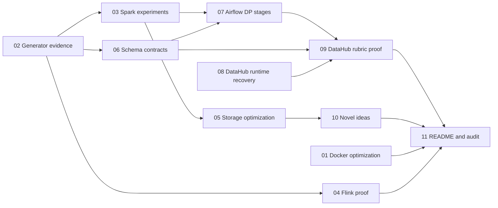

# Mini-Coursework Refactor Plan Index

> **For agentic workers:** REQUIRED SUB-SKILL: Use superpowers:subagent-driven-development (recommended) or superpowers:executing-plans to implement the selected topic plan task-by-task. Steps use checkbox (`- [ ]`) syntax for tracking.

**Goal:** Close every action from rubric rows 2-46 through eleven focused, evidence-backed implementation sessions.

**Architecture:** This index is the control document for the refactor program. Rubric rows remain in workbook order here, while topic plans are numbered in dependency order so implementation evidence exists before final governance and documentation work.

**Tech Stack:** Markdown, PowerShell, RTK, Git, Python/pytest, Docker Compose, Spark, Flink, Iceberg, DuckDB/dbt, Airflow, DataHub, Elasticsearch, and Pinot.

## Global Constraints

- Work from `C:\Users\oou1hc\Documents\FSDS\ecom-data-platform-submission`.
- Preserve unrelated user changes and inspect `rtk git status --short` before editing.
- Execute one topic plan per Codex session unless the user explicitly combines sessions.
- Do not mark a rubric row satisfied until its named implementation and evidence artifacts exist and verification passes.
- Do not stage or commit unless the user explicitly requests it in the implementation session.
- Keep source, Bronze, Silver, and fact-table `created_ts` columns unchanged; only Gold feature outputs become `created`.
- DataHub completion requires indexed search and working UI entity, lineage, assertion, and contract views; direct metadata API results alone are insufficient.
- New evidence must be reproducible from documented commands and must not contain fabricated measurements or screenshots.
- `tmp/` is intentionally gitignored; these plans are local execution controls, not tracked deliverables.

---

## Start Here

For each new Codex session:

1. Read this index, the selected topic plan, and `tmp/rubic-check/mini-coursework-rubric-audit.md`.
2. Confirm all prerequisite topic plans have met their definitions of done.
3. Run `rtk git status --short` and preserve unrelated work.
4. Follow the selected plan in checkbox order, including its focused tests and evidence capture.
5. Record actual commands, outputs, artifact paths, and remaining limitations in that plan's Completion Record.
6. Update this index only after the topic plan passes its own verification.

## Recommended Execution Order

| Order | Topic plan | Why it is placed here | Depends on |
|---:|---|---|---|
| Step 1 | `01-docker-image-optimization.md` | Establishes the engineering-fundamentals proof without depending on data runs. | Clean Docker environment |
| Step 2 | `02-generator-rubric-evidence.md` | Produces the controlled coursework-scale inputs and consolidated quality evidence used downstream. | Generator dependencies |
| Step 3 | `03-spark-skew-cardinality-and-baseline.md` | Uses the coursework dataset for baseline, salting, repartitioning, and correctness proof. | Topic 02 |
| Step 4 | `04-flink-baseline-and-streaming-proof.md` | Uses the same generated streaming scenarios for controlled baseline and optimized runs. | Topic 02 |
| Step 5 | `05-storage-optimization.md` | Benchmarks Iceberg compaction after Spark output exists and DuckDB indexing after dbt output exists. | Topics 02-03 |
| Step 6 | `06-schema-erd-and-feature-contracts.md` | Finalizes all-zone schema evidence and the feature-column contract before orchestration and governance capture. | Topic 02 and a successful dbt build |
| Step 7 | `07-airflow-dp-stage-orchestration.md` | Exposes final DP1, DP2, and DP3 contracts as visible task groups. | Topics 03 and 06 |
| Step 8 | `08-datahub-runtime-recovery.md` | Aligns DataHub and Elasticsearch and restores indexed metadata before UI evidence work. | Ingestion and lakehouse Compose profiles |
| Step 9 | `09-datahub-lineage-and-contract-proof.md` | Emits and captures final DP1-DP3 metadata against the repaired UI. | Topics 06-08 |
| Step 10 | `10-novel-ideas-evidence.md` | Packages verified DuckDB/dbt and Pinot capabilities as the two novel ideas. | Topics 05 and existing Pinot runtime |
| Step 11 | `11-readme-and-rubric-navigation.md` | Links only completed evidence and refreshes the final audit truthfully. | Topics 01-10 |



## Rubric-Order Coverage Matrix

Each workbook row appears once in this table. Topic `08` is an explicit runtime prerequisite for rows 34-39 but does not own an additional rubric row.

| Row | Points | Audit status | Effort | Value | Owning plan | Required outcome |
|---:|---:|---|---|---|---|---|
| 2 | 10 | Partial | S | High | `11-readme-and-rubric-navigation.md` | Central rubric navigation, architecture conventions, repository structure, and documentation/docstring policy are explicit and linked. |
| 3 | 1 | Partial | S | High | `01-docker-image-optimization.md` | Record reproducible Docker image size before and after optimization and explain the method. |
| 4 | 1 | Missing | M | High | `01-docker-image-optimization.md` | Implement and verify a meaningful multistage Kafka Connect image build. |
| 5 | 2 | Satisfied | XS | Medium | `02-generator-rubric-evidence.md` | Present measured city/category skew beside the controlling configuration. |
| 6 | 2 | Partial | S | High | `02-generator-rubric-evidence.md` | Publish approximate distinct counts and uniqueness ratios for key identifiers. |
| 7 | 2 | Satisfied | XS | Medium | `02-generator-rubric-evidence.md` | Present schema-version and old-partition null evidence together. |
| 8 | 2 | Satisfied | XS | Medium | `02-generator-rubric-evidence.md` | Connect configured offline duplicate rate to before/after dedup evidence. |
| 9 | 2 | Satisfied | XS | Low | `02-generator-rubric-evidence.md` | Make the exact generator profile and config path prominent. |
| 10 | 2 | Satisfied | XS | Medium | `02-generator-rubric-evidence.md` | Show stored raw outputs and the Bronze ingestion handoff. |
| 11 | 2 | Satisfied | XS | Medium | `02-generator-rubric-evidence.md` | Consolidate burst configuration and measured output counts. |
| 12 | 2 | Satisfied | XS | Medium | `02-generator-rubric-evidence.md` | Present late-arrival configuration and measured rate together. |
| 13 | 2 | Satisfied | XS | Medium | `02-generator-rubric-evidence.md` | Present streaming duplicate configuration and measured rate together. |
| 14 | 2 | Satisfied | XS | Low | `02-generator-rubric-evidence.md` | Quote the exact scale/profile values used for submitted evidence. |
| 15 | 2 | Partial | M | High | `03-spark-skew-cardinality-and-baseline.md` | Capture Spark baseline and optimized runs, UI evidence, and optimization narrative. |
| 16 | 2 | Partial | M | High | `03-spark-skew-cardinality-and-baseline.md` | Prove targeted salting/repartitioning for the configured hot-city keys. |
| 17 | 2 | Partial | M | High | `03-spark-skew-cardinality-and-baseline.md` | Measure high cardinality and compare a controlled repartition experiment. |
| 18 | 2 | Satisfied | XS | Medium | `03-spark-skew-cardinality-and-baseline.md` | Link schema-evolution code and validation evidence precisely. |
| 19 | 2 | Satisfied | XS | Medium | `03-spark-skew-cardinality-and-baseline.md` | Consolidate duplicate/quarantine logic and validation results. |
| 20 | 2 | Satisfied | XS | Medium | `03-spark-skew-cardinality-and-baseline.md` | Name and show the Spark task inside the Airflow pipeline. |
| 21 | 2 | Partial | M | High | `04-flink-baseline-and-streaming-proof.md` | Capture controlled baseline/optimized Flink runs and UI evidence. |
| 22 | 2 | Satisfied | XS | Medium | `04-flink-baseline-and-streaming-proof.md` | Show a burst input and resulting alert/output. |
| 23 | 2 | Satisfied | XS | Medium | `04-flink-baseline-and-streaming-proof.md` | Show a late event and resulting correction path. |
| 24 | 2 | Satisfied | XS | Medium | `04-flink-baseline-and-streaming-proof.md` | Show streaming duplicate metrics from a real output sample. |
| 25 | 2 | Satisfied | XS | Medium | `04-flink-baseline-and-streaming-proof.md` | Show event-time window code and successful runtime proof. |
| 26 | 2 | Partial | M | High | `05-storage-optimization.md` | Compact Iceberg files and compare layout/query evidence before and after. |
| 27 | 2 | Partial | S | Medium | `05-storage-optimization.md` | Run a reproducible DuckDB index benchmark with plan and timing evidence. |
| 28 | 2 | Partial | S | High | `07-airflow-dp-stage-orchestration.md` | Expose and capture the DP1 raw-to-Bronze ingest stage. |
| 29 | 2 | Partial | S | High | `07-airflow-dp-stage-orchestration.md` | Expose and capture the DP1 Bronze validation stage and GX result. |
| 30 | 2 | Partial | S | High | `07-airflow-dp-stage-orchestration.md` | Expose and capture the DP2 Bronze-to-Silver/Gold transform stage. |
| 31 | 2 | Partial | S | High | `07-airflow-dp-stage-orchestration.md` | Expose and capture the DP2 Gold validation stage and contract result. |
| 32 | 2 | Partial | S | High | `07-airflow-dp-stage-orchestration.md` | Expose and capture the DP3 offline feature compute stage. |
| 33 | 2 | Partial | S | High | `07-airflow-dp-stage-orchestration.md` | Expose and capture the DP3 feature validation stage and contracts. |
| 34 | 2 | Partial | M | High | `09-datahub-lineage-and-contract-proof.md` | Show DP1 lineage in the working DataHub UI. |
| 35 | 2 | Partial | M | High | `09-datahub-lineage-and-contract-proof.md` | Show DP1 contracts/assertions in the working DataHub UI. |
| 36 | 2 | Partial | M | High | `09-datahub-lineage-and-contract-proof.md` | Show Bronze-to-Silver/Gold lineage in the working DataHub UI. |
| 37 | 2 | Partial | M | High | `09-datahub-lineage-and-contract-proof.md` | Show DP2 Gold contracts/assertions in the working DataHub UI. |
| 38 | 2 | Partial | M | High | `09-datahub-lineage-and-contract-proof.md` | Show feature-table lineage in the working DataHub UI. |
| 39 | 2 | Partial | M | High | `09-datahub-lineage-and-contract-proof.md` | Show feature-table contracts/assertions in the working DataHub UI. |
| 40 | 2 | Partial | S | High | `06-schema-erd-and-feature-contracts.md` | Generate and document a complete Bronze/Silver/Gold ERD. |
| 41 | 1 | Satisfied | XS | Medium | `06-schema-erd-and-feature-contracts.md` | Explain the current-row SCD2-compatible column behavior accurately. |
| 42 | 1 | Partial | S | Medium | `06-schema-erd-and-feature-contracts.md` | Expose `event_timestamp` and exact `created` columns on every Gold feature table. |
| 43 | 2 | Satisfied | XS | Medium | `06-schema-erd-and-feature-contracts.md` | Present dimension/fact relationships beside schema proof. |
| 44 | 2 | Satisfied | XS | Low | `06-schema-erd-and-feature-contracts.md` | Present a compact Bronze/Silver/Gold naming-convention table. |
| 45 | 5 | Partial | S | High | `10-novel-ideas-evidence.md` | Document DuckDB/dbt local analytics as Idea 1 with runnable proof. |
| 46 | 5 | Partial | S | High | `10-novel-ideas-evidence.md` | Document Pinot realtime serving as Idea 2 with runnable proof. |

## Progress Tracker

- [x] `01-docker-image-optimization.md` meets its Definition of Done.
- [x] `02-generator-rubric-evidence.md` meets its Definition of Done.
- [x] `03-spark-skew-cardinality-and-baseline.md` meets its Definition of Done.
- [x] `04-flink-baseline-and-streaming-proof.md` meets its Definition of Done.
- [x] `05-storage-optimization.md` meets its Definition of Done.
- [x] `06-schema-erd-and-feature-contracts.md` meets its Definition of Done.
- [x] `07-airflow-dp-stage-orchestration.md` meets its Definition of Done.
- [x] `08-datahub-runtime-recovery.md` meets its Definition of Done.
- [x] `09-datahub-lineage-and-contract-proof.md` meets its Definition of Done.
- [x] `10-novel-ideas-evidence.md` meets its Definition of Done.
- [x] `11-readme-and-rubric-navigation.md` meets its Definition of Done.
- [x] The final audit has been refreshed from actual artifacts rather than anticipated work.

## Program Acceptance Checks

Run these checks after all topic sessions finish.

```powershell
rtk proxy powershell -NoProfile -Command '$files = Get-ChildItem -LiteralPath "tmp/rubic-check/refactor" -Filter "*.md"; if ($files.Count -ne 12) { throw ("Expected 12 Markdown files, found " + $files.Count) }; $files.Name'
```

Expected: twelve filenames, `00-refactor-index.md` through `11-readme-and-rubric-navigation.md`.

```powershell
rtk proxy powershell -NoProfile -Command '$text = Get-Content -Raw -LiteralPath "tmp/rubic-check/refactor/00-refactor-index.md"; foreach ($row in 2..46) { $count = ([regex]::Matches($text, ("(?m)^\| " + $row + " \|"))).Count; if ($count -ne 1) { throw ("Rubric row " + $row + " occurs " + $count + " times") } }'
```

Expected: exit code `0`; every rubric row occurs exactly once in the coverage matrix.

```powershell
rtk proxy powershell -NoProfile -Command '$pattern = ("\bT" + "BD\b|\bT" + "ODO\b|" + "implement" + " later"); $bad = Get-ChildItem -LiteralPath "tmp/rubic-check/refactor" -Filter "*.md" | Select-String -Pattern $pattern -CaseSensitive:$false; if ($bad) { $bad; exit 1 }'
```

Expected: exit code `0` and no placeholder matches.

```powershell
rtk proxy powershell -NoProfile -Command '$required = @("## Global Constraints","## Definition of Done","## Completion Record"); Get-ChildItem -LiteralPath "tmp/rubic-check/refactor" -Filter "*.md" | Where-Object { $_.Name -match "^(0[1-9]|1[01])-.*\.md$" } | ForEach-Object { $text = Get-Content -Raw -LiteralPath $_.FullName; foreach ($heading in $required) { if (-not $text.Contains($heading)) { throw ($_.Name + " is missing " + $heading) } } }'
```

Expected: exit code `0`; every topic plan contains the required control sections.

```powershell
rtk git status --short
```

Expected during planning: no tracked source, configuration, test, or evidence changes. During implementation: only files authorized by the active topic plan and pre-existing user changes may appear.

## Completion Record

Updated 2026-07-13: Topics 01-11 are complete. The verified final evidence manifest is `evidence/final_integration/mini_coursework_rubric_manifest.json`; it reports 45 Satisfied, 0 Partial, and 0 Missing rows and must be re-verified after any bound artifact changes.
